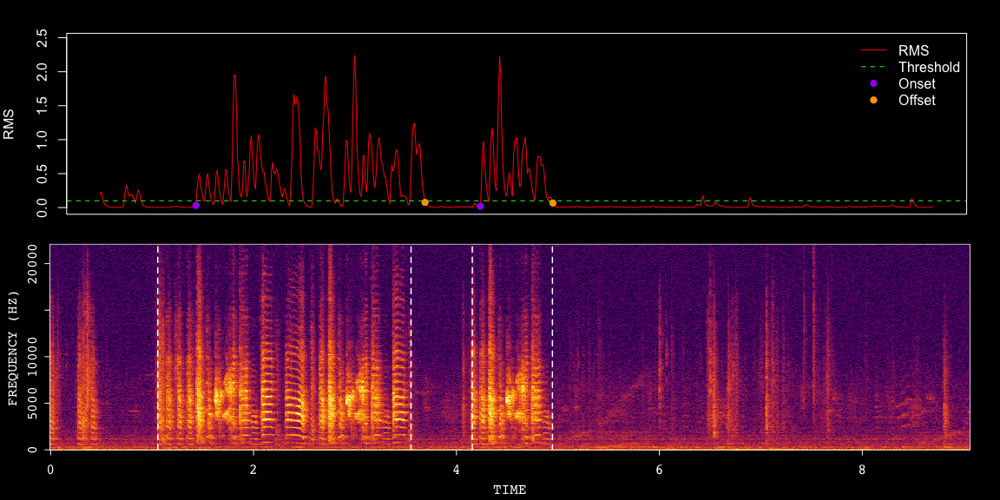

<!-- README.md is generated from README.Rmd. Please edit that file -->

# ASAP: Automated Sound Analysis Pipeline

<!-- badges: start -->

[](https://github.com/LXiao06/ASAP/actions/workflows/R-CMD-check.yaml)

<!-- badges: end -->

## Overview

ASAP (Automated Sound Analysis Pipeline) is a comprehensive R toolkit
designed for longitudinal analysis of birdsong development, with
particular emphasis on zebra finch vocalizations recorded using SAP2011.

## Key Features

- **Automated Song Analysis**
  - Bout detection
  - Motif extraction
  - Syllable segmentation
  - Template matching
  - Feature extraction (temporal & spectral)
- **Advanced Processing**
  - Standardized analytical workflows
  - Large-scale data handling
  - Longitudinal tracking
  - Parallel processing support

## Purpose

ASAP facilitates large-scale longitudinal studies of song development
by: - 📊 Processing and analyzing complex vocal patterns - 🔍 Detecting
and visualizing feature changes in high-dimensional acoustic space - 🧬
Providing white-box algorithms for investigating song evolution in
latent space

## Installation

To install ASAP, I recommend using remotes:

``` r
require(remotes)
remotes::install_github("LXiao06/ASAP")
```

## Example

This example demonstrates how to detect bout boundaries or syllable
segmentation from a single zebra finch song sample (WAV file).



    #> Spectrogram summary:
    #> Dimensions: 122 x 847
    #> Range: -118.23 to 0.00
    #> Time range: 0.00 to 4.00 seconds
    #> Frequency range: 1.00 to 8.00 Hz
    #> Time step: 4.73 ms
    #> 
    #> Searching thresholds up: 10.0 to 40.0 dB
    #> 
    #> Trying threshold: 10 dB
    #> Longest vocalization: 226.95 ms
    #> Found suitable threshold: 10 dB
    #> 
    #> Final results:
    #> Total segemnts found: 25
    #> Duration range: 47.28 to 226.95 ms
    #> Silence gaps range: 9.46 to 633.57 ms


    #> [1] 1

This example demonstrates the automated song development analysis. Using
the SAP object, which is constructed and optimized for SAP2011
recordings, we track and visualize motif changes over time through
heatmaps and latent space projections.

``` r
# Create sap object 
sap <- create_sap_object(
  base_path = "/path/to/your/wav/file/directory",
  subfolders_to_include = c("190", "201", "203"),
  labels = c("BL", "Post", "Rec")
)

# A standardized pipeline for motif analysis
sap <- sap |>
  create_audio_clip(indices = 1, start_time = 1, end_time = 2.5,
                    clip_names = "m1") |>
  create_template(template_name = "d", clip_name = "m1",
                  start_time = 0.72,   end_time =  0.84,
                  freq_min = 1,  freq_max = 10,
                  threshold = 0.5, write_template = TRUE) |>
  detect_template(template_name = "d") |>
  find_motif(template_name = "d", pre_time = 0.7, lag_time = 0.5) |>
  analyze_spectral(balanced = TRUE) |>
  find_clusters() |>
  run_umap() |>
  create_trajectory_matrix(data_type = "feat.embeds", clusters = c(0, 1),
                           balanced = TRUE) |>
  run_pca()  |>
  run_umap(data_type = "traj_mat", min_dist = 0.5)


# Visualization
sap <- sap |>
  plot_heatmap(balanced = TRUE, ordered = TRUE)|>
  plot_umap(split.by = "label") |>
  plot_umap2(data_type = "traj.embeds", overlay_mode = TRUE, 
             base_label = "BL", compare_labels ="Rec")
```


You’ll still need to render `README.Rmd` regularly, to keep `README.md`
up-to-date. `devtools::build_readme()` is handy for this.

In that case, don’t forget to commit and push the resulting figure
files, so they display on GitHub and CRAN.
