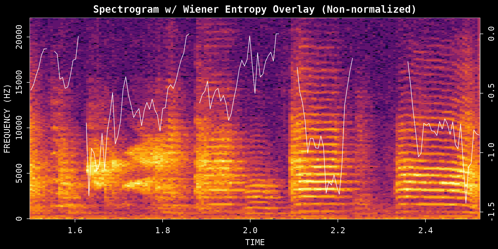
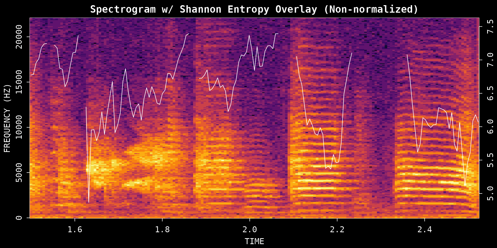
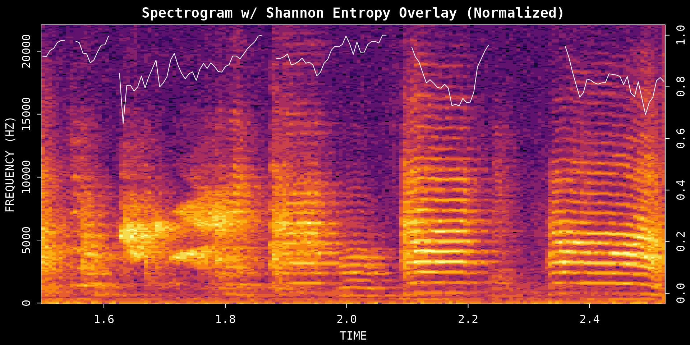
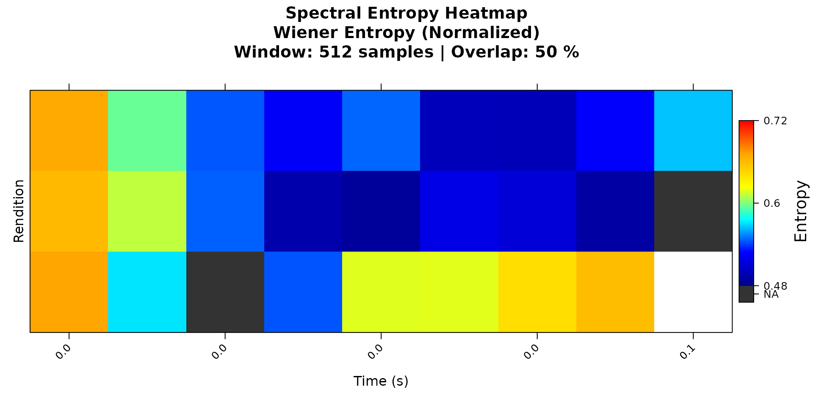
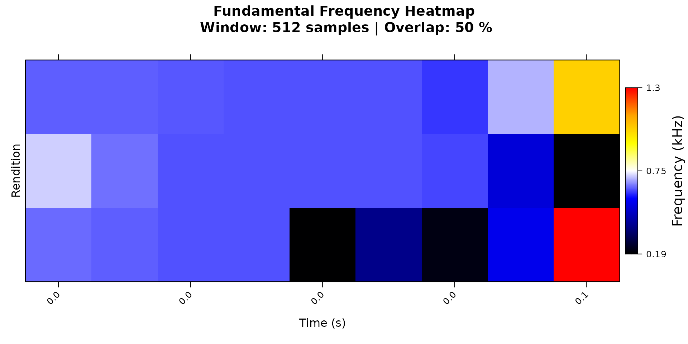

# Acoustic Feature Analysis

## Introduction

This vignette covers three ASAP functions for examining acoustic
structure within a single recording:
[`spectral_entropy()`](https://lxiao06.github.io/ASAP/reference/spectral_entropy.md),
[`FF()`](https://lxiao06.github.io/ASAP/reference/Fundamental_Frequency.md),
and [`amp_env()`](https://lxiao06.github.io/ASAP/reference/amp_env.md).

- **[`spectral_entropy()`](https://lxiao06.github.io/ASAP/reference/spectral_entropy.md)**
  measures how tonal or noisy a sound is at each point in time by
  quantifying how evenly power is spread across frequencies. Zebra finch
  syllables are often highly structured and may show low entropy,
  especially for harmonic stack syllables or certain calls; in contrast,
  noisier syllables, broadband calls, or background noise tend to
  produce higher-entropy traces.
- **[`FF()`](https://lxiao06.github.io/ASAP/reference/Fundamental_Frequency.md)**
  tracks fundamental frequency (perceived pitch) over time. It is the
  go-to tool for looking at pitch contours within a single syllable or
  comparing pitch trajectories across many renditions.
- **[`amp_env()`](https://lxiao06.github.io/ASAP/reference/amp_env.md)**
  extracts the amplitude envelope, summarizing how the overall intensity
  of sound rises and falls across the duration of a segment.

The vignette walks through how to call each function on a simple time
window (provide a file path and start/end times), and then shows how the
same functions accept a segment data frame produced by
[`segment()`](https://lxiao06.github.io/ASAP/reference/segment.md) — a
natural bridge toward population-level analysis with SAP objects.

**Prerequisites**: Before reading this vignette, we recommend
completing:

- [Overview: ASAP
  101](https://lxiao06.github.io/ASAP/articles/single_wav_analysis.md) -
  Basic ASAP functions

**What you will learn**:

1.  What kinds of data each function accepts
2.  How to measure spectral structure with entropy (Wiener and Shannon)
3.  How to extract pitch contours with the cepstrum method
4.  How to measure amplitude envelopes and reuse segment data frames for
    feature analysis

------------------------------------------------------------------------

## Overview: What Data Do These Functions Accept?

All three functions share a common design: they dispatch on the class of
their first argument, so you can pass different kinds of input without
changing the function name.

### `spectral_entropy()` and `FF()`

| Input type          | What to pass                                                 | Key extra argument                             |
|---------------------|--------------------------------------------------------------|------------------------------------------------|
| Single WAV file     | Character path to `.wav` file                                | `start_time`, `end_time` (seconds)             |
| Segment data frame  | Data frame with `filename`, `start_time`, `end_time` columns | `wav_dir` (directory containing the WAV files) |
| SAP object          | A `Sap` object                                               | `segment_type`, sampling/filtering options     |
| Pre-computed matrix | An entropy or F0 matrix returned by a previous call          | — (re-plots the stored matrix)                 |

When `x` is a **character path**, `start_time` and `end_time` default to
the full file duration if omitted.

When `x` is a **data frame**, it must contain at least `filename`,
`start_time`, and `end_time` columns. A single-row data frame behaves
identically to the WAV file method. A multi-row data frame triggers
parallel processing and returns an aligned matrix.

### `amp_env()`

[`amp_env()`](https://lxiao06.github.io/ASAP/reference/amp_env.md)
always takes a **single-row data frame** (`segment_row`) — the row must
contain at least `start_time` and `end_time`. Provide `wav_dir` when the
WAV file directory is not embedded in the data frame as an attribute.

    amp_env(segment_row, wav_dir = NULL, msmooth = NULL,
            amp_normalize = c("none", "peak", "rms"), plot = FALSE)

------------------------------------------------------------------------

## Setup

``` r
library(ASAP)
#> ASAP v0.3.5 loaded.

wav_file <- system.file("extdata", "zf_example.wav", package = "ASAP")
analysis_start <- 1.5
analysis_end <- 2.5
```

------------------------------------------------------------------------

## 1. Spectral Entropy Analysis

Spectral entropy measures how structured or noisy the frequency
distribution is within a sound segment. Harmonic syllables tend to have
lower entropy, while broader-band noisy sounds tend to have higher
entropy.

### Choosing `method` and `normalize`

Two arguments control what the trace looks like:

- **`method`**: `"wiener"` (default) quantifies spectral flatness — more
  negative values mean more structured sound, 0 means noise-like.
  `"shannon"` quantifies information content — higher values reflect
  more uniform spectral energy.
- **`normalize`**: `FALSE` returns the native scale; `TRUE` rescales the
  output to 0–1, making it easier to compare plots across different
  recordings or methods.

These arguments are independent — you can use either method with or
without normalization:

``` r
# Wiener entropy, native scale
wiener_raw <- spectral_entropy(
  wav_file,
  start_time = analysis_start,
  end_time   = analysis_end,
  method     = "wiener",
  normalize  = FALSE,
  plot       = TRUE
)
```



``` r
# Wiener entropy, normalized to 0–1
wiener_norm <- spectral_entropy(
  wav_file,
  start_time = analysis_start,
  end_time   = analysis_end,
  method     = "wiener",
  normalize  = TRUE,
  plot       = TRUE
)
```


``` r
# Shannon entropy, native scale
shannon_raw <- spectral_entropy(
  wav_file,
  start_time = analysis_start,
  end_time   = analysis_end,
  method     = "shannon",
  normalize  = FALSE,
  plot       = TRUE
)
```



``` r
# Shannon entropy, normalized to 0–1
shannon_norm <- spectral_entropy(
  wav_file,
  start_time = analysis_start,
  end_time   = analysis_end,
  method     = "shannon",
  normalize  = TRUE,
  plot       = TRUE
)
```



### Argument guide

| Argument    | Options                   | How to think about it                                                                                             |
|-------------|---------------------------|-------------------------------------------------------------------------------------------------------------------|
| `method`    | `"wiener"` or `"shannon"` | Use Wiener for spectral flatness (classic bioacoustics metric); use Shannon for information-content style entropy |
| `normalize` | `FALSE` or `TRUE`         | Use `FALSE` to keep the native scale; use `TRUE` for a 0–1 scale that is easier to compare across plots           |

All four combinations of `method` × `normalize` are valid; pick
whichever suits your analysis question.

### Quality check

Use the plot to compare low-entropy tonal structure against
higher-entropy noisy regions. If the segment includes long silent
stretches, tighten the time window so the estimate reflects the
vocalization itself rather than surrounding silence.

------------------------------------------------------------------------

## 2. Fundamental Frequency (Pitch) Analysis

The
[`FF()`](https://lxiao06.github.io/ASAP/reference/Fundamental_Frequency.md)
function extracts the fundamental frequency contour, showing how
perceived pitch changes over time.

The two most important arguments for a single recording are:

- `method`: `"cepstrum"` or `"yin"`
- `fmax`: the upper pitch limit to search (Hz)

### Cepstrum method

`"cepstrum"` is the default and the easiest place to start. It is fast
and works well for quick inspection of tonal syllables.

``` r
pitch_cepstrum <- FF(
  wav_file,
  start_time = analysis_start,
  end_time   = analysis_end,
  method     = "cepstrum",
  fmax       = 1400,
  threshold  = 10,
  plot       = TRUE
)
```


### YIN method

`"yin"` can be more robust for some signals, but it requires Python
dependencies through `reticulate`, including `librosa` and `numpy`.

``` r
# ASAP attempts to auto-install librosa/numpy via reticulate when needed.
# This chunk runs only when Python and its dependencies are available;
# it skips gracefully otherwise (e.g. on CRAN or CI build servers).
has_yin <- tryCatch({
  requireNamespace("reticulate", quietly = TRUE) &&
    reticulate::py_module_available("librosa") &&
    reticulate::py_module_available("numpy")
}, error = function(e) FALSE)
#> Downloading uv...Done!

if (has_yin) {
  pitch_yin <- FF(
    wav_file,
    start_time = analysis_start,
    end_time   = analysis_end,
    method     = "yin",
    fmax       = 1400,
    threshold  = 10,
    plot       = TRUE
  )
} else {
  message("YIN method requires Python with librosa and numpy. Skipping.")
}
#> YIN method requires Python with librosa and numpy. Skipping.
```

### Argument guide

| Argument    | Options                   | How to think about it                                                                                            |
|-------------|---------------------------|------------------------------------------------------------------------------------------------------------------|
| `method`    | `"cepstrum"` or `"yin"`   | Start with `cepstrum`; try `yin` if you want an alternative pitch tracker and have Python dependencies installed |
| `fmax`      | Numeric upper limit in Hz | Raise it if the contour clips too low; lower it to reduce implausibly high estimates                             |
| `threshold` | Confidence filter (%)     | Higher values remove uncertain estimates but may introduce gaps                                                  |

### The result contains

- `f0`: Fundamental frequency values over time (kHz)
- `time`: Corresponding time stamps (seconds)

------------------------------------------------------------------------

## 3. Amplitude Envelope from a Syllable Data Frame

The amplitude envelope summarizes how sound intensity changes over time.
[`amp_env()`](https://lxiao06.github.io/ASAP/reference/amp_env.md) takes
a single-row segment data frame with `filename`, `start_time`, and
`end_time` columns. A syllable data frame from
[`segment()`](https://lxiao06.github.io/ASAP/reference/segment.md) is a
simple way to create that input.

### Step 1: Segment a small time window into syllables

``` r
syllables <- segment(
  wav_file,
  start_time         = 1,
  end_time           = 5,
  flim               = c(1, 8),
  silence_threshold  = 0.01,
  min_syllable_ms    = 20,
  max_syllable_ms    = 240,
  min_level_db       = 10,
  verbose            = FALSE,
  plot               = FALSE
)

knitr::kable(head(syllables), digits = 3)
```

| filename       | selec | threshold | .start |  .end | start_time | end_time | duration | silence_gap |
|:---------------|------:|----------:|-------:|------:|-----------:|---------:|---------:|------------:|
| zf_example.wav |     1 |        10 |  0.061 | 0.123 |      1.061 |    1.123 |    0.061 |          NA |
| zf_example.wav |     2 |        10 |  0.151 | 0.199 |      1.151 |    1.199 |    0.047 |       0.028 |
| zf_example.wav |     3 |        10 |  0.260 | 0.312 |      1.260 |    1.312 |    0.052 |       0.061 |
| zf_example.wav |     4 |        10 |  0.359 | 0.411 |      1.359 |    1.411 |    0.052 |       0.047 |
| zf_example.wav |     5 |        10 |  0.444 | 0.520 |      1.444 |    1.520 |    0.076 |       0.033 |
| zf_example.wav |     6 |        10 |  0.548 | 0.610 |      1.548 |    1.610 |    0.061 |       0.028 |

### Step 2: Choose one syllable row

``` r
example_syllable <- NULL
if (!is.null(syllables) && nrow(syllables) >= 1) {
  example_syllable <- syllables[1, , drop = FALSE]
  knitr::kable(example_syllable, digits = 3)
}
```

| filename       | selec | threshold | .start |  .end | start_time | end_time | duration | silence_gap |
|:---------------|------:|----------:|-------:|------:|-----------:|---------:|---------:|------------:|
| zf_example.wav |     1 |        10 |  0.061 | 0.123 |      1.061 |    1.123 |    0.061 |          NA |

### Step 3: Extract the envelope

``` r
if (!is.null(example_syllable)) {
  env_syl <- amp_env(
    example_syllable,
    wav_dir       = dirname(wav_file),
    msmooth       = c(256, 50),
    amp_normalize = "peak",
    plot          = TRUE
  )
}
```


### Smoothing and normalization

- **`msmooth`**: a length-2 vector `c(window_samples, overlap_percent)`.
  Larger windows smooth out fine-grained amplitude fluctuations; smaller
  windows preserve rapid transients.
- **`amp_normalize`**: `"none"` keeps the raw scale; `"peak"` scales to
  the maximum amplitude (good for comparing envelope shapes); `"rms"`
  scales by RMS energy (good for comparing absolute loudness).

### Argument guide

| Argument        | Options                           | How to think about it                                             |
|-----------------|-----------------------------------|-------------------------------------------------------------------|
| `segment_row`   | Single-row data frame             | Must contain `filename`, `start_time`, `end_time`                 |
| `wav_dir`       | Path string                       | Directory containing the WAV files                                |
| `msmooth`       | Numeric vector c(window, overlap) | Larger window = smoother envelope; smaller = more temporal detail |
| `amp_normalize` | `"none"`, `"peak"`, `"rms"`       | Use `"peak"` when comparing envelope shapes across segments       |

------------------------------------------------------------------------

## 4. Add-on: Entropy and Pitch from a Segment Data Frame

The same syllable table can also be passed directly to
[`spectral_entropy()`](https://lxiao06.github.io/ASAP/reference/spectral_entropy.md)
and
[`FF()`](https://lxiao06.github.io/ASAP/reference/Fundamental_Frequency.md).
This is useful when you want to analyze a set of detected segments
instead of manually specifying `start_time` and `end_time` for each one.

### Step 1: Select a few syllable rows

``` r
example_syllables <- NULL
if (!is.null(syllables) && nrow(syllables) >= 3) {
  example_syllables <- syllables[1:3, ]
  knitr::kable(example_syllables, digits = 3)
}
```

| filename       | selec | threshold | .start |  .end | start_time | end_time | duration | silence_gap |
|:---------------|------:|----------:|-------:|------:|-----------:|---------:|---------:|------------:|
| zf_example.wav |     1 |        10 |  0.061 | 0.123 |      1.061 |    1.123 |    0.061 |          NA |
| zf_example.wav |     2 |        10 |  0.151 | 0.199 |      1.151 |    1.199 |    0.047 |       0.028 |
| zf_example.wav |     3 |        10 |  0.260 | 0.312 |      1.260 |    1.312 |    0.052 |       0.061 |

### Step 2: Run spectral entropy on the data frame

The same `method` and `normalize` arguments from the single-file
examples apply here. Mix and match freely — for example, try
`method = "shannon"` with `normalize = FALSE` if you prefer the
information-content scale.

``` r
if (!is.null(example_syllables)) {
  entropy_df <- spectral_entropy(
    example_syllables,
    wav_dir   = dirname(wav_file),
    method    = "wiener",
    normalize = TRUE,
    plot      = TRUE
  )
}
```



### Step 3: Run pitch analysis on the data frame

For data-frame input,
[`FF()`](https://lxiao06.github.io/ASAP/reference/Fundamental_Frequency.md)
aligns the selected segments onto a common time axis and returns a
multi-segment result. The `method`, `fmax`, and `threshold` arguments
work the same way as for a single WAV file.

``` r
if (!is.null(example_syllables)) {
  pitch_df <- FF(
    example_syllables,
    wav_dir   = dirname(wav_file),
    method    = "cepstrum",
    fmax      = 1400,
    threshold = 10,
    plot      = TRUE
  )
}
```



------------------------------------------------------------------------

## Summary

These three functions provide a compact toolkit for exploring acoustic
variation in a single recording:

| Function                                                                             | What it captures                    | Primary input types                                   |
|--------------------------------------------------------------------------------------|-------------------------------------|-------------------------------------------------------|
| [`spectral_entropy()`](https://lxiao06.github.io/ASAP/reference/spectral_entropy.md) | Spectral structure or noisiness     | WAV path, data frame, SAP object, pre-computed matrix |
| [`FF()`](https://lxiao06.github.io/ASAP/reference/Fundamental_Frequency.md)          | Pitch contour over time             | WAV path, data frame, SAP object, pre-computed matrix |
| [`amp_env()`](https://lxiao06.github.io/ASAP/reference/amp_env.md)                   | Amplitude dynamics within a segment | Single-row data frame                                 |

For motif-scale acoustic analysis across many recordings, continue to
the SAP object workflow starting with [Constructing SAP
Object](https://lxiao06.github.io/ASAP/articles/construct_sap_object.md).

## Session Info

``` r
sessionInfo()
#> R version 4.5.3 (2026-03-11)
#> Platform: x86_64-pc-linux-gnu
#> Running under: Ubuntu 24.04.4 LTS
#> 
#> Matrix products: default
#> BLAS:   /usr/lib/x86_64-linux-gnu/openblas-pthread/libblas.so.3 
#> LAPACK: /usr/lib/x86_64-linux-gnu/openblas-pthread/libopenblasp-r0.3.26.so;  LAPACK version 3.12.0
#> 
#> locale:
#>  [1] LC_CTYPE=C.UTF-8       LC_NUMERIC=C           LC_TIME=C.UTF-8       
#>  [4] LC_COLLATE=C.UTF-8     LC_MONETARY=C.UTF-8    LC_MESSAGES=C.UTF-8   
#>  [7] LC_PAPER=C.UTF-8       LC_NAME=C              LC_ADDRESS=C          
#> [10] LC_TELEPHONE=C         LC_MEASUREMENT=C.UTF-8 LC_IDENTIFICATION=C   
#> 
#> time zone: UTC
#> tzcode source: system (glibc)
#> 
#> attached base packages:
#> [1] stats     graphics  grDevices utils     datasets  methods   base     
#> 
#> other attached packages:
#> [1] ASAP_0.3.5
#> 
#> loaded via a namespace (and not attached):
#>  [1] rappdirs_0.3.4     sass_0.4.10        generics_0.1.4     tidyr_1.3.2       
#>  [5] lattice_0.22-9     digest_0.6.39      magrittr_2.0.4     evaluate_1.0.5    
#>  [9] grid_4.5.3         RColorBrewer_1.1-3 fastmap_1.2.0      rprojroot_2.1.1   
#> [13] jsonlite_2.0.0     Matrix_1.7-4       tuneR_1.4.7        purrr_1.2.1       
#> [17] scales_1.4.0       pbapply_1.7-4      textshaping_1.0.5  jquerylib_0.1.4   
#> [21] cli_3.6.5          rlang_1.1.7        pbmcapply_1.5.1    fftw_1.0-9        
#> [25] withr_3.0.2        seewave_2.2.4      cachem_1.1.0       yaml_2.3.12       
#> [29] av_0.9.6           tools_4.5.3        parallel_4.5.3     dplyr_1.2.0       
#> [33] ggplot2_4.0.2      here_1.0.2         reticulate_1.45.0  vctrs_0.7.2       
#> [37] R6_2.6.1           png_0.1-9          lifecycle_1.0.5    fs_2.0.1          
#> [41] MASS_7.3-65        ragg_1.5.2         pkgconfig_2.0.3    desc_1.4.3        
#> [45] pkgdown_2.2.0      pillar_1.11.1      bslib_0.10.0       gtable_0.3.6      
#> [49] glue_1.8.0         Rcpp_1.1.1         systemfonts_1.3.2  xfun_0.57         
#> [53] tibble_3.3.1       tidyselect_1.2.1   knitr_1.51         farver_2.1.2      
#> [57] htmltools_0.5.9    patchwork_1.3.2    rmarkdown_2.31     signal_1.8-1      
#> [61] compiler_4.5.3     S7_0.2.1
```
