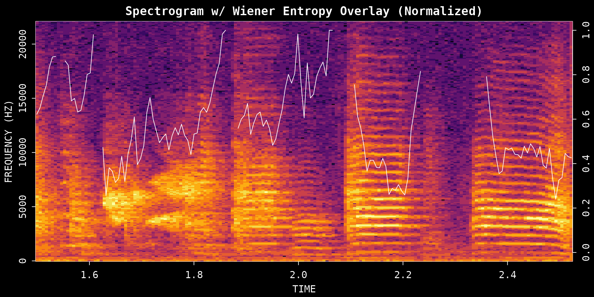
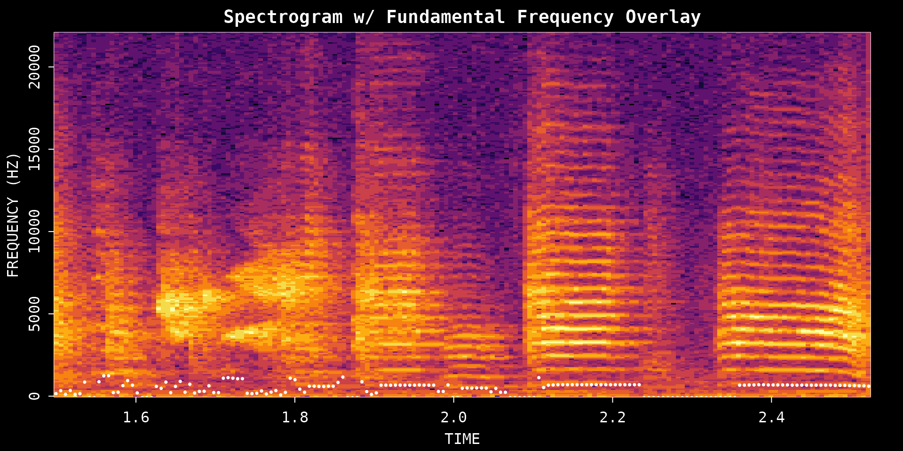

# Acoustic Feature Analysis

## Introduction

This vignette focuses on acoustic measurements you can extract from a
single recording after identifying bouts or syllables of interest. It
pairs naturally with [Overview: ASAP
101](https://lxiao06.github.io/ASAP/articles/single_wav_analysis.md) and
can also be used after [Motif
Detection](https://lxiao06.github.io/ASAP/articles/motif_detection.md)
when you want to inspect the structure of selected song segments in more
detail.

**Prerequisites**: Before reading this vignette, we recommend
completing:

- [Overview: ASAP
  101](https://lxiao06.github.io/ASAP/articles/single_wav_analysis.md) -
  Basic ASAP functions

**What you will learn**:

1.  How to measure spectral structure with entropy
2.  How to extract pitch contours from a single song segment
3.  How to compare amplitude-envelope shapes across bouts and syllables

------------------------------------------------------------------------

## Overview

These feature-analysis functions are best used after you have already
located a time window, bout, or syllable worth inspecting. Because this
is a single-WAV tutorial, the vignette stays focused on a few small
runnable examples rather than wrapping everything in a larger umbrella
workflow. The aim is to show what each feature captures and how to
interpret the resulting plots.

------------------------------------------------------------------------

## Setup

``` r
library(ASAP)
#> ASAP v0.3.5 loaded.

wav_file <- system.file("extdata", "zf_example.wav", package = "ASAP")

bouts <- find_bout(
  wav_file,
  rms_threshold = 0.1,
  min_duration = 0.7,
  plot = FALSE
)

syllables <- segment(
  wav_file,
  start_time = 1,
  end_time = 5,
  flim = c(1, 8),
  silence_threshold = 0.01,
  min_syllable_ms = 20,
  max_syllable_ms = 240,
  min_level_db = 10,
  verbose = FALSE,
  plot = FALSE
)
```

------------------------------------------------------------------------

## 1. Spectral Entropy Analysis

Spectral entropy measures how structured or noisy the frequency
distribution is within a sound segment. Harmonic syllables tend to have
lower entropy, while broader-band noisy sounds tend to have higher
entropy.

``` r
entropy_result <- spectral_entropy(
  wav_file,
  start_time = 1.5,
  end_time = 2.5,
  method = "wiener",
  normalize = TRUE,
  plot = TRUE
)
```



### Interpreting entropy values

- **Low entropy (near 0)**: Structured, harmonic sounds
- **High entropy (near 1)**: Noisy, unstructured sounds

### Available methods

- `"wiener"`: Ratio of geometric to arithmetic mean
- `"shannon"`: Information-theoretic entropy

### Quality check

Use the plot to compare low-entropy tonal structure against
higher-entropy noisy regions. If the segment includes long silent
stretches, tighten the time window so the estimate reflects the
vocalization itself rather than surrounding silence.

------------------------------------------------------------------------

## 2. Fundamental Frequency (Pitch) Analysis

The
[`FF()`](https://lxiao06.github.io/ASAP/reference/Fundamental_Frequency.md)
function extracts the fundamental frequency contour, which describes how
perceived pitch changes over time.

``` r
pitch_result <- FF(
  wav_file,
  start_time = 1.5,
  end_time = 2.5,
  method = "cepstrum",
  fmax = 1400,
  threshold = 10,
  plot = TRUE
)
```



### Key parameters

- `fmax`: Maximum fundamental frequency to detect
- `threshold`: Higher values filter out uncertain estimates
- `method`: `"cepstrum"` (default) or `"yin"`

### The result contains

- `f0`: Fundamental frequency values over time
- `time`: Corresponding time stamps

### Tuning tips

| Parameter   | Role                         | Typical effect                                                                         |
|-------------|------------------------------|----------------------------------------------------------------------------------------|
| `fmax`      | Upper bound for pitch search | Raise it if the contour clips at the top; lower it to avoid implausibly high estimates |
| `threshold` | Confidence filter            | Higher values remove uncertain estimates but may leave gaps                            |
| `method`    | Pitch extraction algorithm   | `"cepstrum"` is a good default for quick inspection                                    |

------------------------------------------------------------------------

## 3. Amplitude Envelope

The amplitude envelope summarizes how sound intensity changes over time.
This is useful for comparing bout or syllable shapes after you have
segmented them.

### Bout-level envelope

``` r
if (!is.null(bouts) && nrow(bouts) >= 1) {
  env_bout <- amp_env(
    bouts[1, ],
    wav_dir = dirname(wav_file),
    msmooth = c(256, 50),
    amp_normalize = "peak",
    plot = TRUE
  )
}
```


### Syllable-level envelope

``` r
if (!is.null(syllables) && nrow(syllables) >= 1) {
  env_syl <- amp_env(
    syllables[1, ],
    wav_dir = dirname(wav_file),
    msmooth = c(256, 50),
    amp_normalize = "peak",
    plot = TRUE
  )
}
```


### Smoothing parameters

The `msmooth` argument controls envelope smoothing:

- First value: Window length in samples
- Second value: Overlap percentage

Smoother envelopes are useful for broad temporal structure, while
lighter smoothing preserves fine timing differences between syllables.

------------------------------------------------------------------------

## Summary

These three functions provide a compact toolkit for exploring acoustic
variation in a single recording:

| Function                                                                             | What it captures                             |
|--------------------------------------------------------------------------------------|----------------------------------------------|
| [`spectral_entropy()`](https://lxiao06.github.io/ASAP/reference/spectral_entropy.md) | Spectral structure or noisiness              |
| [`FF()`](https://lxiao06.github.io/ASAP/reference/Fundamental_Frequency.md)          | Pitch contour over time                      |
| [`amp_env()`](https://lxiao06.github.io/ASAP/reference/amp_env.md)                   | Amplitude dynamics within bouts or syllables |

For motif-scale acoustic analysis across many recordings, continue to
the SAP object workflow starting with [Constructing SAP
Object](https://lxiao06.github.io/ASAP/articles/construct_sap_object.md).

## Session Info

``` r
sessionInfo()
#> R version 4.5.3 (2026-03-11)
#> Platform: x86_64-pc-linux-gnu
#> Running under: Ubuntu 24.04.4 LTS
#> 
#> Matrix products: default
#> BLAS:   /usr/lib/x86_64-linux-gnu/openblas-pthread/libblas.so.3 
#> LAPACK: /usr/lib/x86_64-linux-gnu/openblas-pthread/libopenblasp-r0.3.26.so;  LAPACK version 3.12.0
#> 
#> locale:
#>  [1] LC_CTYPE=C.UTF-8       LC_NUMERIC=C           LC_TIME=C.UTF-8       
#>  [4] LC_COLLATE=C.UTF-8     LC_MONETARY=C.UTF-8    LC_MESSAGES=C.UTF-8   
#>  [7] LC_PAPER=C.UTF-8       LC_NAME=C              LC_ADDRESS=C          
#> [10] LC_TELEPHONE=C         LC_MEASUREMENT=C.UTF-8 LC_IDENTIFICATION=C   
#> 
#> time zone: UTC
#> tzcode source: system (glibc)
#> 
#> attached base packages:
#> [1] stats     graphics  grDevices utils     datasets  methods   base     
#> 
#> other attached packages:
#> [1] ASAP_0.3.5
#> 
#> loaded via a namespace (and not attached):
#>  [1] sass_0.4.10        generics_0.1.4     tidyr_1.3.2        lattice_0.22-9    
#>  [5] digest_0.6.39      magrittr_2.0.4     evaluate_1.0.5     grid_4.5.3        
#>  [9] RColorBrewer_1.1-3 fastmap_1.2.0      jsonlite_2.0.0     Matrix_1.7-4      
#> [13] tuneR_1.4.7        purrr_1.2.1        scales_1.4.0       pbapply_1.7-4     
#> [17] textshaping_1.0.5  jquerylib_0.1.4    cli_3.6.5          rlang_1.1.7       
#> [21] pbmcapply_1.5.1    fftw_1.0-9         seewave_2.2.4      cachem_1.1.0      
#> [25] yaml_2.3.12        av_0.9.6           tools_4.5.3        parallel_4.5.3    
#> [29] dplyr_1.2.0        ggplot2_4.0.2      reticulate_1.45.0  vctrs_0.7.2       
#> [33] R6_2.6.1           png_0.1-9          lifecycle_1.0.5    fs_2.0.1          
#> [37] MASS_7.3-65        ragg_1.5.2         pkgconfig_2.0.3    desc_1.4.3        
#> [41] pkgdown_2.2.0      pillar_1.11.1      bslib_0.10.0       gtable_0.3.6      
#> [45] glue_1.8.0         Rcpp_1.1.1         systemfonts_1.3.2  xfun_0.57         
#> [49] tibble_3.3.1       tidyselect_1.2.1   knitr_1.51         farver_2.1.2      
#> [53] htmltools_0.5.9    patchwork_1.3.2    rmarkdown_2.31     signal_1.8-1      
#> [57] compiler_4.5.3     S7_0.2.1
```
