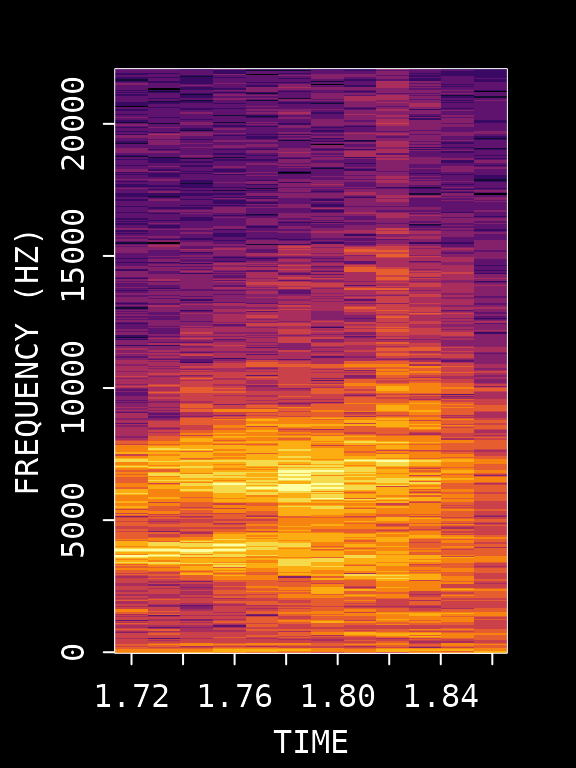

# Motif Detection

## Introduction

This vignette demonstrates how to find and extract **song motifs** from
a single zebra finch WAV file using ASAP’s template matching workflow. A
motif is the stereotyped sequence of syllables that adult male zebra
finches repeat during singing.

**Purpose of this vignette**: This tutorial provides the fundamental
concepts for template-based motif detection in ASAP. You’ll learn how to
interactively optimize template parameters using a single recording
before applying them to bulk processing. The emphasis is on developing a
reliable “anchor” template that will serve as the foundation for
detecting motifs across longitudinal recordings.

The workflow involves:

1.  **Visualizing the song** - Identify a clear motif rendition
2.  **Creating an audio clip** - Extract a segment containing the motif
3.  **Creating a template** - Select a distinctive syllable as an anchor
    point
4.  **Detecting the template** - Find all occurrences of the template
5.  **Extracting motifs** - Define motif boundaries around template
    detections
6.  **Visualizing results** - View extracted motifs and amplitude
    heatmaps

> **Iterative Optimization**: Steps 3-6 should be repeated multiple
> times to refine template parameters until reliable detection is
> achieved. This optimization is crucial before proceeding to bulk
> processing.

## Setup

``` r
library(ASAP)

# Get path to example WAV file included with the package
wav_file <- system.file("extdata", "zf_example.wav", package = "ASAP")
```

## 1. Visualize the Song

First, let’s look at the full recording to identify motif structure:

``` r
visualize_song(wav_file)
```


    #> Song visualization completed for: zf_example.wav

We can see multiple motif renditions in this recording. Let’s zoom in on
a clear section to identify a good reference motif:

``` r
visualize_song(wav_file, 
               start_time_in_second = 1, 
               end_time_in_second = 2.5)
```


    #> Song visualization completed for: zf_example.wav

## 2. Create an Audio Clip

To create a template, we first extract an audio clip containing a clear
motif. We’ll use the segment from 1-2.5 seconds which contains a
complete motif.

``` r
# Create an audio clip from the WAV file
clip_path <- create_audio_clip(wav_file,
                               start_time = 1,
                               end_time = 2.5)
#> Song clip clip_zf_example.wav is generated.

# View the created clip path
clip_path
#> [1] "/home/runner/work/_temp/Library/ASAP/extdata/templates/clip_zf_example.wav"
```

## 3. Create a Template (Critical Step)

Creating a good template is **the most critical step** in the motif
detection workflow. The template serves as an “anchor point” that ASAP
uses to locate motifs throughout recordings. A poorly chosen template
will result in missed detections or false positives.

### Characteristics of a Good Template Syllable

When selecting a syllable for template creation, look for one that:

- **Is acoustically distinctive** - Has unique spectral features that
  differentiate it from other syllables and background noise
- **Occurs exactly once per motif** - Ensures one-to-one mapping between
  detections and motifs
- **Has clear temporal boundaries** - Sharp onset and offset for precise
  alignment
- **Is consistently produced** - Appears reliably across all motif
  renditions
- **Is stable across development** - If analyzing longitudinal data,
  choose a syllable that remains recognizable over time

### Template Selection Process

Based on the spectrogram above, we’ll use syllable “d” which occurs
around 0.72-0.84 seconds within our clip. Let’s visualize this specific
region:

``` r
# First, visualize the template region
visualize_song(wav_file,
               start_time_in_second = 1 + 0.72,
               end_time_in_second = 1 + 0.84)
```



    #> Song visualization completed for: zf_example.wav

Now create the template with specified frequency bounds:

``` r
# Create the template
template <- create_template(clip_path,
                            template_name = "d",
                            start_time = 0.72,
                            end_time = 0.84,
                            freq_min = 1,
                            freq_max = 10,
                            write_template = FALSE)
```


    #> 
    #> Automatic point selection.
    #> 
    #> Done.

    # View template info
    template
    #> 
    #> Object of class "corTemplateList"
    #>  containing  1  templates
    #>                                                           original.recording
    #> d /home/runner/work/_temp/Library/ASAP/extdata/templates/clip_zf_example.wav
    #>   sample.rate lower.frequency upper.frequency lower.amp upper.amp duration
    #> d       44100           1.034           9.991    -80.41         0    0.104
    #>   n.points score.cutoff
    #> d     1050          0.6

### Key Template Parameters

| Parameter             | Description           | Optimization Tips                                            |
|-----------------------|-----------------------|--------------------------------------------------------------|
| `start_time/end_time` | Syllable boundaries   | Adjust to capture complete syllable without gaps             |
| `freq_min/freq_max`   | Frequency range (kHz) | Narrow range reduces noise; 1-10 kHz typical for zebra finch |

## 4. Detect Template Occurrences

Now we search for all occurrences of this template throughout the
recording:

``` r
# Run template detection on the original WAV file
# proximity_window filters out multiple detections within the same motif
template_matches <- detect_template(x = wav_file,
                                    template = template,
                                    proximity_window = 1,  # Filter detections within 1s
                                    save_plot = FALSE)

# View detection results
knitr::kable(template_matches, digits = 2)
```

| filename       | template | time | score |
|:---------------|:---------|-----:|------:|
| zf_example.wav | d        | 1.76 |  0.93 |
| zf_example.wav | d        | 3.07 |  0.77 |
| zf_example.wav | d        | 4.66 |  0.79 |

### Key Detection Parameters

| Parameter          | Description                                       | Purpose                                                                                                                |
|--------------------|---------------------------------------------------|------------------------------------------------------------------------------------------------------------------------|
| `proximity_window` | Time window (seconds) to filter nearby detections | Eliminates false positives within a motif duration. Only the highest-scoring detection within each window is retained. |
| `threshold`        | Minimum correlation score (0-1)                   | Set during template creation; detections below this score are discarded(available for sap method)                      |

### Evaluating Detection Quality

Review the detection results carefully:

- **Score column**: Higher scores indicate better matches. If scores are
  uniformly low, the template may need adjustment.
- **Number of detections**: Should match expected motif count based on
  visual inspection.
- **Detection spacing**: Detections should be evenly spaced if motifs
  occur regularly.

If detection results are unsatisfactory, **return to Step 3** and try:

- Different syllable selection
- Adjusting time boundaries
- Modifying frequency range

## 5. Extract Motif Boundaries

Once we have reliable template detections, we define motif boundaries by
extending a fixed time window before and after each detection:

``` r
# Define motif boundaries around each detection
# pre_time: how much before the template to include
# lag_time: how much after the template to include
motifs <- find_motif(template_matches,
                     pre_time = 0.7,
                     lag_time = 0.5,
                     wav_dir = dirname(wav_file))
#> Processed zf_example.wav: 3/3 valid motifs (0 excluded)
#> Total valid motifs found: 3 (excluded: 0)

# View extracted motifs
knitr::kable(motifs, digits = 2)
```

| filename       | detection_time | start_time | end_time | duration |
|:---------------|---------------:|-----------:|---------:|---------:|
| zf_example.wav |           1.76 |       1.06 |     2.26 |      1.2 |
| zf_example.wav |           3.07 |       2.37 |     3.57 |      1.2 |
| zf_example.wav |           4.66 |       3.96 |     5.16 |      1.2 |

### Adjusting Pre/Lag Times

| Parameter  | Description                 | Adjustment Strategy                           |
|------------|-----------------------------|-----------------------------------------------|
| `pre_time` | Time before template anchor | Should capture syllables preceding the anchor |
| `lag_time` | Time after template anchor  | Should capture syllables following the anchor |

## 6. Visualize Detected Motifs

Let’s visualize the detected motifs to verify our detection worked
correctly:

``` r
# Visualize all extracted motifs
visualize_segments(motifs, 
                   wav_dir = dirname(wav_file),
                   n_samples = min(nrow(motifs), 4))
#> Song visualization completed for: zf_example.wav
#> Song visualization completed for: zf_example.wav
```


    #> Song visualization completed for: zf_example.wav

### Quality Check

Examine the extracted motifs:

- Are all motifs complete (no truncation at boundaries)?
- Are motifs properly aligned?
- Are there any false positives (non-motif sounds)?
- Is the temporal structure consistent across renditions?

If issues are found, **iterate back through Steps 3-6** with adjusted
parameters.

## 7. Amplitude Envelope Heatmap

Once satisfied with detection quality, create a heatmap of amplitude
envelopes across all detected motifs to visualize the temporal
structure:

``` r
# Plot amplitude envelope heatmap
plot_heatmap(motifs, wav_dir = dirname(wav_file))
```


A well-detected set of motifs will show consistent vertical banding
patterns corresponding to syllables across all renditions.

## Summary

This vignette demonstrated the core ASAP workflow for finding motifs in
a single recording. The key insight is that **template optimization is
an iterative process** — Steps 3-6 should be repeated until detection
results are satisfactory.

| Step | Function                                                                                 | Description                                   |
|------|------------------------------------------------------------------------------------------|-----------------------------------------------|
| 1    | [`visualize_song()`](https://lxiao06.github.io/ASAP/reference/visualize_song.md)         | View spectrogram to identify motifs           |
| 2    | [`create_audio_clip()`](https://lxiao06.github.io/ASAP/reference/create_audio_clip.md)   | Extract a reference motif segment             |
| 3    | [`create_template()`](https://lxiao06.github.io/ASAP/reference/create_template.md)       | Create a template from a distinctive syllable |
| 4    | [`detect_template()`](https://lxiao06.github.io/ASAP/reference/detect_template.md)       | Find all template occurrences                 |
| 5    | [`find_motif()`](https://lxiao06.github.io/ASAP/reference/find_motif.md)                 | Define motif boundaries around detections     |
| 6    | [`visualize_segments()`](https://lxiao06.github.io/ASAP/reference/visualize_segments.md) | View extracted motif spectrograms             |
| 7    | [`plot_heatmap()`](https://lxiao06.github.io/ASAP/reference/plot_heatmap.md)             | Visualize amplitude envelope patterns         |

### Key Parameters Reference

| Parameter             | Description                          | Typical Value            |
|-----------------------|--------------------------------------|--------------------------|
| `start_time/end_time` | Template time limits (seconds)       | 0.1-0.2s duration        |
| `freq_min/freq_max`   | Frequency range (kHz)                | 1-10 kHz for zebra finch |
| `pre_time`            | Time before template for motif start | 0.2-0.8s                 |
| `lag_time`            | Time after template for motif end    | 0.2-0.8s                 |

## Next Steps: Longitudinal Recording Analysis with SAP Object

Once you have optimized template parameters using a single recording (as
demonstrated in this vignette), you can apply them to bulk processing of
longitudinal recordings using SAP objects.

The following vignettes cover the longitudinal analysis workflow:

- [**Constructing SAP
  Object**](https://lxiao06.github.io/ASAP/articles/construct_sap_object.md) -
  How to organize and import longitudinal recording data
- [**Longitudinal Motif
  Detection**](https://lxiao06.github.io/ASAP/articles/longitudinal_motif_detection.md) -
  Applying optimized templates across multiple recordings

Here’s a preview of the SAP object pipeline using the parameters we
optimized above:

``` r
# Create SAP object from organized recording folders
sap <- create_sap_object(
  base_path = "/path/to/recordings",
  subfolders_to_include = c("190", "201", "203"),
  labels = c("BL", "Post", "Rec")
)

# Run motif detection pipeline with optimized parameters
sap <- sap |>
  create_audio_clip(indices = 1, start_time = 1, end_time = 2.5, 
                    clip_names = "m1") |>
  create_template(template_name = "d", clip_name = "m1",
                  start_time = 0.72, end_time = 0.84,  # Optimized
                  freq_min = 1, freq_max = 10, 
                  threshold = 0.5,            # Filter low-scoring matches
                  write_template = TRUE) |>
  detect_template(template_name = "d",
                  threshold = 0.5,            # Can adjust threshold here too
                  proximity_window = 1) |>    # Remove duplicate detections
  find_motif(template_name = "d", pre_time = 0.7, lag_time = 0.5) |>
  analyze_spectral(balanced = TRUE) |>
  find_clusters() |>
  run_umap()

# Visualize results
sap |>
  plot_heatmap(balanced = TRUE) |>
  plot_umap(split.by = "label")
```

## Session Info

``` r
sessionInfo()
#> R version 4.5.2 (2025-10-31)
#> Platform: x86_64-pc-linux-gnu
#> Running under: Ubuntu 24.04.3 LTS
#> 
#> Matrix products: default
#> BLAS:   /usr/lib/x86_64-linux-gnu/openblas-pthread/libblas.so.3 
#> LAPACK: /usr/lib/x86_64-linux-gnu/openblas-pthread/libopenblasp-r0.3.26.so;  LAPACK version 3.12.0
#> 
#> locale:
#>  [1] LC_CTYPE=C.UTF-8       LC_NUMERIC=C           LC_TIME=C.UTF-8       
#>  [4] LC_COLLATE=C.UTF-8     LC_MONETARY=C.UTF-8    LC_MESSAGES=C.UTF-8   
#>  [7] LC_PAPER=C.UTF-8       LC_NAME=C              LC_ADDRESS=C          
#> [10] LC_TELEPHONE=C         LC_MEASUREMENT=C.UTF-8 LC_IDENTIFICATION=C   
#> 
#> time zone: UTC
#> tzcode source: system (glibc)
#> 
#> attached base packages:
#> [1] stats     graphics  grDevices utils     datasets  methods   base     
#> 
#> other attached packages:
#> [1] ASAP_0.3.3
#> 
#> loaded via a namespace (and not attached):
#>  [1] sass_0.4.10        generics_0.1.4     tidyr_1.3.2        lattice_0.22-7    
#>  [5] digest_0.6.39      magrittr_2.0.4     evaluate_1.0.5     grid_4.5.2        
#>  [9] RColorBrewer_1.1-3 fastmap_1.2.0      jsonlite_2.0.0     Matrix_1.7-4      
#> [13] monitoR_1.2        tuneR_1.4.7        purrr_1.2.1        scales_1.4.0      
#> [17] pbapply_1.7-4      textshaping_1.0.4  jquerylib_0.1.4    cli_3.6.5         
#> [21] rlang_1.1.7        pbmcapply_1.5.1    withr_3.0.2        seewave_2.2.4     
#> [25] cachem_1.1.0       yaml_2.3.12        av_0.9.6           tools_4.5.2       
#> [29] parallel_4.5.2     dplyr_1.1.4        ggplot2_4.0.1      reticulate_1.44.1 
#> [33] vctrs_0.7.1        R6_2.6.1           png_0.1-8          lifecycle_1.0.5   
#> [37] fs_1.6.6           MASS_7.3-65        ragg_1.5.0         pkgconfig_2.0.3   
#> [41] desc_1.4.3         pkgdown_2.2.0      pillar_1.11.1      bslib_0.10.0      
#> [45] gtable_0.3.6       glue_1.8.0         Rcpp_1.1.1         systemfonts_1.3.1 
#> [49] xfun_0.56          tibble_3.3.1       tidyselect_1.2.1   knitr_1.51        
#> [53] farver_2.1.2       htmltools_0.5.9    patchwork_1.3.2    rmarkdown_2.30    
#> [57] signal_1.8-1       compiler_4.5.2     S7_0.2.1
```
