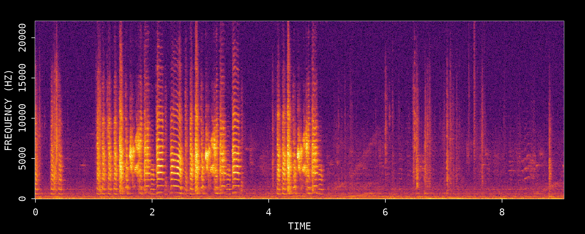
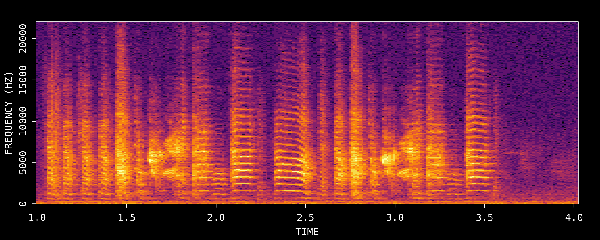
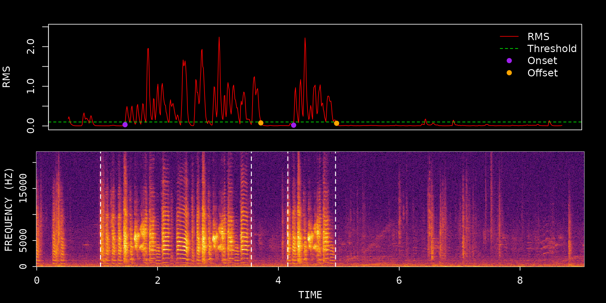
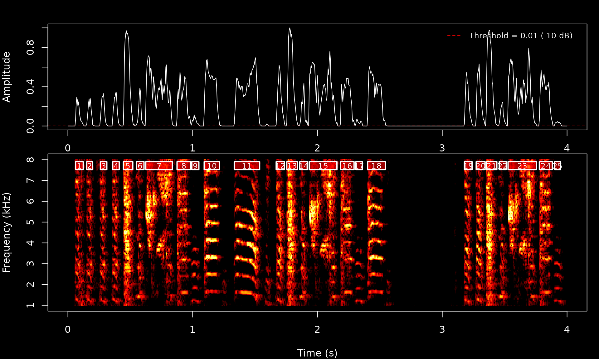
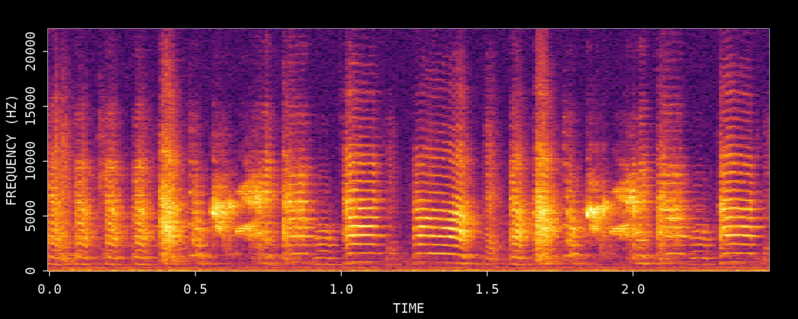
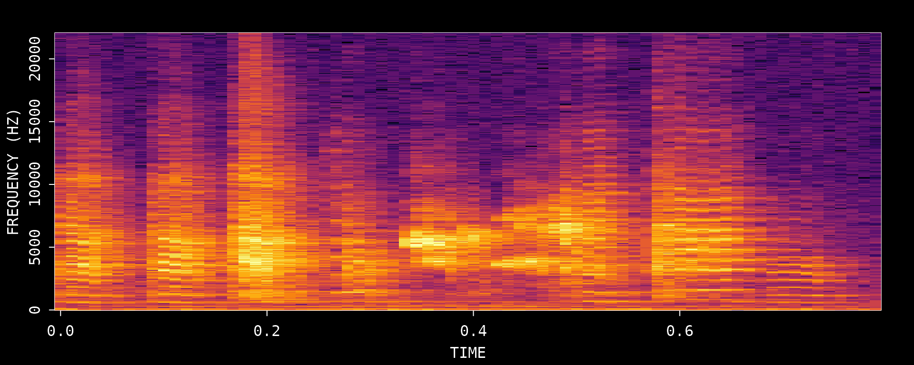

# Overview: ASAP 101

## Introduction

This vignette is the quickest way to get oriented with ASAP on a single
WAV file. While ASAP is designed for large-scale longitudinal studies,
the core functions work directly on individual recordings, which makes
them a useful starting point for learning the workflow.

The goal here is not to exhaust every function in the package. Instead,
this article introduces the basic sequence most users need when first
opening a new recording: inspect the song, detect bouts, segment
syllables, and export a clean example clip.

**What you will learn**:

1.  How to inspect a WAV file with ASAP spectrogram tools
2.  How to detect bouts and segment syllables in a single recording
3.  How to export a detected bout as a standalone WAV clip

------------------------------------------------------------------------

## Overview

Single-file analysis is the fastest way to understand how ASAP behaves
before moving on to SAP-object workflows. The same core functions used
here also power the larger longitudinal tutorials, but running them on
one example file makes it much easier to tune parameters and visually
check the results.

## Setup

``` r
library(ASAP)
#> ASAP v0.3.5 loaded.

# Get path to example WAV file included with the package
wav_file <- system.file("extdata", "zf_example.wav", package = "ASAP")
```

------------------------------------------------------------------------

## 1. Audio Visualization

The
[`visualize_song()`](https://lxiao06.github.io/ASAP/reference/visualize_song.md)
function creates spectrogram visualizations of audio recordings. This is
often the first step when inspecting a new recording.

### Full recording

``` r
visualize_song(wav_file)
```



    #> Song visualization completed for: zf_example.wav

### Specific time window

You can focus on a smaller time range with `start_time_in_second` and
`end_time_in_second`:

``` r
visualize_song(
  wav_file,
  start_time_in_second = 1,
  end_time_in_second = 4
)
```



    #> Song visualization completed for: zf_example.wav

Use this zoomed view to sanity-check whether the recording contains
clear song, where dense singing occurs, and which time window is a good
candidate for the next analysis steps.

------------------------------------------------------------------------

## 2. Bout Detection

A “bout” is a continuous period of singing. The
[`find_bout()`](https://lxiao06.github.io/ASAP/reference/find_bout.md)
function detects bout boundaries using RMS amplitude thresholding after
bandpass filtering.

``` r
bouts <- find_bout(
  wav_file,
  rms_threshold = 0.1,
  min_duration = 0.7,
  plot = TRUE
)
```



``` r

knitr::kable(bouts, digits = 3)
```

| filename       | selec | start_time | end_time |
|:---------------|------:|-----------:|---------:|
| zf_example.wav |     1 |      1.057 |    3.553 |
| zf_example.wav |     2 |      4.156 |    4.946 |

### Key parameters

- `rms_threshold`: Higher values require louder sounds; lower values
  detect quieter vocalizations
- `min_duration`: Minimum bout length (filters out short sounds or
  noise)
- `freq_range`: Bandpass filter range (default: 1-8 kHz for zebra finch)

### Quality control

The overlaid detection plot is the main QC step for bout finding. Check
whether the detected start and end times match the visible song energy
in the spectrogram. If bouts are being split too aggressively, try
increasing `gap_duration` or lowering `rms_threshold`. If short noise
events are being mistaken for song, increase `min_duration`.

------------------------------------------------------------------------

## 3. Syllable Segmentation

The [`segment()`](https://lxiao06.github.io/ASAP/reference/segment.md)
function detects individual syllables within a chosen time window using
dynamic spectral thresholding.

``` r
syllables <- segment(
  wav_file,
  start_time = 1,
  end_time = 5,
  flim = c(1, 8),
  silence_threshold = 0.01,
  min_syllable_ms = 20,
  max_syllable_ms = 240,
  min_level_db = 10,
  verbose = FALSE
)
```



``` r

knitr::kable(syllables, digits = 2)
```

| filename       | selec | threshold | .start | .end | start_time | end_time | duration | silence_gap |
|:---------------|------:|----------:|-------:|-----:|-----------:|---------:|---------:|------------:|
| zf_example.wav |     1 |        10 |   0.06 | 0.12 |       1.06 |     1.12 |     0.06 |          NA |
| zf_example.wav |     2 |        10 |   0.15 | 0.20 |       1.15 |     1.20 |     0.05 |        0.03 |
| zf_example.wav |     3 |        10 |   0.26 | 0.31 |       1.26 |     1.31 |     0.05 |        0.06 |
| zf_example.wav |     4 |        10 |   0.36 | 0.41 |       1.36 |     1.41 |     0.05 |        0.05 |
| zf_example.wav |     5 |        10 |   0.44 | 0.52 |       1.44 |     1.52 |     0.08 |        0.03 |
| zf_example.wav |     6 |        10 |   0.55 | 0.61 |       1.55 |     1.61 |     0.06 |        0.03 |
| zf_example.wav |     7 |        10 |   0.62 | 0.84 |       1.62 |     1.84 |     0.21 |        0.01 |
| zf_example.wav |     8 |        10 |   0.87 | 0.98 |       1.87 |     1.98 |     0.11 |        0.04 |
| zf_example.wav |     9 |        10 |   0.99 | 1.05 |       1.99 |     2.05 |     0.06 |        0.01 |
| zf_example.wav |    10 |        10 |   1.09 | 1.22 |       2.09 |     2.22 |     0.12 |        0.04 |
| zf_example.wav |    11 |        10 |   1.33 | 1.54 |       2.33 |     2.54 |     0.20 |        0.12 |
| zf_example.wav |    12 |        10 |   1.67 | 1.74 |       2.67 |     2.74 |     0.07 |        0.13 |
| zf_example.wav |    13 |        10 |   1.75 | 1.84 |       2.75 |     2.84 |     0.09 |        0.02 |
| zf_example.wav |    14 |        10 |   1.86 | 1.92 |       2.86 |     2.92 |     0.06 |        0.02 |
| zf_example.wav |    15 |        10 |   1.93 | 2.16 |       2.93 |     3.16 |     0.22 |        0.01 |
| zf_example.wav |    16 |        10 |   2.18 | 2.29 |       3.18 |     3.29 |     0.11 |        0.03 |
| zf_example.wav |    17 |        10 |   2.31 | 2.36 |       3.31 |     3.36 |     0.05 |        0.01 |
| zf_example.wav |    18 |        10 |   2.40 | 2.54 |       3.40 |     3.54 |     0.14 |        0.04 |
| zf_example.wav |    19 |        10 |   3.18 | 3.24 |       4.18 |     4.24 |     0.06 |        0.63 |
| zf_example.wav |    20 |        10 |   3.27 | 3.34 |       4.27 |     4.34 |     0.07 |        0.03 |
| zf_example.wav |    21 |        10 |   3.35 | 3.44 |       4.35 |     4.44 |     0.09 |        0.01 |
| zf_example.wav |    22 |        10 |   3.46 | 3.51 |       4.46 |     4.51 |     0.06 |        0.02 |
| zf_example.wav |    23 |        10 |   3.53 | 3.75 |       4.53 |     4.75 |     0.23 |        0.01 |
| zf_example.wav |    24 |        10 |   3.78 | 3.88 |       4.78 |     4.88 |     0.10 |        0.02 |
| zf_example.wav |    25 |        10 |   3.90 | 3.95 |       4.90 |     4.95 |     0.05 |        0.02 |

### Understanding the output

The returned data frame contains:

- `start_time`/`end_time`: Syllable boundaries in seconds
- `duration`: Syllable length
- `silence_gap`: Gap before the next syllable
- `selec`: Selection number for tracking

### Tuning tips

| Parameter           | Role                                 | Typical effect                                                          |
|---------------------|--------------------------------------|-------------------------------------------------------------------------|
| `silence_threshold` | Minimum silent gap between syllables | Lower values merge nearby events; higher values split more aggressively |
| `min_syllable_ms`   | Short-event filter                   | Increase to suppress clicks and noise                                   |
| `max_syllable_ms`   | Long-event filter                    | Decrease to avoid merging long phrases into one syllable                |
| `min_level_db`      | Detection threshold                  | Raise it for noisier files; lower it for quieter syllables              |

------------------------------------------------------------------------

## 4. Export Bout Clips

Once you are happy with bout detection, you can export bouts as
standalone WAV files. In this example we export **all detected bouts**
to a temporary directory, inspect the export metadata, visualize the
exported files, and then remove the temporary files at the end of the
vignette.

### Step 1: Create a temporary export directory

This keeps the example self-contained and avoids leaving extra files
behind after the vignette runs.

``` r
# Create a temporary directory for the exported WAV files
bout_export_dir <- file.path(tempdir(), "asap_bout_export")
dir.create(bout_export_dir, recursive = TRUE, showWarnings = FALSE)

# Initialize objects that will be filled in by the export step
bout_export_meta <- NULL
exported_bout_files <- character(0)
```

### Step 2: Export all detected bouts

[`create_bout_clips()`](https://lxiao06.github.io/ASAP/reference/create_bout_clips.md)
reads the bout table returned by
[`find_bout()`](https://lxiao06.github.io/ASAP/reference/find_bout.md)
and writes one WAV file per row. Because `bouts` already contains the
start and end times, we can pass the full data frame directly.

``` r
if (!is.null(bouts) && nrow(bouts) > 0) {
  bout_export_meta <- create_bout_clips(
    bouts,
    wav_dir = dirname(wav_file),
    output_dir = bout_export_dir,
    output_format = "wav",
    write_metadata = FALSE,
    verbose = FALSE
  )
}
```

### Step 3: Review the export metadata

The returned metadata table records which bout was exported, where it
came from, and where the generated WAV file was written.

``` r
if (!is.null(bout_export_meta) && nrow(bout_export_meta) > 0) {
  exported_bout_files <- bout_export_meta$output_path

  knitr::kable(
    bout_export_meta[, c("clip_id", "start_time", "end_time", "duration", "output_path")],
    digits = 3
  )
}
```

| clip_id  | start_time | end_time | duration | output_path                                                                  |
|:---------|-----------:|---------:|---------:|:-----------------------------------------------------------------------------|
| bout_001 |      1.057 |    3.553 |    2.496 | /tmp/Rtmp4ZVVMs/asap_bout_export/bouts/unknown_bird/unknown_day/bout_001.wav |
| bout_002 |      4.156 |    4.946 |    0.789 | /tmp/Rtmp4ZVVMs/asap_bout_export/bouts/unknown_bird/unknown_day/bout_002.wav |

### Step 4: Visualize the exported bout files

Because this example recording only contains two bouts, we can inspect
every exported clip directly.

``` r
if (length(exported_bout_files) > 0) {
  for (i in seq_along(exported_bout_files)) {
    visualize_song(exported_bout_files[i])
  }
}
#> Song visualization completed for: bout_001.wav
#> Song visualization completed for: bout_002.wav
```



In longer workflows, exporting all bouts is a convenient way to create a
clean set of song clips for manual review or downstream analysis. The
metadata table is especially useful for tracing each exported clip back
to the original WAV file and bout boundaries.

------------------------------------------------------------------------

## Next Steps

After you are comfortable with these basics, the next two
single-recording vignettes extend the workflow in two different
directions:

- [Motif
  Detection](https://lxiao06.github.io/ASAP/articles/motif_detection.md) -
  Template matching on a single WAV file
- [Acoustic Feature
  Analysis](https://lxiao06.github.io/ASAP/articles/acoustic_feature_analysis.md) -
  Spectral entropy, pitch, and amplitude-envelope analysis

## Session Info

``` r
sessionInfo()
#> R version 4.5.3 (2026-03-11)
#> Platform: x86_64-pc-linux-gnu
#> Running under: Ubuntu 24.04.4 LTS
#> 
#> Matrix products: default
#> BLAS:   /usr/lib/x86_64-linux-gnu/openblas-pthread/libblas.so.3 
#> LAPACK: /usr/lib/x86_64-linux-gnu/openblas-pthread/libopenblasp-r0.3.26.so;  LAPACK version 3.12.0
#> 
#> locale:
#>  [1] LC_CTYPE=C.UTF-8       LC_NUMERIC=C           LC_TIME=C.UTF-8       
#>  [4] LC_COLLATE=C.UTF-8     LC_MONETARY=C.UTF-8    LC_MESSAGES=C.UTF-8   
#>  [7] LC_PAPER=C.UTF-8       LC_NAME=C              LC_ADDRESS=C          
#> [10] LC_TELEPHONE=C         LC_MEASUREMENT=C.UTF-8 LC_IDENTIFICATION=C   
#> 
#> time zone: UTC
#> tzcode source: system (glibc)
#> 
#> attached base packages:
#> [1] stats     graphics  grDevices utils     datasets  methods   base     
#> 
#> other attached packages:
#> [1] ASAP_0.3.5
#> 
#> loaded via a namespace (and not attached):
#>  [1] sass_0.4.10        generics_0.1.4     tidyr_1.3.2        lattice_0.22-9    
#>  [5] digest_0.6.39      magrittr_2.0.4     evaluate_1.0.5     grid_4.5.3        
#>  [9] RColorBrewer_1.1-3 fastmap_1.2.0      jsonlite_2.0.0     Matrix_1.7-4      
#> [13] tuneR_1.4.7        purrr_1.2.1        scales_1.4.0       pbapply_1.7-4     
#> [17] textshaping_1.0.5  jquerylib_0.1.4    cli_3.6.5          rlang_1.1.7       
#> [21] pbmcapply_1.5.1    fftw_1.0-9         seewave_2.2.4      cachem_1.1.0      
#> [25] yaml_2.3.12        av_0.9.6           tools_4.5.3        parallel_4.5.3    
#> [29] dplyr_1.2.0        ggplot2_4.0.2      reticulate_1.45.0  vctrs_0.7.2       
#> [33] R6_2.6.1           png_0.1-9          lifecycle_1.0.5    fs_2.0.1          
#> [37] MASS_7.3-65        ragg_1.5.2         pkgconfig_2.0.3    desc_1.4.3        
#> [41] pkgdown_2.2.0      pillar_1.11.1      bslib_0.10.0       gtable_0.3.6      
#> [45] glue_1.8.0         Rcpp_1.1.1         systemfonts_1.3.2  xfun_0.57         
#> [49] tibble_3.3.1       tidyselect_1.2.1   knitr_1.51         farver_2.1.2      
#> [53] htmltools_0.5.9    patchwork_1.3.2    rmarkdown_2.31     signal_1.8-1      
#> [57] compiler_4.5.3     S7_0.2.1
```
