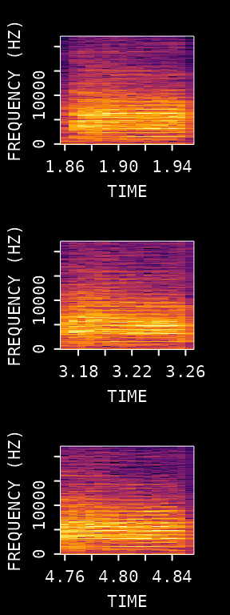
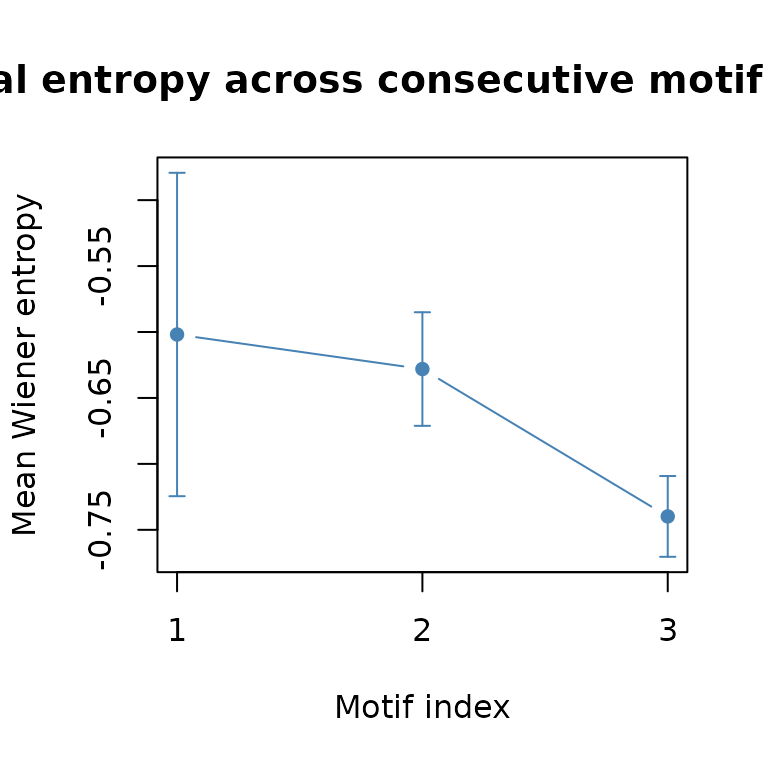
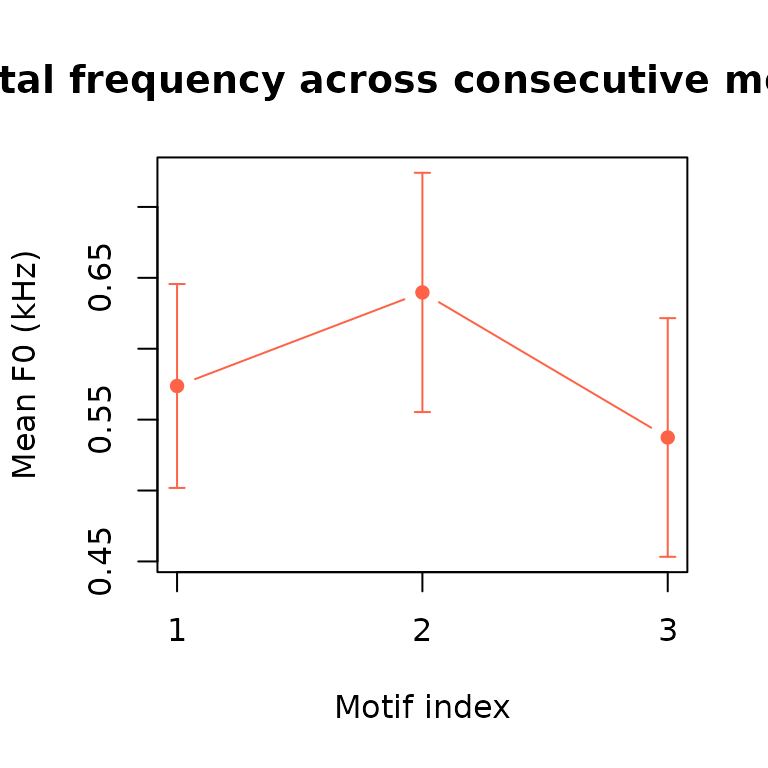
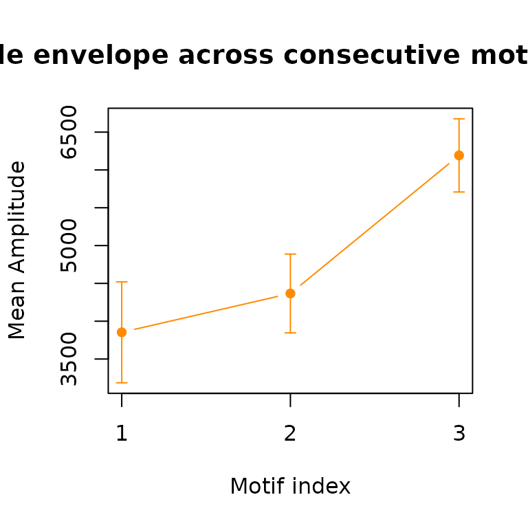

# Advanced Acoustic Feature Analysis

## Introduction

This vignette shows how to detect motifs in a single recording and
extract quantitative acoustic features from a selected syllable across
repeated renditions.

**Prerequisites**: Before reading this vignette, we recommend
completing:

- [Overview: ASAP
  101](https://lxiao06.github.io/ASAP/dev/articles/single_wav_analysis.md)
- [Motif
  Detection](https://lxiao06.github.io/ASAP/dev/articles/motif_detection.md)
- [Acoustic Feature
  Analysis](https://lxiao06.github.io/ASAP/dev/articles/acoustic_feature_analysis.md)

**What you will learn**:

1.  How to recap motif detection in a few key lines
2.  How to define a syllable window of interest relative to motif
    boundaries
3.  How to iterate
    [`spectral_entropy()`](https://lxiao06.github.io/ASAP/dev/reference/spectral_entropy.md),
    [`FF()`](https://lxiao06.github.io/ASAP/dev/reference/Fundamental_Frequency.md),
    and
    [`amp_env()`](https://lxiao06.github.io/ASAP/dev/reference/amp_env.md)
    over all motifs to build a per-motif feature table
4.  How to summarize and visualize feature trajectories across
    renditions

------------------------------------------------------------------------

## Overview.

The workflow has three steps:

1.  Detect repeated motifs in the recording
2.  Define a consistent syllable window within each motif
3.  Measure entropy, pitch, and amplitude for that window and summarize
    the results across renditions

------------------------------------------------------------------------

## Setup

``` r
library(ASAP)
#> ASAP v0.3.5.9000 loaded.

wav_file <- system.file("extdata", "zf_example.wav", package = "ASAP")
wav_dir <- dirname(wav_file)
```

------------------------------------------------------------------------

## Motif Detection

The visualization and parameter-tuning steps are covered in detail in
the [Motif
Detection](https://lxiao06.github.io/ASAP/dev/articles/motif_detection.md)
vignette. Here we recap only the core lines needed to produce the
`motifs` table that drives Phase 2.

``` r
# 1. Extract a reference clip and build a template from syllable "d"
clip_path <- create_audio_clip(wav_file, start_time = 1, end_time = 2.5)
#> Song clip clip_zf_example.wav is generated.

template <- create_template(clip_path,
  template_name  = "d",
  start_time     = 0.72,
  end_time       = 0.84,
  freq_min       = 1,
  freq_max       = 10,
  write_template = FALSE
)
#> 
#> Automatic point selection.
#> 
#> Done.

# 2. Detect template occurrences across the full recording
template_matches <- detect_template(
  x                = wav_file,
  template         = template,
  proximity_window = 1,
  save_plot        = FALSE
)

# 3. Expand each detection into full-motif boundaries
motifs <- find_motif(template_matches,
  pre_time = 0.7,
  lag_time = 0.5,
  wav_dir  = wav_dir
)
#> Processed zf_example.wav: 3/3 valid motifs (0 excluded)
#> Total valid motifs found: 3 (excluded: 0)

knitr::kable(motifs, digits = 3)
```

| filename       | detection_time | start_time | end_time | duration |
|:---------------|---------------:|-----------:|---------:|---------:|
| zf_example.wav |           1.76 |       1.06 |     2.26 |      1.2 |
| zf_example.wav |           3.07 |       2.37 |     3.57 |      1.2 |
| zf_example.wav |           4.66 |       3.96 |     5.16 |      1.2 |

------------------------------------------------------------------------

## Selecting a Syllable Window of Interest

Rather than analyzing the entire motif, we focus on a specific syllable
to reduce noise and make comparisons more precise. We define the
syllable window as a fixed offset **relative to each motif’s
`start_time`**.

Based on visual inspection of the motif spectrogram (see the [Motif
Detection](https://lxiao06.github.io/ASAP/dev/articles/motif_detection.md)
vignette), syllable “e” falls roughly 0.78–0.85 s after the motif onset.
We encode these offsets once so they are applied consistently across
every motif row.

``` r
# Offsets from each motif's start_time (seconds) — syllable "e"
syl_pre <- 0.8 # syllable onset relative to motif start
syl_post <- 0.85 # syllable offset relative to motif start

# Build a per-motif data frame for the syllable window
syl_windows <- motifs
syl_windows$start_time <- motifs$start_time + syl_pre
syl_windows$end_time <- motifs$start_time + syl_post
syl_windows$duration <- syl_post - syl_pre

knitr::kable(syl_windows[, c("filename", "start_time", "end_time", "duration")],
  digits = 3
)
```

| filename       | start_time | end_time | duration |
|:---------------|-----------:|---------:|---------:|
| zf_example.wav |       1.86 |     1.91 |     0.05 |
| zf_example.wav |       3.17 |     3.22 |     0.05 |
| zf_example.wav |       4.76 |     4.81 |     0.05 |

Use
[`visualize_segments()`](https://lxiao06.github.io/ASAP/dev/reference/visualize_segments.md)
to inspect the syllable “e” window across **all** detected motifs at
once. Consistent spectrogram structure across panels confirms the offset
is correctly aligned before committing it to the feature-extraction
loop.

``` r
visualize_segments(syl_windows,
  wav_dir   = wav_dir,
  n_samples = nrow(syl_windows)
)
#> Song visualization completed for: zf_example.wav
#> Song visualization completed for: zf_example.wav
```



    #> Song visualization completed for: zf_example.wav

## Feature Extraction Across All Motifs

We now iterate over every row of `syl_windows` and compute three
features. Each function accepts a single-row data frame plus `wav_dir`,
so the pattern is uniform for all three.

### 3a. Spectral Entropy

``` r
entropy_results <- vector("list", nrow(syl_windows))

for (i in seq_len(nrow(syl_windows))) {
  row <- syl_windows[i, , drop = FALSE]

  # spectral_entropy() returns a 2-column matrix: [time, entropy]
  ent_mat <- spectral_entropy(
    row,
    wav_dir    = wav_dir,
    method     = "wiener",
    normalize  = FALSE,
    plot       = FALSE
  )

  n_frames <- sum(!is.na(ent_mat[, 2]))
  entropy_results[[i]] <- data.frame(
    motif_index  = i,
    start_time   = row$start_time,
    mean_entropy = mean(ent_mat[, 2], na.rm = TRUE),
    sem_entropy  = sd(ent_mat[, 2], na.rm = TRUE) / sqrt(n_frames)
  )
}

entropy_df <- do.call(rbind, entropy_results)
knitr::kable(entropy_df, digits = 4)
```

| motif_index | start_time | mean_entropy | sem_entropy |
|------------:|-----------:|-------------:|------------:|
|           1 |       1.86 |      -0.6019 |      0.1226 |
|           2 |       3.17 |      -0.6281 |      0.0431 |
|           3 |       4.76 |      -0.7398 |      0.0306 |

### 3b. Fundamental Frequency

``` r
ff_results <- vector("list", nrow(syl_windows))

for (i in seq_len(nrow(syl_windows))) {
  row <- syl_windows[i, , drop = FALSE]

  # FF() returns a 2-column matrix: [time, frequency (kHz)]
  ff_mat <- FF(
    row,
    wav_dir   = wav_dir,
    method    = "cepstrum",
    fmax      = 1000,
    threshold = 10,
    plot      = FALSE
  )

  # Exclude zeros (unvoiced frames)
  voiced <- ff_mat[ff_mat[, 2] > 0, 2]

  ff_results[[i]] <- data.frame(
    motif_index = i,
    start_time  = row$start_time,
    mean_ff_kHz = ifelse(length(voiced) > 0, mean(voiced, na.rm = TRUE), NA_real_),
    sem_ff_kHz  = ifelse(length(voiced) > 0, sd(voiced, na.rm = TRUE) / sqrt(length(voiced)), NA_real_)
  )
}

ff_df <- do.call(rbind, ff_results)
knitr::kable(ff_df, digits = 4)
```

| motif_index | start_time | mean_ff_kHz | sem_ff_kHz |
|------------:|-----------:|------------:|-----------:|
|           1 |       1.86 |      0.5737 |     0.0719 |
|           2 |       3.17 |      0.6397 |     0.0844 |
|           3 |       4.76 |      0.5374 |     0.0841 |

### 3c. Amplitude Envelope

We summarize the envelope by its peak amplitude and the time-averaged
RMS, which together capture both the loudness ceiling and the mean
energy.

``` r
env_results <- vector("list", nrow(syl_windows))

for (i in seq_len(nrow(syl_windows))) {
  row <- syl_windows[i, , drop = FALSE]

  # amp_env() returns a numeric vector of envelope values
  env <- amp_env(
    row,
    wav_dir       = wav_dir,
    msmooth       = c(256, 50),
    plot          = FALSE
  )

  n_env <- sum(!is.na(env))
  env_results[[i]] <- data.frame(
    motif_index = i,
    start_time  = row$start_time,
    mean_amp    = mean(env, na.rm = TRUE),
    sem_amp     = sd(env, na.rm = TRUE) / sqrt(n_env),
    rms_amp     = sqrt(mean(env^2, na.rm = TRUE))
  )
}

env_df <- do.call(rbind, env_results)
knitr::kable(env_df, digits = 4)
```

| motif_index | start_time | mean_amp |  sem_amp |  rms_amp |
|------------:|-----------:|---------:|---------:|---------:|
|           1 |       1.86 | 3853.205 | 667.5323 | 4640.170 |
|           2 |       3.17 | 4366.645 | 520.8094 | 4810.013 |
|           3 |       4.76 | 6192.217 | 483.9166 | 6469.635 |

------------------------------------------------------------------------

## Combine and Visualize Feature Trajectories

Merge all three feature tables and look at how each metric changes
across consecutive motif renditions.

``` r
feature_df <- Reduce(
  function(a, b) merge(a, b, by = c("motif_index", "start_time")),
  list(entropy_df, ff_df, env_df)
)

knitr::kable(feature_df, digits = 4)
```

| motif_index | start_time | mean_entropy | sem_entropy | mean_ff_kHz | sem_ff_kHz | mean_amp |  sem_amp |  rms_amp |
|------------:|-----------:|-------------:|------------:|------------:|-----------:|---------:|---------:|---------:|
|           1 |       1.86 |      -0.6019 |      0.1226 |      0.5737 |     0.0719 | 3853.205 | 667.5323 | 4640.170 |
|           2 |       3.17 |      -0.6281 |      0.0431 |      0.6397 |     0.0844 | 4366.645 | 520.8094 | 4810.013 |
|           3 |       4.76 |      -0.7398 |      0.0306 |      0.5374 |     0.0841 | 6192.217 | 483.9166 | 6469.635 |

### Average entropy across renditions

``` r
plot(
  feature_df$motif_index,
  feature_df$mean_entropy,
  type  = "b",
  pch   = 16,
  col   = "steelblue",
  ylim  = range(c(feature_df$mean_entropy - feature_df$sem_entropy,
                  feature_df$mean_entropy + feature_df$sem_entropy), na.rm = TRUE),
  xlab  = "Motif index",
  ylab  = "Mean Wiener entropy",
  main  = "Spectral entropy across consecutive motif renditions",
  xaxt  = "n"
)
axis(1, at = feature_df$motif_index)

# ±1 SEM ribbon
arrows(
  x0     = feature_df$motif_index,
  y0     = feature_df$mean_entropy - feature_df$sem_entropy,
  y1     = feature_df$mean_entropy + feature_df$sem_entropy,
  length = 0.04,
  angle  = 90,
  code   = 3,
  col    = "steelblue"
)
```



### Mean fundamental frequency across renditions

``` r
plot(
  feature_df$motif_index,
  feature_df$mean_ff_kHz,
  type  = "b",
  pch   = 16,
  col   = "tomato",
  ylim  = range(c(feature_df$mean_ff_kHz - feature_df$sem_ff_kHz,
                  feature_df$mean_ff_kHz + feature_df$sem_ff_kHz), na.rm = TRUE),
  xlab  = "Motif index",
  ylab  = "Mean F0 (kHz)",
  main  = "Fundamental frequency across consecutive motif renditions",
  xaxt  = "n"
)
axis(1, at = feature_df$motif_index)

arrows(
  x0     = feature_df$motif_index,
  y0     = feature_df$mean_ff_kHz - feature_df$sem_ff_kHz,
  y1     = feature_df$mean_ff_kHz + feature_df$sem_ff_kHz,
  length = 0.04,
  angle  = 90,
  code   = 3,
  col    = "tomato"
)
```



### Envelope amplitude across renditions

``` r
plot(
  feature_df$motif_index,
  feature_df$mean_amp,
  type  = "b",
  pch   = 16,
  col   = "darkorange",
  ylim  = range(c(feature_df$mean_amp - feature_df$sem_amp,
                  feature_df$mean_amp + feature_df$sem_amp), na.rm = TRUE),
  xlab  = "Motif index",
  ylab  = "Mean Amplitude",
  main  = "Amplitude envelope across consecutive motif renditions",
  xaxt  = "n"
)
axis(1, at = feature_df$motif_index)

arrows(
  x0     = feature_df$motif_index,
  y0     = feature_df$mean_amp - feature_df$sem_amp,
  y1     = feature_df$mean_amp + feature_df$sem_amp,
  length = 0.04,
  angle  = 90,
  code   = 3,
  col    = "darkorange"
)
```



------------------------------------------------------------------------

## Exporting the Feature Table

The combined `feature_df` is a standard R data frame ready for any
downstream analysis.

``` r
# Save as CSV for use in other tools or scripts
write.csv(feature_df,
  file      = "syllable_features.csv",
  row.names = FALSE
)
```

------------------------------------------------------------------------

## Summary

This vignette demonstrated a complete single-recording pipeline that
bridges motif detection and acoustic feature analysis:

| Phase           | Key steps                                                                                                                                                             | Output                             |
|-----------------|-----------------------------------------------------------------------------------------------------------------------------------------------------------------------|------------------------------------|
| Motif detection | [`detect_template()`](https://lxiao06.github.io/ASAP/dev/reference/detect_template.md) → [`find_motif()`](https://lxiao06.github.io/ASAP/dev/reference/find_motif.md) | `motifs` data frame                |
| Syllable window | Fixed offset from `start_time`                                                                                                                                        | `syl_windows` data frame           |
| Entropy         | [`spectral_entropy()`](https://lxiao06.github.io/ASAP/dev/reference/spectral_entropy.md) per row                                                                      | Mean ± SEM per motif               |
| Pitch           | [`FF()`](https://lxiao06.github.io/ASAP/dev/reference/Fundamental_Frequency.md) per row, voiced frames only                                                           | Mean F0 ± SEM per motif            |
| Envelope        | [`amp_env()`](https://lxiao06.github.io/ASAP/dev/reference/amp_env.md) per row                                                                                        | Mean ± SEM, RMS per motif          |
| Visualization   | Base R [`plot()`](https://rdrr.io/r/graphics/plot.default.html)                                                                                                       | Trajectory plots across renditions |

The same pattern — iterate per row, collect scalar summaries, bind into
a data frame — scales directly to larger datasets by replacing the `for`
loop with [`lapply()`](https://rdrr.io/r/base/lapply.html) or
[`parallel_apply()`](https://lxiao06.github.io/ASAP/dev/reference/parallel_apply.md),
or by passing a multi-row data frame directly to
[`spectral_entropy()`](https://lxiao06.github.io/ASAP/dev/reference/spectral_entropy.md)
or
[`FF()`](https://lxiao06.github.io/ASAP/dev/reference/Fundamental_Frequency.md).

------------------------------------------------------------------------

## Session Info

``` r
sessionInfo()
#> R version 4.5.3 (2026-03-11)
#> Platform: x86_64-pc-linux-gnu
#> Running under: Ubuntu 24.04.4 LTS
#> 
#> Matrix products: default
#> BLAS:   /usr/lib/x86_64-linux-gnu/openblas-pthread/libblas.so.3 
#> LAPACK: /usr/lib/x86_64-linux-gnu/openblas-pthread/libopenblasp-r0.3.26.so;  LAPACK version 3.12.0
#> 
#> locale:
#>  [1] LC_CTYPE=C.UTF-8       LC_NUMERIC=C           LC_TIME=C.UTF-8       
#>  [4] LC_COLLATE=C.UTF-8     LC_MONETARY=C.UTF-8    LC_MESSAGES=C.UTF-8   
#>  [7] LC_PAPER=C.UTF-8       LC_NAME=C              LC_ADDRESS=C          
#> [10] LC_TELEPHONE=C         LC_MEASUREMENT=C.UTF-8 LC_IDENTIFICATION=C   
#> 
#> time zone: UTC
#> tzcode source: system (glibc)
#> 
#> attached base packages:
#> [1] stats     graphics  grDevices utils     datasets  methods   base     
#> 
#> other attached packages:
#> [1] ASAP_0.3.5.9000
#> 
#> loaded via a namespace (and not attached):
#>  [1] sass_0.4.10        generics_0.1.4     tidyr_1.3.2        lattice_0.22-9    
#>  [5] digest_0.6.39      magrittr_2.0.4     evaluate_1.0.5     grid_4.5.3        
#>  [9] RColorBrewer_1.1-3 fastmap_1.2.0      jsonlite_2.0.0     Matrix_1.7-4      
#> [13] monitoR_1.2        tuneR_1.4.7        purrr_1.2.1        scales_1.4.0      
#> [17] pbapply_1.7-4      textshaping_1.0.5  jquerylib_0.1.4    cli_3.6.5         
#> [21] rlang_1.1.7        pbmcapply_1.5.1    fftw_1.0-9         withr_3.0.2       
#> [25] seewave_2.2.4      cachem_1.1.0       yaml_2.3.12        av_0.9.6          
#> [29] tools_4.5.3        parallel_4.5.3     dplyr_1.2.0        ggplot2_4.0.2     
#> [33] reticulate_1.45.0  vctrs_0.7.2        R6_2.6.1           png_0.1-9         
#> [37] lifecycle_1.0.5    fs_2.0.1           MASS_7.3-65        ragg_1.5.2        
#> [41] pkgconfig_2.0.3    desc_1.4.3         pkgdown_2.2.0      pillar_1.11.1     
#> [45] bslib_0.10.0       gtable_0.3.6       glue_1.8.0         Rcpp_1.1.1        
#> [49] systemfonts_1.3.2  xfun_0.57          tibble_3.3.1       tidyselect_1.2.1  
#> [53] knitr_1.51         farver_2.1.2       htmltools_0.5.9    patchwork_1.3.2   
#> [57] rmarkdown_2.31     signal_1.8-1       compiler_4.5.3     S7_0.2.1
```
