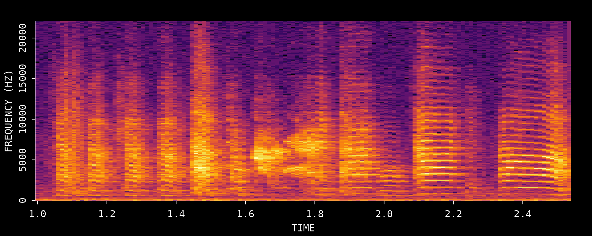
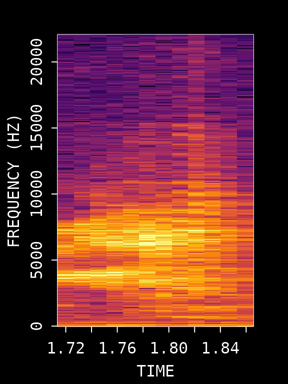
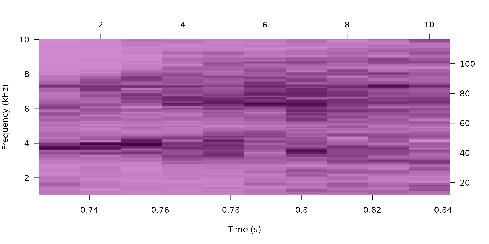
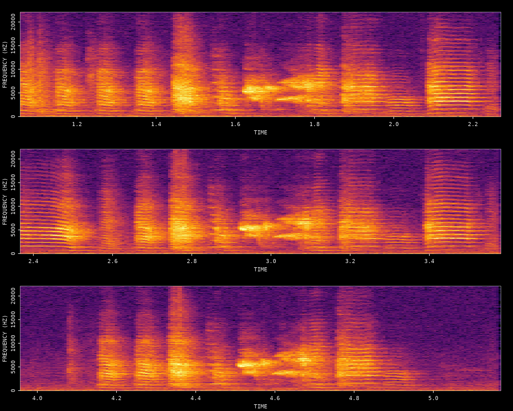
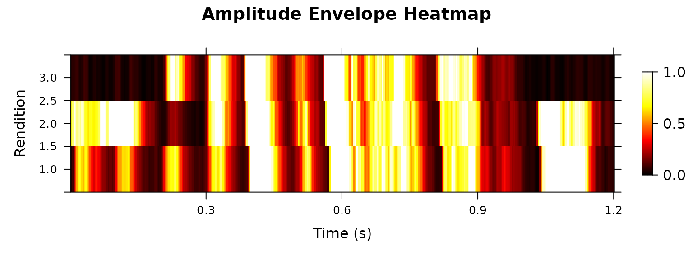
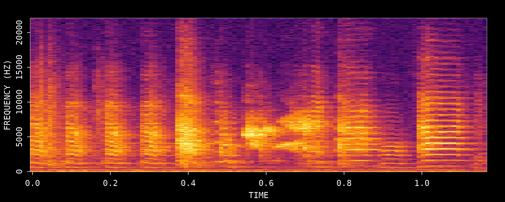
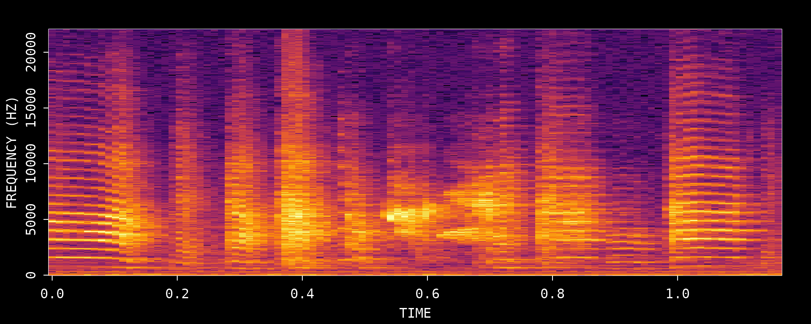
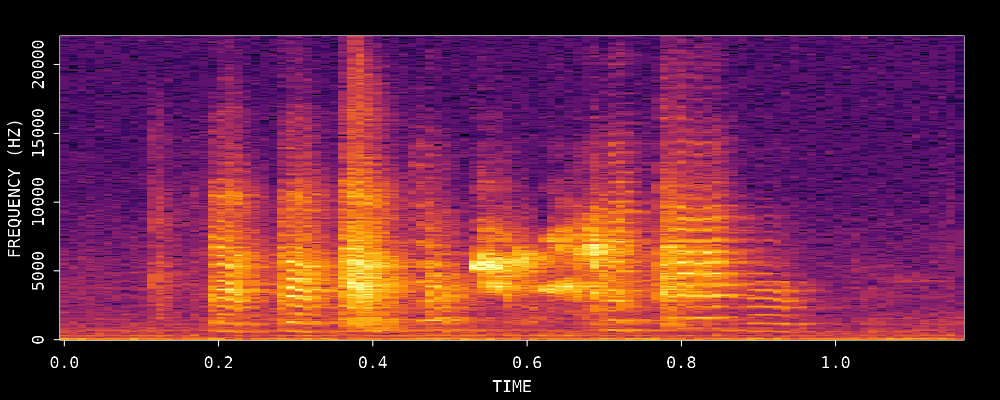

# Motif Detection

## Introduction

This vignette demonstrates how to find and extract **song motifs** from
a single zebra finch WAV file using ASAP’s template matching workflow. A
motif is the stereotyped sequence of syllables that adult male zebra
finches repeat during singing.

This tutorial introduces the core logic of template-based motif
detection in ASAP. The emphasis is on interactively optimizing a
reliable “anchor” template using one recording before carrying the same
strategy into longitudinal analysis.

**Prerequisites**: Before reading this vignette, we recommend
completing:

- [Overview: ASAP
  101](https://lxiao06.github.io/ASAP/dev/articles/single_wav_analysis.md) -
  Basic ASAP functions

**What you will learn**:

1.  How to choose a good reference motif from a single recording
2.  How to create and test a syllable template for motif detection
3.  How to verify extracted motifs with spectrograms and heatmaps
4.  How to export detected motifs as standalone clips

------------------------------------------------------------------------

## Overview

Motif detection in ASAP is an iterative single-file workflow: identify a
clear motif rendition, choose a distinctive anchor syllable, detect that
template throughout the recording, and then inspect the extracted
motifs. Unlike the SAP object tutorials, the goal here is not to present
a full batch-processing pipeline. Instead, this vignette focuses on the
small decisions that make a template robust before you scale up.

> **Iterative optimization**: Steps 3-6 should usually be repeated more
> than once. Refining the template is the most important part of getting
> reliable motif boundaries later in longitudinal analysis.

------------------------------------------------------------------------

## Setup

``` r
library(ASAP)
#> ASAP v0.3.5.9000 loaded.

# Get path to example WAV file included with the package
wav_file <- system.file("extdata", "zf_example.wav", package = "ASAP")
```

------------------------------------------------------------------------

## 1. Visualize the Song

First, let’s look at the full recording to identify motif structure:

``` r
visualize_song(wav_file)
```


    #> Song visualization completed for: zf_example.wav

We can see multiple motif renditions in this recording. Let’s zoom in on
a clear section to identify a good reference motif:

``` r
visualize_song(wav_file,
  start_time_in_second = 1,
  end_time_in_second = 2.5
)
```



    #> Song visualization completed for: zf_example.wav

This zoomed view helps you choose a clean motif rendition with clear
syllable boundaries and minimal overlap from neighboring vocalizations.

------------------------------------------------------------------------

## 2. Create an Audio Clip

To create a template, we first extract an audio clip containing a clear
motif. We’ll use the segment from 1-2.5 seconds which contains a
complete motif.

``` r
# Create an audio clip from the WAV file
clip_path <- create_audio_clip(wav_file,
  start_time = 1,
  end_time = 2.5
)
#> Song clip clip_zf_example.wav is generated.

# View the created clip path
clip_path
#> [1] "/home/runner/work/_temp/Library/ASAP/extdata/templates/clip_zf_example.wav"
```

------------------------------------------------------------------------

## 3. Create a Template (Critical Step)

Creating a good template is **the most critical step** in the motif
detection workflow. The template serves as an “anchor point” that ASAP
uses to locate motifs throughout recordings. A poorly chosen template
will result in missed detections or false positives.

### Characteristics of a Good Template Syllable

When selecting a syllable for template creation, look for one that:

- **Is acoustically distinctive** - Has unique spectral features that
  differentiate it from other syllables and background noise
- **Occurs exactly once per motif** - Ensures one-to-one mapping between
  detections and motifs
- **Has clear temporal boundaries** - Sharp onset and offset for precise
  alignment
- **Is consistently produced** - Appears reliably across all motif
  renditions
- **Is stable across development** - If analyzing longitudinal data,
  choose a syllable that remains recognizable over time

### Template Selection Process

Based on the spectrogram above, we’ll use syllable “d” which occurs
around 0.72-0.84 seconds within our clip. Let’s visualize this specific
region:

``` r
# First, visualize the template region
visualize_song(wav_file,
  start_time_in_second = 1 + 0.72,
  end_time_in_second = 1 + 0.84
)
```



    #> Song visualization completed for: zf_example.wav

Now create the template with specified frequency bounds:

``` r
# Create the template
template <- create_template(clip_path,
  template_name = "d",
  start_time = 0.72,
  end_time = 0.84,
  freq_min = 1,
  freq_max = 10,
  write_template = FALSE
)
```



    #> 
    #> Automatic point selection.
    #> 
    #> Done.

    # View template info
    template
    #> 
    #> Object of class "corTemplateList"
    #>  containing  1  templates
    #>                                                           original.recording
    #> d /home/runner/work/_temp/Library/ASAP/extdata/templates/clip_zf_example.wav
    #>   sample.rate lower.frequency upper.frequency lower.amp upper.amp duration
    #> d       44100           1.034           9.991    -80.41         0    0.104
    #>   n.points score.cutoff
    #> d     1050          0.6

### Key Template Parameters

| Parameter             | Description           | Optimization Tips                                            |
|-----------------------|-----------------------|--------------------------------------------------------------|
| `start_time/end_time` | Syllable boundaries   | Adjust to capture complete syllable without gaps             |
| `freq_min/freq_max`   | Frequency range (kHz) | Narrow range reduces noise; 1-10 kHz typical for zebra finch |

### Tuning tips

- If the template matches too many unrelated sounds, narrow
  `freq_min/freq_max` around the most distinctive part of the syllable.
- If good motif renditions are being missed, expand the time window
  slightly so the full syllable is captured.
- Prefer a syllable that appears once per motif; repeated syllables are
  more likely to produce ambiguous detections.

------------------------------------------------------------------------

## 4. Detect Template Occurrences

Now we search for all occurrences of this template throughout the
recording:

``` r
# Run template detection on the original WAV file
# proximity_window filters out multiple detections within the same motif
template_matches <- detect_template(
  x = wav_file,
  template = template,
  proximity_window = 1, # Filter detections within 1s
  save_plot = FALSE
)

# View detection results
knitr::kable(template_matches, digits = 2)
```

| filename       | template | time | score |
|:---------------|:---------|-----:|------:|
| zf_example.wav | d        | 1.76 |  0.93 |
| zf_example.wav | d        | 3.07 |  0.77 |
| zf_example.wav | d        | 4.66 |  0.79 |

### Key Detection Parameters

| Parameter          | Description                                       | Purpose                                                                                                                |
|--------------------|---------------------------------------------------|------------------------------------------------------------------------------------------------------------------------|
| `proximity_window` | Time window (seconds) to filter nearby detections | Eliminates false positives within a motif duration. Only the highest-scoring detection within each window is retained. |
| `threshold`        | Minimum correlation score (0-1)                   | Set during template creation; detections below this score are discarded(available for sap method)                      |

### Evaluating Detection Quality

Review the detection results carefully:

- **Score column**: Higher scores indicate better matches. If scores are
  uniformly low, the template may need adjustment.
- **Number of detections**: Should match expected motif count based on
  visual inspection.
- **Detection spacing**: Detections should be evenly spaced if motifs
  occur regularly.

If detection results are unsatisfactory, **return to Step 3** and try:

- Different syllable selection
- Adjusting time boundaries
- Modifying frequency range

------------------------------------------------------------------------

## 5. Extract Motif Boundaries

Once we have reliable template detections, we define motif boundaries by
extending a fixed time window before and after each detection:

``` r
# Define motif boundaries around each detection
# pre_time: how much before the template to include
# lag_time: how much after the template to include
motifs <- find_motif(template_matches,
  pre_time = 0.7,
  lag_time = 0.5,
  wav_dir = dirname(wav_file)
)
#> Processed zf_example.wav: 3/3 valid motifs (0 excluded)
#> Total valid motifs found: 3 (excluded: 0)

# View extracted motifs
knitr::kable(motifs, digits = 2)
```

| filename       | detection_time | start_time | end_time | duration |
|:---------------|---------------:|-----------:|---------:|---------:|
| zf_example.wav |           1.76 |       1.06 |     2.26 |      1.2 |
| zf_example.wav |           3.07 |       2.37 |     3.57 |      1.2 |
| zf_example.wav |           4.66 |       3.96 |     5.16 |      1.2 |

### Adjusting Pre/Lag Times

| Parameter  | Description                 | Adjustment Strategy                           |
|------------|-----------------------------|-----------------------------------------------|
| `pre_time` | Time before template anchor | Should capture syllables preceding the anchor |
| `lag_time` | Time after template anchor  | Should capture syllables following the anchor |

------------------------------------------------------------------------

## 6. Visualize Detected Motifs

Let’s visualize the detected motifs to verify our detection worked
correctly:

``` r
# Visualize all extracted motifs
visualize_segments(motifs,
  wav_dir = dirname(wav_file),
  n_samples = min(nrow(motifs), 4)
)
#> Song visualization completed for: zf_example.wav
#> Song visualization completed for: zf_example.wav
```



    #> Song visualization completed for: zf_example.wav

### Quality Check

Examine the extracted motifs:

- Are all motifs complete (no truncation at boundaries)?
- Are motifs properly aligned?
- Are there any false positives (non-motif sounds)?
- Is the temporal structure consistent across renditions?

If issues are found, **iterate back through Steps 3-6** with adjusted
parameters.

------------------------------------------------------------------------

## 7. Amplitude Envelope Heatmap

Once satisfied with detection quality, create a heatmap of amplitude
envelopes across all detected motifs to visualize the temporal
structure:

``` r
# Plot amplitude envelope heatmap
plot_heatmap(motifs, wav_dir = dirname(wav_file))
```



A well-detected set of motifs will show consistent vertical banding
patterns corresponding to syllables across all renditions.

------------------------------------------------------------------------

## 8. Export Motif Clips

Once you are satisfied with the detected motif boundaries, you can
export each motif as its own WAV file. This is useful for manual review,
sharing examples, or preparing a small set of motif clips for downstream
analysis.

### Step 1: Create a temporary export directory

``` r
# Create a temporary directory for exported motif clips
motif_export_dir <- file.path(tempdir(), "asap_motif_export")
dir.create(motif_export_dir, recursive = TRUE, showWarnings = FALSE)

# Initialize objects filled in by the export step
motif_export_meta <- NULL
exported_motif_files <- character(0)
```

### Step 2: Export all detected motifs

[`create_motif_clips()`](https://lxiao06.github.io/ASAP/dev/reference/create_motif_clips.md)
reads the detected motif table and writes one WAV file per motif. For
this example recording, the three detected motifs are small enough that
we can export all of them.

``` r
if (!is.null(motifs) && nrow(motifs) > 0) {
  motif_export_meta <- create_motif_clips(
    motifs,
    wav_dir = dirname(wav_file),
    output_dir = motif_export_dir,
    output_format = "wav",
    write_metadata = FALSE,
    verbose = FALSE
  )
}
```

### Step 3: Review the export metadata

The returned metadata table tracks the original motif boundaries and the
output path of each generated file.

``` r
if (!is.null(motif_export_meta) && nrow(motif_export_meta) > 0) {
  exported_motif_files <- motif_export_meta$output_path

  knitr::kable(
    motif_export_meta[, c("clip_id", "start_time", "end_time", "duration", "output_path")],
    digits = 3
  )
}
```

| clip_id   | start_time | end_time | duration | output_path                                                                     |
|:----------|-----------:|---------:|---------:|:--------------------------------------------------------------------------------|
| motif_001 |       1.06 |     2.26 |      1.2 | /tmp/RtmpkKaJ6R/asap_motif_export/motifs/unknown_bird/unknown_day/motif_001.wav |
| motif_002 |       2.37 |     3.57 |      1.2 | /tmp/RtmpkKaJ6R/asap_motif_export/motifs/unknown_bird/unknown_day/motif_002.wav |
| motif_003 |       3.96 |     5.16 |      1.2 | /tmp/RtmpkKaJ6R/asap_motif_export/motifs/unknown_bird/unknown_day/motif_003.wav |

### Step 4: Visualize the exported motif files

Because this example only contains three motifs, we can inspect every
exported clip directly.

``` r
if (length(exported_motif_files) > 0) {
  for (i in seq_along(exported_motif_files)) {
    visualize_song(exported_motif_files[i])
  }
}
#> Song visualization completed for: motif_001.wav
#> Song visualization completed for: motif_002.wav
#> Song visualization completed for: motif_003.wav
```



------------------------------------------------------------------------

## Summary

This vignette demonstrated the core ASAP workflow for finding motifs in
a single recording. The key insight is that **template optimization is
an iterative process** — Steps 3-6 should be repeated until detection
results are satisfactory.

| Step | Function                                                                                     | Description                                   |
|------|----------------------------------------------------------------------------------------------|-----------------------------------------------|
| 1    | [`visualize_song()`](https://lxiao06.github.io/ASAP/dev/reference/visualize_song.md)         | View spectrogram to identify motifs           |
| 2    | [`create_audio_clip()`](https://lxiao06.github.io/ASAP/dev/reference/create_audio_clip.md)   | Extract a reference motif segment             |
| 3    | [`create_template()`](https://lxiao06.github.io/ASAP/dev/reference/create_template.md)       | Create a template from a distinctive syllable |
| 4    | [`detect_template()`](https://lxiao06.github.io/ASAP/dev/reference/detect_template.md)       | Find all template occurrences                 |
| 5    | [`find_motif()`](https://lxiao06.github.io/ASAP/dev/reference/find_motif.md)                 | Define motif boundaries around detections     |
| 6    | [`visualize_segments()`](https://lxiao06.github.io/ASAP/dev/reference/visualize_segments.md) | View extracted motif spectrograms             |
| 7    | [`plot_heatmap()`](https://lxiao06.github.io/ASAP/dev/reference/plot_heatmap.md)             | Visualize amplitude envelope patterns         |
| 8    | [`create_motif_clips()`](https://lxiao06.github.io/ASAP/dev/reference/create_motif_clips.md) | Export detected motifs as WAV clips           |

### Key Parameters Reference

| Parameter             | Description                          | Typical Value            |
|-----------------------|--------------------------------------|--------------------------|
| `start_time/end_time` | Template time limits (seconds)       | 0.1-0.2s duration        |
| `freq_min/freq_max`   | Frequency range (kHz)                | 1-10 kHz for zebra finch |
| `pre_time`            | Time before template for motif start | 0.2-0.8s                 |
| `lag_time`            | Time after template for motif end    | 0.2-0.8s                 |

## Next Steps: Longitudinal Recording Analysis with SAP Object

Once you have optimized template parameters using a single recording (as
demonstrated in this vignette), you can apply them to bulk processing of
longitudinal recordings using SAP objects.

The following vignettes cover the longitudinal analysis workflow:

- [**Constructing SAP
  Object**](https://lxiao06.github.io/ASAP/dev/articles/construct_sap_object.md) -
  How to organize and import longitudinal recording data
- [**Longitudinal Motif
  Detection**](https://lxiao06.github.io/ASAP/dev/articles/longitudinal_motif_detection.md) -
  Applying optimized templates across multiple recordings

------------------------------------------------------------------------

## Session Info

``` r
sessionInfo()
#> R version 4.5.3 (2026-03-11)
#> Platform: x86_64-pc-linux-gnu
#> Running under: Ubuntu 24.04.4 LTS
#> 
#> Matrix products: default
#> BLAS:   /usr/lib/x86_64-linux-gnu/openblas-pthread/libblas.so.3 
#> LAPACK: /usr/lib/x86_64-linux-gnu/openblas-pthread/libopenblasp-r0.3.26.so;  LAPACK version 3.12.0
#> 
#> locale:
#>  [1] LC_CTYPE=C.UTF-8       LC_NUMERIC=C           LC_TIME=C.UTF-8       
#>  [4] LC_COLLATE=C.UTF-8     LC_MONETARY=C.UTF-8    LC_MESSAGES=C.UTF-8   
#>  [7] LC_PAPER=C.UTF-8       LC_NAME=C              LC_ADDRESS=C          
#> [10] LC_TELEPHONE=C         LC_MEASUREMENT=C.UTF-8 LC_IDENTIFICATION=C   
#> 
#> time zone: UTC
#> tzcode source: system (glibc)
#> 
#> attached base packages:
#> [1] stats     graphics  grDevices utils     datasets  methods   base     
#> 
#> other attached packages:
#> [1] ASAP_0.3.5.9000
#> 
#> loaded via a namespace (and not attached):
#>  [1] sass_0.4.10        generics_0.1.4     tidyr_1.3.2        lattice_0.22-9    
#>  [5] digest_0.6.39      magrittr_2.0.5     evaluate_1.0.5     grid_4.5.3        
#>  [9] RColorBrewer_1.1-3 fastmap_1.2.0      jsonlite_2.0.0     Matrix_1.7-4      
#> [13] monitoR_1.2        tuneR_1.4.7        purrr_1.2.1        scales_1.4.0      
#> [17] pbapply_1.7-4      textshaping_1.0.5  jquerylib_0.1.4    cli_3.6.5         
#> [21] rlang_1.2.0        pbmcapply_1.5.1    withr_3.0.2        seewave_2.2.4     
#> [25] cachem_1.1.0       yaml_2.3.12        av_0.9.6           tools_4.5.3       
#> [29] parallel_4.5.3     dplyr_1.2.1        ggplot2_4.0.2      reticulate_1.45.0 
#> [33] vctrs_0.7.2        R6_2.6.1           png_0.1-9          lifecycle_1.0.5   
#> [37] fs_2.0.1           MASS_7.3-65        ragg_1.5.2         pkgconfig_2.0.3   
#> [41] desc_1.4.3         pkgdown_2.2.0      pillar_1.11.1      bslib_0.10.0      
#> [45] gtable_0.3.6       glue_1.8.0         Rcpp_1.1.1         systemfonts_1.3.2 
#> [49] xfun_0.57          tibble_3.3.1       tidyselect_1.2.1   knitr_1.51        
#> [53] farver_2.1.2       htmltools_0.5.9    patchwork_1.3.2    rmarkdown_2.31    
#> [57] signal_1.8-1       compiler_4.5.3     S7_0.2.1
```
