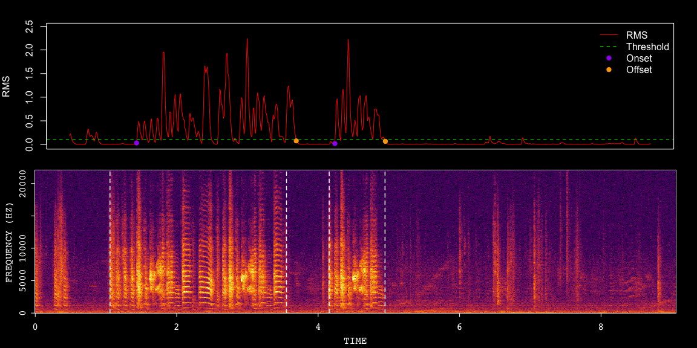
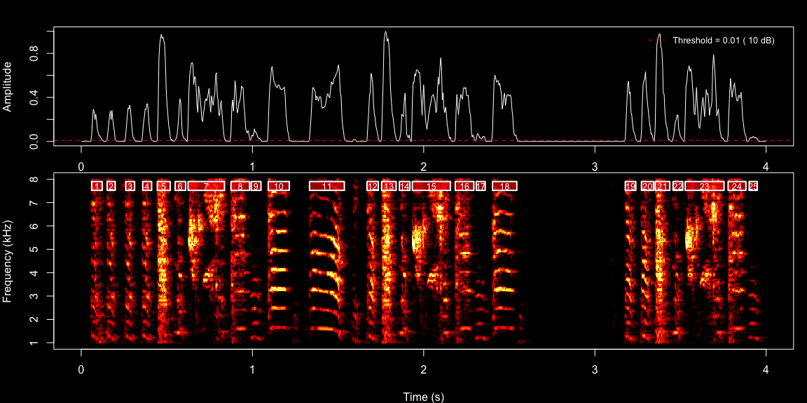
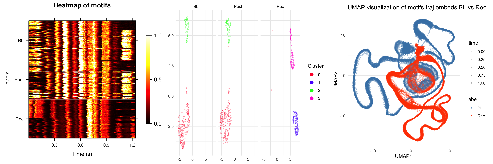

# ASAP

## Overview

ASAP (Automated Sound Analysis Pipeline) is an R toolkit designed for
the longitudinal analysis of birdsong development, specifically
optimized for tracking and studying the long-term vocalization patterns
of zebra finches.

The pipeline introduces a dedicated SAP object, which streamlines the
processing of recordings from the SAP2011 system or other sound data
organized with similar structures. Additionally, ASAP is built with
flexibility in mind, allowing for the integration of other objects to
ensure compatibility with various recording platforms.

### Key Features

- **Bout Detection**: Automatically identifies periods of singing within
  recordings.

- **Motif Extraction**: Extracts recurring song motifs for in-depth
  analysis.

- **Syllable Segmentation**: Breaks down songs into individual syllables
  for detailed study.

- **Template Matching**: Compares and matches song patterns against
  predefined templates.

- **Feature Extraction**: Extracts detailed temporal and spectral
  features from vocalizations.

- **Standardized Analytical Workflows**: Utilizes predefined workflows
  for consistent and efficient analysis.

## Installation

To install ASAP, I recommend using remotes:

``` r
require(remotes)
remotes::install_github("LXiao06/ASAP")
```

## Example

### Detecting Bout Boundaries and Syllable Segmentation

This example demonstrates how to use functions to detect **bout
boundaries** and perform **syllable segmentation** on a single WAV file
of a zebra finch recording.

``` r
library(ASAP)
# Get path to example WAV file
wav_file <- system.file("extdata", "zf_example.wav", package = "ASAP")
  
# Find bout
bouts <- find_bout(wav_file, rms_threshold= 0.1, min_duration = 0.7)
```



``` r

# Segmentation 
syllables <- segment(wav_file, start_time = 1, end_time = 5, flim = c(1, 8),
                     silence_threshold = 0.01, min_syllable_ms = 20, 
                     max_syllable_ms = 240, min_level_db = 10, verbose = FALSE)
```



### Standardized Song Analysis Pipeline for Motif Analysis

This example demonstrates a **song analysis pipeline** initiated by
creating a SAP object, which tracks and visualizes motif changes over
time using heatmaps and latent space projections.

``` r
# Create sap object 
sap <- create_sap_object(
  base_path = "/path/to/your/wav/file/directory",
  subfolders_to_include = c("190", "201", "203"),
  labels = c("BL", "Post", "Rec")
)

# A standardized pipeline for motif analysis
sap <- sap |>
  create_audio_clip(indices = 1, start_time = 1, end_time = 2.5,
                    clip_names = "m1") |>
  create_template(template_name = "d", clip_name = "m1",
                  start_time = 0.72,   end_time =  0.84,
                  freq_min = 1,  freq_max = 10,
                  threshold = 0.5, write_template = TRUE) |>
  detect_template(template_name = "d") |>
  find_motif(template_name = "d", pre_time = 0.7, lag_time = 0.5) |>
  analyze_spectral(balanced = TRUE) |>
  find_clusters() |>
  run_umap() |>
  create_trajectory_matrix(data_type = "feat.embeds", clusters = c(0, 1), balanced = TRUE) |>
  run_pca()  |>
  run_umap(data_type = "traj_mat", min_dist = 0.5)


# Visualization
sap <- sap |>
  plot_heatmap(balanced = TRUE, ordered = TRUE)|>
  plot_umap(split.by = "label") |>
  plot_umap2(data_type = "traj.embeds", overlay_mode = TRUE, 
             base_label = "BL", compare_labels ="Rec")
```


