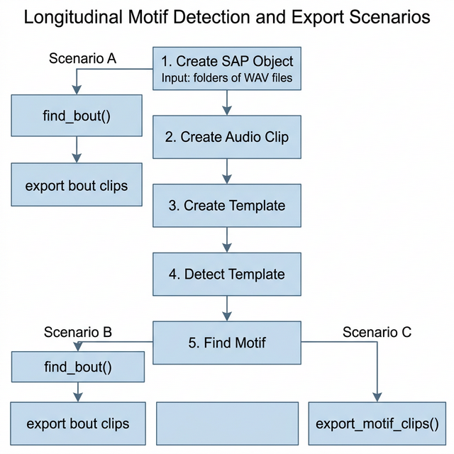

```{r, include = FALSE}
knitr::opts_chunk$set(
    collapse = TRUE,
    comment = "#>"
)
```

## Introduction

In longitudinal birdsong studies or large-scale bioacoustic projects, raw audio recordings can be massive and mostly consist of silence or irrelevant background noise. The ASAP package provides powerful tools—`create_bout_clips()` and `create_motif_clips()`—to export curated, highly specific audio clips from your recordings based on your detection results.

This vignette covers how to choose the right export strategy for your research needs, the differences between output formats, and how to tune key export arguments like amplitude normalization.

## Processing Scenarios

Depending on your downstream analysis, you may want to export long bouts that contain a mixture of vocalizations, filtered bouts that only contain learned song, or tightly cropped individual motifs. 

Here are the three primary export scenarios supported by ASAP:

```{r export-scenarios-diagram, echo = FALSE, eval = TRUE, out.width = "70%", fig.align = "center", fig.cap = "ASAP song clip export scenarios overview."}
if (file.exists("figures/export_scenarios.png")) {
    
}
```

### Scenario A: General Compression 

**Workflow:** `create_sap_object()` -> `find_bout()` -> `create_bout_clips()`

If you simply want to remove hours of silence from your recordings and don't care about isolating learned song yet, you can detect bouts purely based on amplitude right after creating your SAP object.

* **Pros:** Preserves all potentially useful recordings (innate calls, unstereotyped practice). Drastically reduces storage size.
* **Cons:** The exported clips will still contain background cage noise and non-song vocalizations.

```{r scenario-A, eval = FALSE}
sap <- sap |>
    find_bout(min_duration = 0.5) |>
    create_bout_clips(
        output_dir = "compressed_bouts",
        output_format = "wav"
    )
```

### Scenario B: Filtered Bouts

**Workflow:** `find_motif()` -> `find_bout()` -> `create_bout_clips()`

If you want to study the broader syntactic structure of song (e.g., how motifs are grouped together) but want to exclude general cage noise and innate calls, you should run `find_motif()` *before* `find_bout()`. When motif data is present, `find_bout()` will automatically filter out any amplitude bouts that do not contain a recognized motif.

* **Pros:** Excludes background noise and innate vocalizations. Leaves you with clean, multi-motif song bouts.
* **Cons:** May miss very poor early-stage practice song if your motif template is too strict.

```{r scenario-B, eval = FALSE}
sap <- sap |>
    find_motif(template_name = "syllable_d") |>
    find_bout() |>
    create_bout_clips(
        output_dir = "filtered_bouts",
        output_format = "wav"
    )
```

### Scenario C: Strict Motifs

**Workflow:** `find_motif()` -> `create_motif_clips()`

If you are only interested in analyzing the core learned vocalization (the individual motif) and want to strip away inter-motif gaps, introductory notes, and calls entirely, you should export motifs directly.

* **Pros:** Perfect for tight acoustic feature extraction, spectrogram clustering, and UMAPs.
* **Cons:** Loses syntactic sequence context (rhythm and pacing between motifs).

```{r scenario-C, eval = FALSE}
sap <- sap |>
    find_motif(template_name = "syllable_d") |>
    create_motif_clips(
        output_dir = "strict_motifs",
        output_format = "wav"
    )
```

## Output Formats: WAV vs. HDF5

You can export clips in two formats using the `output_format` argument: `"wav"` or `"hdf5"`.

### 1. WAV Output (`output_format = "wav"`)
Creates a standard directory tree: `output_dir/{type}/{bird_id}/{day_post_hatch}/{prefix}_xxx.wav`.

**When to use WAV:**
* You want to manually listen to the files or inspect them in Praat/Audacity.
* You are sharing the data with collaborators who rely on standard audio software.

A companion `metadata.csv` is automatically generated in the out folder to map each file to its exact source and original timestamp.

### 2. HDF5 Output (`output_format = "hdf5"`)
Compiles all audio data directly into a single, hierarchical matrix file (`.h5`).

**When to use HDF5:**
* **Machine Learning:** Perfect for training PyTorch/TensorFlow models. Data loaders can stream directly from a single chunked binary file much faster than opening thousands of tiny `.wav` files.
* **Large-scale Datasets:** Prevents file system exhaustion (inodes) when exporting tens of thousands of motifs on compute clusters.

```{r hdf5-example, eval = FALSE}
sap <- create_motif_clips(
    sap,
    output_format = "hdf5",
    output_dir    = "ml_dataset",
    hdf5_filename = "training_motifs.h5"
)
```

## Key Arguments

Both `create_bout_clips()` and `create_motif_clips()` share a rich set of arguments to give you precise control over exactly what gets exported.

### Amplitude Normalization (`amp_normalize`)

When exporting clips from longitudinal data, the distance of the bird to the microphone can vary drastically across days. ASAP allows you to normalize the volume of exported clips on the fly.

* **`"none"`** (Default): Leaves the audio exactly as it was in the raw recording. Best if absolute amplitude is biologically relevant to your study.
* **`"peak"`**: Scales the audio so the loudest peak hits the maximum allowed digital value without clipping. Good for standardizing general listening volume.
* **`"rms"`**: Normalizes the audio to a standard root-mean-square (RMS) energy level. **Strongly recommended for machine learning models**, as it guarantees a consistent baseline volume across all developmental stages regardless of microphone placement.

```{r rms-example, eval = FALSE}
sap <- create_motif_clips(
    sap,
    output_format = "wav",
    output_dir = "rms_normalized",
    amp_normalize = "rms"
)
```

### Standardized Sampling (`n_bouts` / `n_motifs`)

When analyzing thousands of clips, some days may have 2,000 motifs/bouts while others have only 50. If you export everything, downstream statistical models will be heavily biased toward the highly vocal days.

Using `n_motifs = N` or `n_bouts = N` instructs ASAP to randomly sample up to *N* clips **per day** (the `day_post_hatch` variable).

```{r sampling-example, eval = FALSE}
# Get exactly 50 target motif clips per day to ensure balanced longitudinal models
sap <- create_motif_clips(
    sap,
    output_format = "wav",
    output_dir = "balanced_dataset",
    n_motifs = 50,
    seed = 222 # Sets random seed for reproducible sampling
)
```
