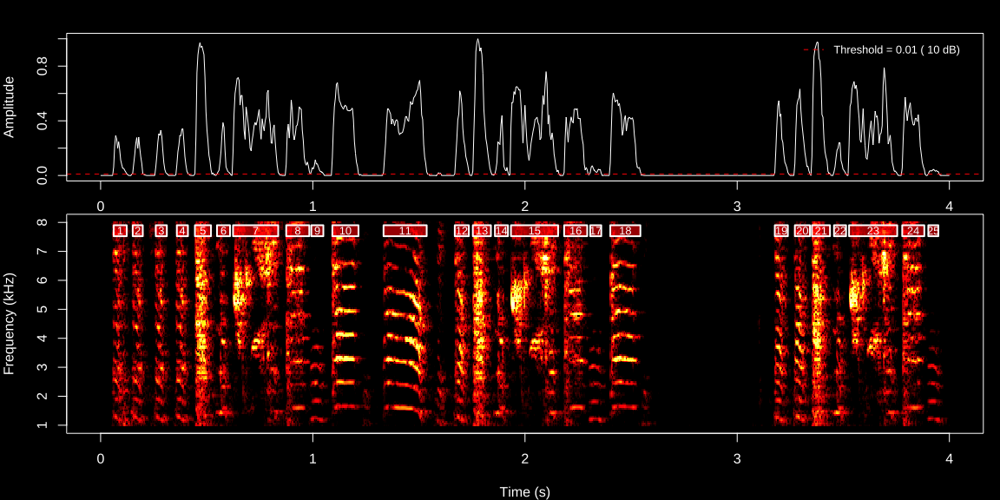
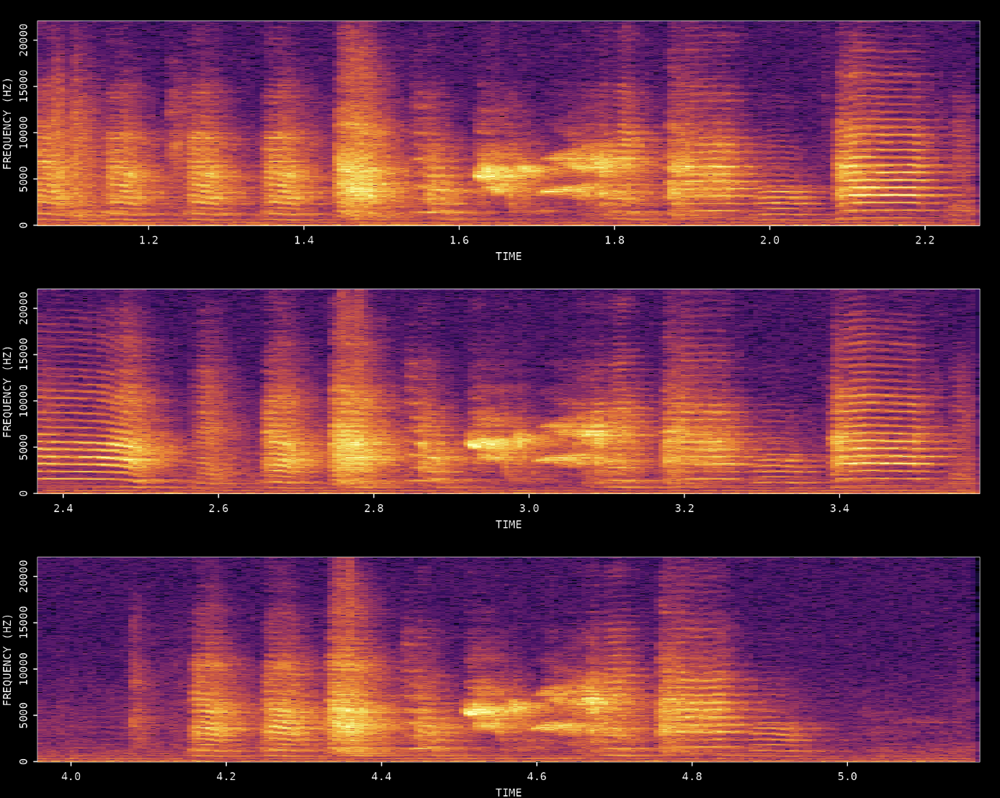
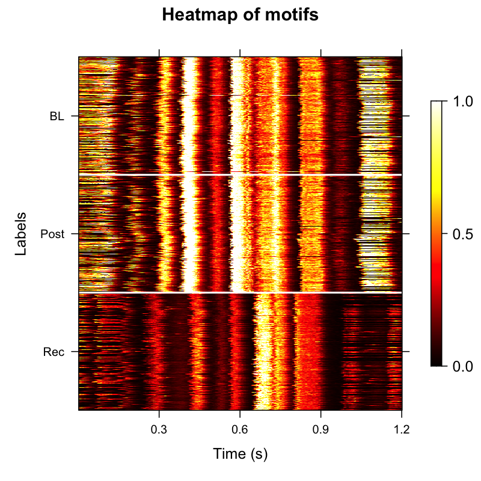
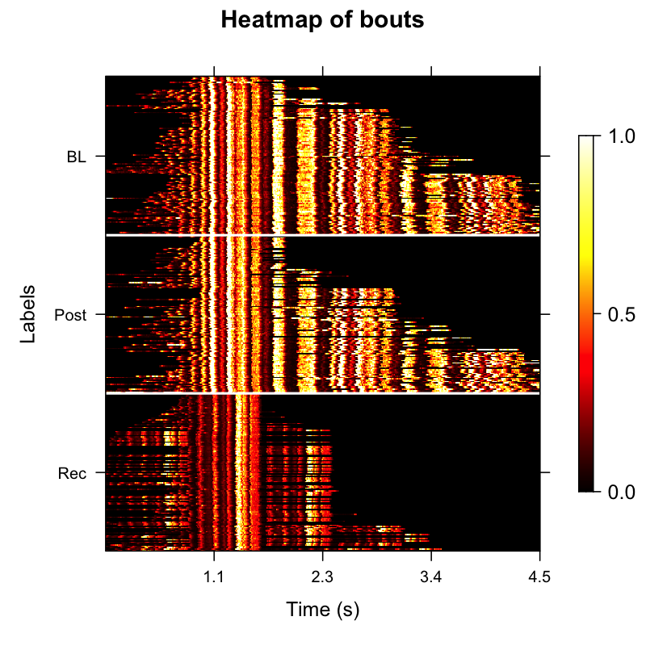
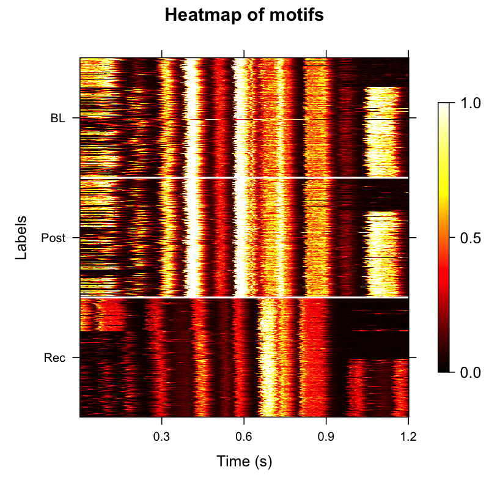

```{=html}
<style>
/* ── intro blurb ── */
.gs-intro {
  font-size: 1.05rem;
  color: #444;
  max-width: 760px;
  margin: 0 0 2.5rem;
  line-height: 1.7;
}

/* ── section heading ── */
.gs-section {
  font-size: 1.25rem;
  font-weight: 700;
  color: #1e88e5;
  border-bottom: 2px solid #e3f2fd;
  padding-bottom: 0.4rem;
  margin: 2.8rem 0 1.4rem;
}

/* ── card grid ── */
.gs-grid {
  display: grid;
  grid-template-columns: repeat(auto-fill, minmax(240px, 1fr));
  gap: 1.3rem;
  margin-bottom: 1.5rem;
}

/* ── single card ── */
.gs-card {
  border: 1px solid #dde4ef;
  border-radius: 10px;
  overflow: hidden;
  background: #fff;
  display: flex;
  flex-direction: column;
  text-decoration: none !important;
  color: inherit !important;
  transition: box-shadow .18s ease, transform .18s ease;
}
.gs-card:hover {
  box-shadow: 0 6px 22px rgba(30,136,229,.18);
  transform: translateY(-3px);
}

/* ── thumbnail ── */
.gs-card-img-wrap {
  width: 100%;
  padding-top: 62%;        /* slightly taller box gives images more breathing room */
  position: relative;
  overflow: hidden;
  background: #0d0d0d;     /* neutral dark bg for contain mode */
}
.gs-card-img-wrap img {
  position: absolute;
  top: 50%; left: 50%;
  transform: translate(-50%, -50%);
  width: 100%;
  height: 100%;
  object-fit: contain;
  object-position: center;
}

/* ── card body ── */
.gs-card-body {
  padding: .9rem 1rem 1.1rem;
  display: flex;
  flex-direction: column;
  flex: 1;
}
.gs-card-title {
  font-size: .97rem;
  font-weight: 700;
  color: #1e88e5;
  margin-bottom: .35rem;
  line-height: 1.3;
}
.gs-card-desc {
  font-size: .83rem;
  color: #555;
  line-height: 1.55;
  flex: 1;
}
.gs-card-tag {
  display: inline-block;
  margin-top: .7rem;
  font-size: .72rem;
  font-weight: 700;
  text-transform: uppercase;
  letter-spacing: .05em;
  color: #1e88e5;
  opacity: .75;
}
</style>

<p class="gs-intro">
  ASAP (Automated Sound Analysis Pipeline) provides an integrated toolkit for
  processing, analysing, and visualising avian vocalizations — from single
  audio files to large longitudinal datasets. Choose a tutorial below to get
  started.
</p>

<!-- ══════════════════════════════════════ -->
<!--  SECTION 1 – Single WAV File Analysis -->
<!-- ══════════════════════════════════════ -->
<div class="gs-section">Single WAV File Analysis</div>
<p style="color:#666;font-size:.93rem;margin:-0.8rem 0 1.2rem;">
  Learn ASAP functions using individual audio files.
</p>

<div class="gs-grid">

  <!-- Card 1 -->
  <a class="gs-card" href="single_wav_analysis.html">
    <div class="gs-card-img-wrap">
      
    </div>
    <div class="gs-card-body">
      <div class="gs-card-title">Overview &amp; Basic Audio Analysis</div>
      <div class="gs-card-desc">
        Load WAV files, visualise spectrograms, and explore the basic audio
        analysis tools that underpin the ASAP workflow.
      </div>
      <span class="gs-card-tag">Beginner &middot; ~10 min</span>
    </div>
  </a>

  <!-- Card 2 -->
  <a class="gs-card" href="motif_detection.html">
    <div class="gs-card-img-wrap">
      
    </div>
    <div class="gs-card-body">
      <div class="gs-card-title">Motif Detection</div>
      <div class="gs-card-desc">
        Build a cross-correlation template, detect motif occurrences in a
        single recording, and review the detected segments.
      </div>
      <span class="gs-card-tag">Beginner &middot; ~15 min</span>
    </div>
  </a>

</div>

<!-- ══════════════════════════════════════════════════════════ -->
<!--  SECTION 2 – Longitudinal Recording Analysis (SAP Object) -->
<!-- ══════════════════════════════════════════════════════════ -->
<div class="gs-section">Longitudinal Recording Analysis with SAP Object</div>
<p style="color:#666;font-size:.93rem;margin:-0.8rem 0 1.2rem;">
  Batch processing of recordings across developmental time points.
</p>

<div class="gs-grid">

  <!-- Card 3 -->
  <a class="gs-card" href="construct_sap_object.html">
    <div class="gs-card-img-wrap" style="background:#fff;">
      
    </div>
    <div class="gs-card-body">
      <div class="gs-card-title">Constructing a SAP Object</div>
      <div class="gs-card-desc">
        Organise multi-day recording directories into a SAP object
        for reproducible longitudinal analysis.
      </div>
      <span class="gs-card-tag">Intermediate &middot; ~10 min</span>
    </div>
  </a>

  <!-- Card 4 -->
  <a class="gs-card" href="longitudinal_motif_detection.html">
    <div class="gs-card-img-wrap" style="background:#fff;">
      
    </div>
    <div class="gs-card-body">
      <div class="gs-card-title">Longitudinal Motif Detection</div>
      <div class="gs-card-desc">
        Detect and align motifs across developmental time points. Visualise
        acoustic changes with amplitude heatmaps and UMAP embeddings.
      </div>
      <span class="gs-card-tag">Intermediate &middot; ~25 min</span>
    </div>
  </a>

  <!-- Card 5 -->
  <a class="gs-card" href="longitudinal_bout_detection.html">
    <div class="gs-card-img-wrap" style="background:#fff;">
      
    </div>
    <div class="gs-card-body">
      <div class="gs-card-title">Longitudinal Bout Detection</div>
      <div class="gs-card-desc">
        Detect song bouts across recordings, summarise motif-bout
        relationships, and track changes in bout duration and density
        over development.
      </div>
      <span class="gs-card-tag">Intermediate &middot; ~20 min</span>
    </div>
  </a>

  <!-- Card 6 -->
  <a class="gs-card" href="longitudinal_syllable_segmentation.html">
    <div class="gs-card-img-wrap" style="background:#fff;">
      
    </div>
    <div class="gs-card-body">
      <div class="gs-card-title">Longitudinal Syllable Segmentation</div>
      <div class="gs-card-desc">
        Segment detected bouts into individual syllables, extract spectral
        features, cluster segments, and visualise the acoustic structure
        with UMAP dimensionality reduction.
      </div>
      <span class="gs-card-tag">Advanced &middot; ~25 min</span>
    </div>
  </a>

  <!-- Card 7 -->
  <a class="gs-card" href="syllable_labeling.html">
    <div class="gs-card-img-wrap" style="background:#fff;">
      
    </div>
    <div class="gs-card-body">
      <div class="gs-card-title">Syllable Labeling</div>
      <div class="gs-card-desc">
        Assign letter identities to syllable clusters using automatic
        DBSCAN-based labeling and manual refinement. Verify the final
        syllable inventory across developmental stages.
      </div>
      <span class="gs-card-tag">Advanced &middot; ~20 min</span>
    </div>
  </a>

</div>
```
