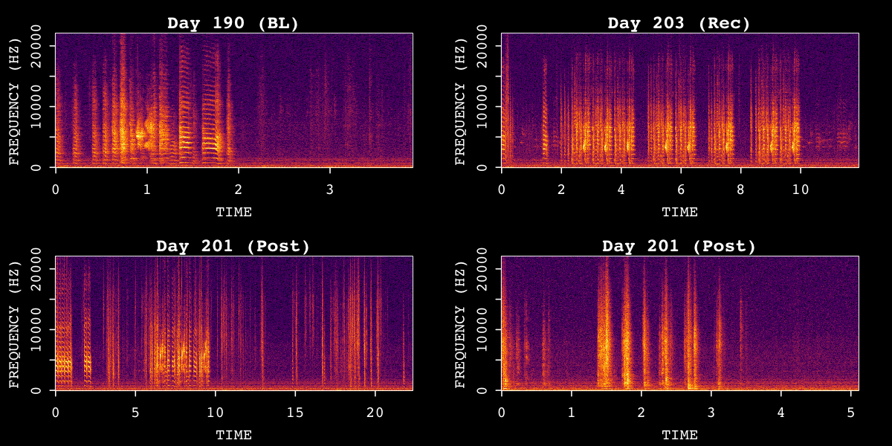
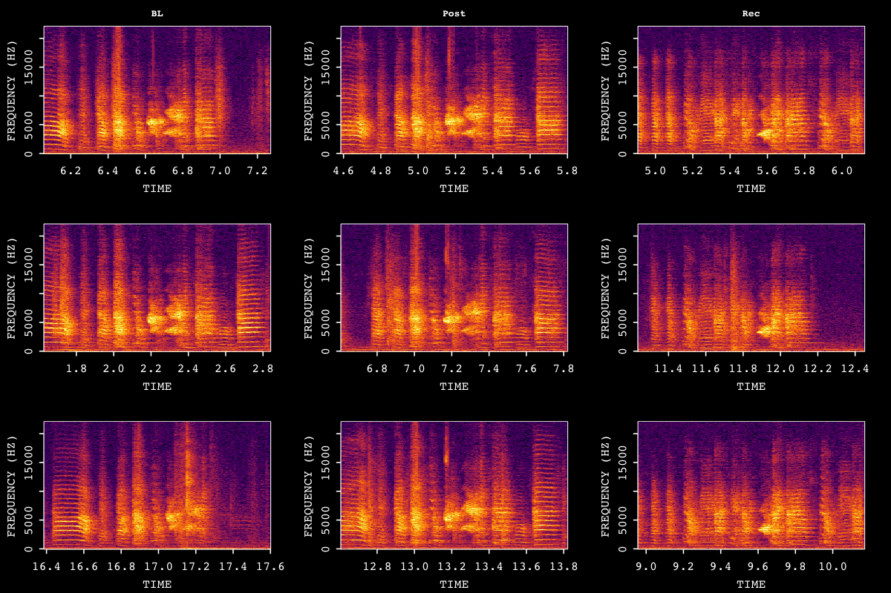
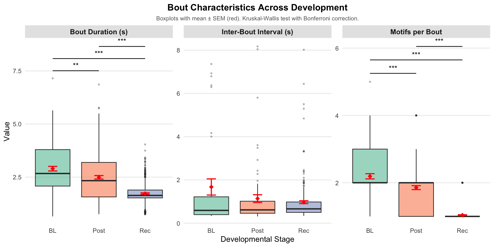

<link rel="stylesheet" href="../pkgdown/extra.css">

ASAP (Automated Sound Analysis Pipeline) provides an integrated suite of tools
for processing, analysing, and visualising avian vocalizations—from single
audio files to large longitudinal datasets.  
Choose a tutorial below to get started.

---

## Single WAV File Analysis {.section-title}

<!-- Card 1 -->
<a class="tutorial-card" href="single_wav_analysis.html">
  
  

    
Visualising Song Recordings

    

      Load a single WAV file, create a SAP object, and plot spectrograms to
      explore the raw audio signal.
    

    Beginner · ~10 min
  

</a>

<!-- Card 2 -->
<a class="tutorial-card" href="motif_detection.html">
  
  

    
Motif Detection (Single File)

    

      Build a template, run cross-correlation–based detection, and extract
      motif segments from a single recording.
    

    Beginner · ~15 min
  

</a>

---

## Longitudinal Recording Analysis with SAP Object {.section-title}

<!-- Card 3 -->
<a class="tutorial-card" href="construct_sap_object.html">
  
  

    
Construct a SAP Object

    

      Organise multi-day recording directories into a typed SAP object for
      reproducible longitudinal analysis.
    

    Intermediate · ~10 min
  

</a>

<!-- Card 4 -->
<a class="tutorial-card" href="longitudinal_motif_detection.html">
  
  

    
Longitudinal Motif Detection

    

      Detect, align, and cluster motifs across developmental time points.  
      Visualise changes in acoustic structure with heatmaps and UMAP embeddings.
    

    Intermediate · ~25 min
  

</a>

<!-- Card 5 -->
<a class="tutorial-card" href="longitudinal_bout_detection.html">
  
  

    
Longitudinal Bout Detection

    

      Detect song bouts across recordings, summarise motif-bout relationships,
      and track developmental changes in bout duration and motif density.
    

    Intermediate · ~20 min
  

</a>

