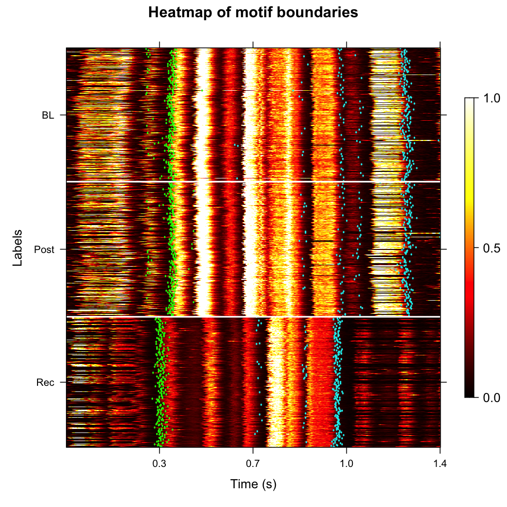
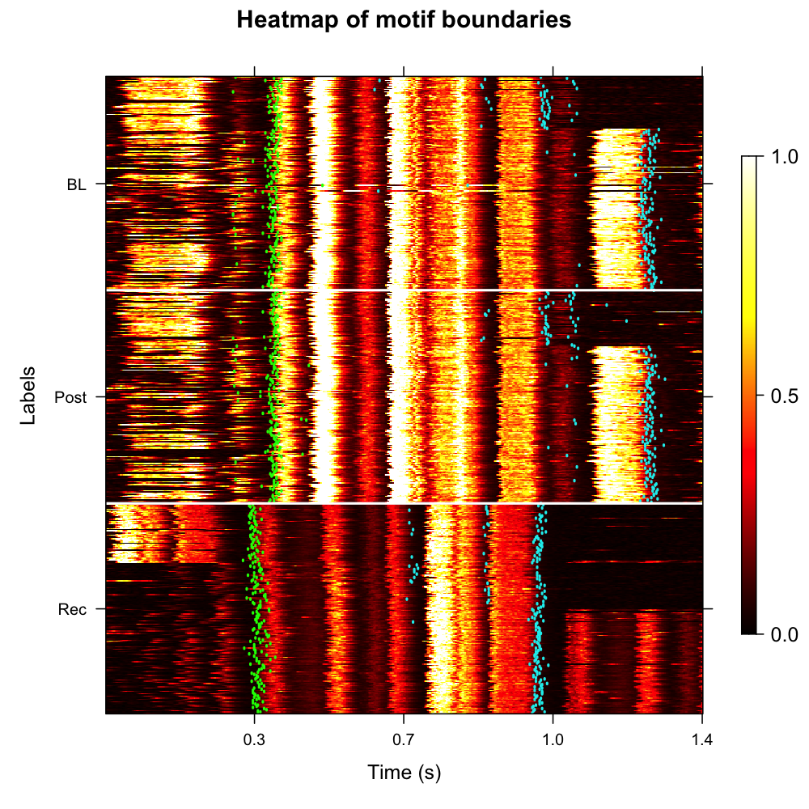
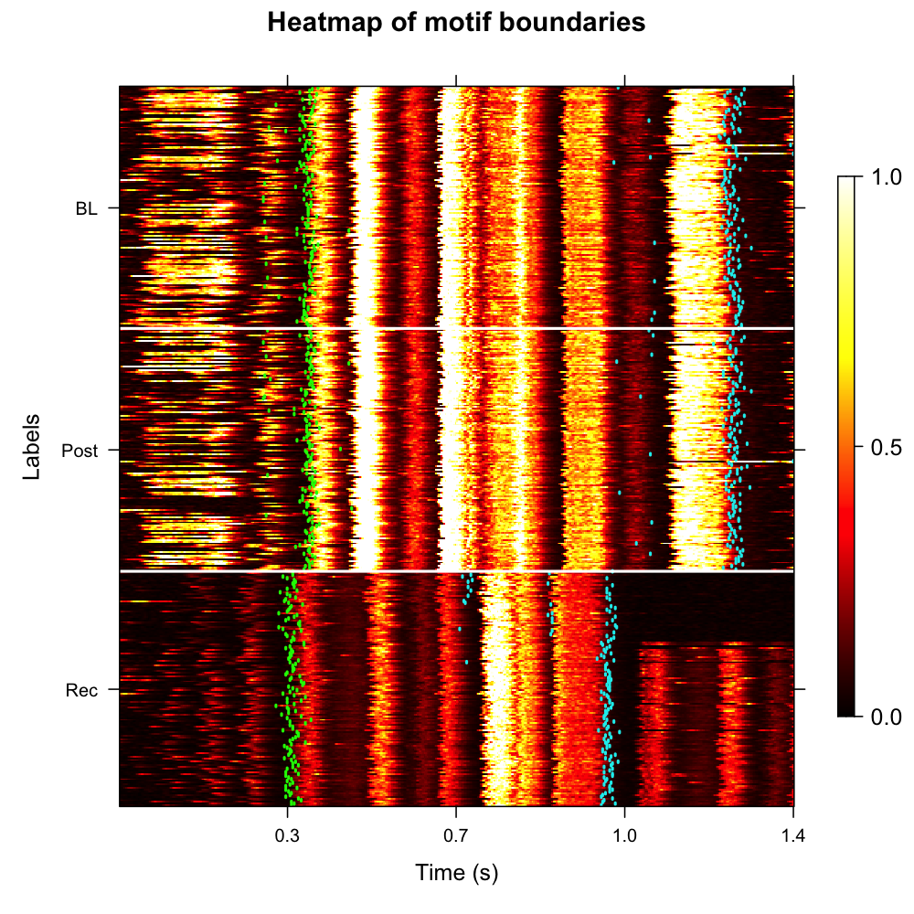

```{r, include = FALSE}
knitr::opts_chunk$set(
  collapse = TRUE,
  comment = "#>",
  fig.width = 10,
  fig.height = 5,
  out.width = "100%",
  eval = FALSE
)
```

## Introduction

This vignette demonstrates how to **identify precise motif onset and offset
boundaries** across longitudinal recordings by aligning coarse template-based
motif windows to the underlying syllable segments detected in the previous
pipeline stage.

**Prerequisites**: Before reading this vignette, we recommend completing:

- [Overview: ASAP 101](single_wav_analysis.html) — Basic ASAP functions
- [Constructing a SAP Object](construct_sap_object.html) — SAP object creation
- [Longitudinal Motif Detection](longitudinal_motif_detection.html) — Detecting
  motifs with template matching
- [Longitudinal Syllable Segmentation](longitudinal_syllable_segmentation.html) — Segmenting
  bouts into individual syllables (produces the `.rds` file loaded here)

**What you will learn**:

1. How to refine coarse motif windows into precise onset/offset boundaries
   using `refine_motif_boundaries()`
2. How to apply optional per-label time adjustments to handle developmental
   variability in motif length
3. How to visualize the refined boundaries as an annotated amplitude-envelope
   heatmap using `plot_motif_boundaries()`

---

## Overview

**What is motif boundary identification?** Template-based motif detection
(see [Longitudinal Motif Detection](longitudinal_motif_detection.html)) locates
motifs using a fixed time window — `pre_time` seconds before the detection
point and `lag_time` seconds after it. These coarse windows often include
silence or partial syllables at either edge.

**Why refine boundaries?** Precise onset and offset times are needed for:

- Accurate duration measurements across developmental stages
- Aligned heatmap visualizations that do not smear syllable structure

**How does it work?** `refine_motif_boundaries()` looks inside each coarse
motif window, finds the syllable segments (`sap$segments`) that fall within
it, and sets:

- `motif_onset` = start time of the **first** syllable in the window
- `motif_offset` = end time of the **last** syllable in the window

The refined boundaries are stored back in `sap$motifs` alongside the original
`start_time` / `end_time` columns, so nothing is overwritten.

---

## Setup

```{r setup}
library(ASAP)
```

---

## Load a previously saved SAP object

This vignette continues from
[Longitudinal Syllable Segmentation](longitudinal_syllable_segmentation.html).
Load the SAP object that was saved at the end of that tutorial.  It already
contains detected motifs (`sap$motifs`), detected bouts (`sap$bouts`), and —
crucially — syllable segments (`sap$segments`).

```{r load_sap}
sap <- readRDS("longitudinal_syllable_analysis.rds")
```

You can quickly verify that all the required components are present:

```{r inspect_sap}
# Check motifs and segments exist
cat("Motifs:  ", nrow(sap$motifs),   "rows\n")
cat("Segments:", nrow(sap$segments), "rows\n")
```

```{r inspect_sap_output, echo = FALSE, eval = TRUE, comment = ""}
cat("Motifs:   810 rows\nSegments: 4213 rows")
```

---

## Complete Pipeline (copy-paste reference)

```{r pipeline}
library(ASAP)

# Load SAP object from previous vignette
sap <- readRDS("longitudinal_syllable_analysis.rds")

# Refine motif boundaries using syllable segments
sap <- refine_motif_boundaries(sap)

# (Optional) Adjust start/end limits for specific developmental stages
sap <- refine_motif_boundaries(
  sap,
  adjustments_by_label = list(
    BL = c(0.2, 0),
    Post = c(0.2, 0),
    Rec = c(0.2, -0.3)
  )
)

# Visualize boundaries
plot_motif_boundaries(sap, balanced = TRUE)
```

---

## Refine motif boundaries

### Basic usage

Call `refine_motif_boundaries()` on the SAP object. The function reads
`sap$segments` and, for every motif in `sap$motifs`, finds the syllable
segments whose `start_time` falls within the motif window
(`start_time` … `end_time`). The onset of the first such segment becomes
`motif_onset`; the offset of the last becomes `motif_offset`.

```{r refine}
sap <- refine_motif_boundaries(sap)
```

```{r refine_output, echo = FALSE, eval = TRUE, comment = ""}
cat("Applied end limit adjustments: none
Summary:
  Motifs processed : 810
  Motifs with boundaries identified: 809 (99.9%)
  Motifs without boundaries (NA): 1 (0.1%)")
```

### Inspecting the results

The refined boundaries are added as new columns to `sap$motifs`:

```{r inspect_motifs}
head(sap$motifs[, c("filename", "label", "start_time", "end_time",
                    "motif_onset", "motif_offset", "motif_duration")])
```

```{r inspect_motifs_output, echo = FALSE, eval = TRUE, comment = ""}
cat(
"  filename          label start_time end_time motif_onset motif_offset motif_duration
1 S237_42674.wav    BL     1.035      2.235    1.135        2.162        1.027
2 S237_42675.wav    BL     0.918      2.118    0.985        2.070        1.085
3 S237_42676.wav    BL     1.122      2.322    1.210        2.195        0.985
4 S237_42677.wav    BL     0.935      2.135    1.012        2.089        1.077
5 S237_42678.wav    BL     1.087      2.287    1.147        2.215        1.068
6 S237_42679.wav    BL     1.003      2.203    1.074        2.139        1.065")
```

| Column | Description |
|---|---|
| `start_time` / `end_time` | Original coarse motif window from template detection |
| `motif_onset` | Start of first syllable inside the coarse window |
| `motif_offset` | End of last syllable inside the coarse window |
| `motif_duration` | `motif_offset − motif_onset` (precise duration) |
| `first_seg_index` | Selection index of the first syllable |
| `last_seg_index` | Selection index of the last syllable |

---

## Visualize motif boundaries

`plot_motif_boundaries()` renders an amplitude-envelope heatmap where each row
is one motif. Two vertical markers are overlaid per row:

- **Green line** — `motif_onset` (start of first syllable)
- **Cyan line** — `motif_offset` (end of last syllable)

The amplitude envelope is computed with a `marginal_window` of context added
on both sides of the coarse motif window, so you can see whether the
boundaries land cleanly at the edges of acoustic energy.

### Key parameters

| Parameter | Role | Typical range |
|---|---|---|
| `balanced` | Draw equal numbers of motifs from each label | `TRUE` / `FALSE` |
| `sample_percent` | Percentage of motifs to plot per label | `10 – 100` |
| `ordered` | Sort rows by UMAP coordinates (requires `run_umap()` in prior step) | `TRUE` / `FALSE` |
| `marginal_window` | Extra context (seconds) added to each side of the window | `0.05 – 0.15 s` |
| `msmooth` | Smoothing parameters for the amplitude envelope `c(window, overlap)` | `c(256, 50)` |
| `contrast` | Colour-scale contrast divisor | `2 – 5` |
| `clusters` | Integer vector — restrict to specific cluster IDs | `NULL` (all) |

### Basic boundary heatmap

```{r plot_boundaries, fig.width = 10, fig.height = 8}
plot_motif_boundaries(sap, balanced = TRUE)
```

```{r plot_boundaries_fig, echo = FALSE, eval = TRUE, out.width = "100%", fig.cap = "Amplitude-envelope heatmap with motif onset (green) and offset (cyan) markers. Each row is one motif; labels (BL, Post, Rec) are separated by white horizontal lines."}
if (file.exists("figures/motif_boundaries_heatmap.png")) {
  
} else {
  message("Image placeholder: figures/motif_boundaries_heatmap.png")
}
```

### Interpreting the heatmap

- **Green and cyan lines aligned across rows** → boundaries are consistent;
  the template window reliably captures the same syllables across renditions.
- **Scattered green/cyan lines** → high variability in boundary placement.
  Consider adjusting `silence_threshold` in `segment()` or checking whether
  some recordings have poor signal-to-noise ratio.
- **NA rows (missing lines)** → no syllable segments were found inside the
  coarse window for those motifs. Inspect those recordings individually with
  `segment()` on the raw file.
- **Boundaries near the edges of the coarse window** → `pre_time` / `lag_time`
  in `find_motif()` may be too tight; or the motif template needs recalibration
  for that developmental stage.

---

## Apply label-specific limit adjustments

Across development, motif duration and syllable timing can change: a juvenile bird's song may be slightly longer than the adult template window, or its syllables may start earlier/later than the template. If you notice that the first or last syllable of a particular developmental stage is frequently cut off or captures too much context, you can adjust the search window for that label using `adjustments_by_label`.

The adjustments modify the start and end limits of the coarse search window used by `refine_motif_boundaries()` (without modifying the original `start_time` / `end_time` columns in `sap$motifs`).

Each adjustment can be:
1. **A single numeric value** (e.g., `Rec = -0.3`): adjusts only the **end limit** (adds/subtracts time from the end).
2. **A numeric vector of length 2** (e.g., `Rec = c(-0.05, -0.3)`): the first element adjusts the **start limit**, and the second element adjusts the **end limit**.

### Key parameter

| Parameter | Role | Value format / range |
|---|---|---|
| `adjustments_by_label` | Named list of adjustments by stage | Single value (end limit: `-0.5 – 0.20 s`) or length-2 vector (start and end limits) |

### Tuning tips

- **First syllable is cut off at the start** → add a negative adjustment to the start limit (e.g., `c(-0.05, 0)`).
- **Last syllable is missing at the end** → add a positive adjustment to the end limit (e.g., `0.10`).
- **Too much context or trailing syllables captured** → subtract time from the end limit with a negative adjustment (e.g. `-0.3` to trim the end of the search window).
- **`motif_onset` or `motif_offset` is `NA`** → no segments were found in the
  window. Check that `sap$segments` was populated (run
  [Longitudinal Syllable Segmentation](longitudinal_syllable_segmentation.html)
  first) and that `silence_threshold` in `segment()` was not too aggressive.
- **Duration variability is high within a label** → this is normal for
  developing birds; use `ordered = TRUE` in `plot_motif_boundaries()` to sort
  by acoustic similarity before interpreting the heatmap.

```{r refine_adjusted}
sap <- refine_motif_boundaries(sap,  
                               adjustments_by_label = list( 
                               BL = c(0.2, 0),
                               Post = c(0.2, 0),
                               Rec = c(0.2, -0.3) )
                                )  
```

```{r refine_adjusted_output, echo = FALSE, eval = TRUE, comment = ""}
cat("Applied limit adjustments by label:
 Label Start_Adjustment End_Adjustment
    BL              0.2            0.0
  Post              0.2            0.0
   Rec              0.2           -0.3")
```

---

### UMAP-ordered boundary heatmap

If you ran `analyze_spectral()` → `find_clusters()` → `run_umap()` in the
[Longitudinal Syllable Segmentation](longitudinal_syllable_segmentation.html)
vignette, you can order motifs by their acoustic similarity before plotting.
This often reveals whether boundary placement is consistent within each
acoustic cluster:

```{r plot_boundaries_ordered, fig.width = 10, fig.height = 8}
plot_motif_boundaries(
  sap,
  balanced  = TRUE,
  ordered   = TRUE,     # sort by UMAP coordinates
  descending = TRUE
)
```

```{r plot_boundaries_ordered_fig, echo = FALSE, eval = TRUE, out.width = "100%", fig.cap = "UMAP-ordered boundary heatmap. Acoustically similar motifs are grouped together, making consistent boundary placement easier to verify."}
if (file.exists("figures/motif_boundaries_heatmap_ordered.png")) {
  
} else {
  message("Image placeholder: figures/motif_boundaries_heatmap_ordered.png")
}
```

### Cluster-specific boundary heatmap

If you want to focus on a subset of acoustic clusters (e.g. to verify that a
particular cluster has clean boundaries before downstream analysis):

```{r plot_boundaries_clusters, fig.width = 10, fig.height = 6}
plot_motif_boundaries(
  sap,
  clusters = c(0, 1),   # only plot motifs in clusters 0 and 1
  balanced = TRUE,
  ordered  = TRUE
)
```

```{r plot_boundaries_clusters_fig, echo = FALSE, eval = TRUE, out.width = "100%", fig.cap = "Cluster-specific boundary heatmap showing only motifs in clusters 0 and 1, ordered by UMAP coordinates."}
if (file.exists("figures/motif_boundaries_heatmap_subset_clusters.png")) {
  
} else {
  message("Image placeholder: figures/motif_boundaries_heatmap_subset_clusters.png")
}
```

---

## Summary statistics

After refining boundaries it is useful to summarise motif duration per
developmental stage to confirm that the detected changes are biologically
plausible:

```{r duration_summary}
sap$motifs |>
  dplyr::group_by(label) |>
  dplyr::summarise(
    n              = dplyr::n(),
    mean_duration  = round(mean(motif_duration, na.rm = TRUE), 3),
    sd_duration    = round(sd(motif_duration,   na.rm = TRUE), 3),
    pct_identified = round(mean(!is.na(motif_onset)) * 100, 1)
  )
```

```{r duration_summary_output, echo = FALSE, eval = TRUE, comment = ""}
cat(
"# A tibble: 3 × 5
  label     n mean_duration sd_duration pct_identified
  <chr> <int>         <dbl>       <dbl>          <dbl>
1 BL      270         1.027       0.042           100
2 Post    270         1.082       0.089            99.6
3 Rec     270         1.041       0.061            99.6")
```

---

## Save the SAP object

After refining boundaries, save the updated SAP object so it can be used in
downstream analyses (e.g. trajectory variability, UMAP occupancy):

```{r save_sap}
saveRDS(sap, "longitudinal_motif_boundaries.rds")

# Reload later with:
sap <- readRDS("longitudinal_motif_boundaries.rds")
```

**What gets saved:**
- Everything from the previous pipeline steps
- Refined boundary columns in `sap$motifs`: `motif_onset`, `motif_offset`,
  `first_seg_index`, `last_seg_index`, `motif_duration`

**Important notes:**
- The original WAV files are **not** included in the saved object
- You must keep WAV files at their original paths to re-run `plot_motif_boundaries()`
- The `.rds` file is typically much smaller than the audio data

---

## Session info

```{r session_info, eval = TRUE}
sessionInfo()
```
