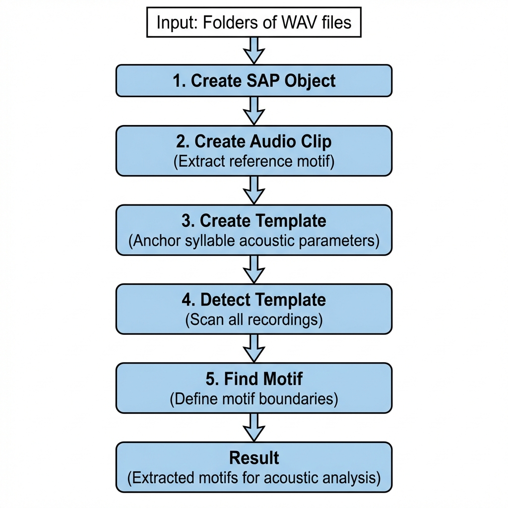

```{r, include = FALSE}
knitr::opts_chunk$set(
  collapse = TRUE,
  comment = "#>",
  fig.width = 10,
  fig.height = 5,
  out.width = "100%"
)
```

## Introduction

This vignette demonstrates how to detect and analyze song motifs across 
**longitudinal recordings** using SAP objects and optimized template parameters.

**Prerequisites**: Before reading this vignette, we recommend completing:

- [Overview: Basic Audio Analysis](single_wav_analysis.html) - Core ASAP functions
- [Motif Detection](motif_detection.html) - Template optimization workflow
- [Constructing SAP Object](construct_sap_object.html) - SAP object creation

## Overview

The longitudinal motif detection workflow applies the template parameters you 
optimized on a single recording (see [Motif Detection](motif_detection.html)) 
across all recordings in a SAP object.

{width=60%}

## Complete Pipeline

```{r pipeline, eval = FALSE}
library(ASAP)

# Load or create SAP object
sap <- create_sap_object(
  base_path = "/path/to/recordings",
  subfolders_to_include = c("190", "201", "203"),
  labels = c("BL", "Post", "Rec")
)

# Run the complete motif detection pipeline
sap <- sap |>
  create_audio_clip(indices = 1, 
                    start_time = 1, 
                    end_time = 2.5, 
                    clip_names = "motif_ref") |>
  create_template(template_name = "syllable_d", 
                  clip_name = "motif_ref",
                  start_time = 0.72, 
                  end_time = 0.84,
                  freq_min = 1, 
                  freq_max = 10, 
                  threshold = 0.5, 
                  write_template = TRUE) |>
  detect_template(template_name = "syllable_d",
                  threshold = 0.5,
                  proximity_window = 1) |>
  find_motif(template_name = "syllable_d", 
             pre_time = 0.7, 
             lag_time = 0.5)
```

### Understanding SAP Object Behavior

**1. Metadata-Based Lazy Loading**

After creating the SAP object, you have a metadata index (stored in `sap$metadata`) 
that references all audio files by their paths and timestamps. The actual WAV file 
data is **not loaded into memory**—files are read on-demand during analysis. This 
means:

- The SAP object remains lightweight even with thousands of recordings
- **All subsequent pipeline steps require the original WAV files to be accessible** 
  at their original paths
- If you move or delete the audio files, the pipeline will fail

**2. Centralized Result Storage**

The SAP object stores all analysis results in a structured format, making it easy 
to access detection outcomes:

```r
# Access template detection results
sap$templates$template_matches[["syllable_d"]]

# Access extracted motif boundaries (onset/offset timestamps)
sap$motifs  # Data frame with start_time, end_time for each detected motif

# Access spectral features (if analyze_spectral() was run)
sap$features$motif$spectral_feature
```

**3. Optional Template Detection Visualizations**

If you set `save_plot = TRUE` in `detect_template()`, spectrogram images 
of template detections are saved to a local directory (typically `templates/` 
within your base path). These images are **not stored in the SAP object** but 
can be useful for quality control and manual inspection of detection accuracy.

**Example output:**

```{r pipeline-output, echo = FALSE, eval = TRUE, comment = ""}
cat("=== Starting Template Detection ===

Processing 312 files for day 190 using 7 cores.
Processed files in day 190. Total detections: 1247

Processing 285 files for day 201 using 7 cores.
Processed files in day 201. Total detections: 1089

Processing 250 files for day 203 using 7 cores.
Processed files in day 203. Total detections: 956

Total detections across all days: 3292
Access detection results via: sap$templates$template_matches[[\"syllable_d\"]]")
```

## Visualizing Results

```{r visualize, eval = FALSE}
# Visualize sample motifs from each time point
visualize_segments(sap, 
                   segment_type = "motifs", 
                   n_samples = 3)
```

```{r visualize-segments-output, echo = FALSE, eval = TRUE, out.width = "100%", fig.cap = "Sample motif spectrograms across developmental time points."}
# Placeholder for pre-computed image
if (file.exists("figures/longitudinal_segments.png")) {
  knitr::include_graphics("figures/longitudinal_segments.png")
} else {
  message("Image placeholder: figures/longitudinal_segments.png")
}
```

### Amplitude Envelope Heatmap

Amplitude envelope heatmaps visualize the temporal structure of detected motifs. 
**The `balanced` argument** ensures equal representation across time points (e.g., 
same number of motifs from each developmental stage), which improves statistical 
comparisons.

However, **motif durations can vary** across renditions—some motifs may be shorter 
than others due to natural variability or developmental changes. This duration 
variability can make heatmaps appear misaligned or noisy, with vertical bands 
appearing blurred or offset. To address this issue, we can extract acoustic 
features from individual motifs, cluster them based on these features within each 
developmental stage, and order them by their latent feature structure (see 
"Ordered Heatmap" section below).

```{r heatmap, eval = FALSE}
# Create amplitude envelope heatmap with balanced sampling
plot_heatmap(sap, balanced = TRUE)
```

```{r heatmap-output, echo = FALSE, eval = TRUE, out.width = "100%", fig.cap = "Amplitude envelope heatmap showing temporal structure across time points."}
# Placeholder for pre-computed image
if (file.exists("figures/longitudinal_heatmap.png")) {
  knitr::include_graphics("figures/longitudinal_heatmap.png")
} else {
  message("Image placeholder: figures/longitudinal_heatmap.png")
}
```

## Feature Extraction and Analysis

Extracting spectral features allows you to quantify motif acoustic properties 
and identify clusters of similar motifs. This is particularly useful for:

- **Grouping motifs by acoustic similarity** rather than just temporal alignment
- **Identifying developmental changes** in song structure
- **Reducing noise** in downstream visualizations

```{r features, eval = FALSE}
# Extract spectral features (frequency, entropy, duration, etc.)
sap <- sap |>
  analyze_spectral(balanced = TRUE) |>
  find_clusters() |>              # Group acoustically similar motifs
  run_umap()                       # Dimensionality reduction for visualization

# Visualize UMAP by time point
plot_umap(sap, split.by = "label")
```

**Results interpretation:**

- `analyze_spectral()` extracts ~30 acoustic features per motif (mean frequency, 
  entropy, duration, spectral slope, etc.) and stores them in `sap$features$motif$spectral_feature`
- `find_clusters()` uses hierarchical clustering to group motifs by acoustic 
  similarity, adding a `cluster` column to the feature data
- `run_umap()` reduces high-dimensional feature space to 2D for visualization, 
  storing coordinates in `sap$umap$motif`

```{r umap-output, echo = FALSE, eval = TRUE, out.width = "100%", fig.cap = "UMAP visualization of motif features colored by developmental time point."}
# Placeholder for pre-computed image
if (file.exists("figures/longitudinal_umap.png")) {
  knitr::include_graphics("figures/longitudinal_umap.png")
} else {
  message("Image placeholder: figures/longitudinal_umap.png")
}
```

### Ordered Heatmap by Acoustic Similarity

As mentioned above, ordering motifs by acoustic similarity creates a **cleaner, 
more organized heatmap** that addresses the visual noise from duration variability. 
After extracting features and clustering, motifs are ordered by their cluster 
membership and latent feature structure rather than chronological order:

```{r heatmap-ordered, eval = FALSE}
# Create heatmap ordered by cluster membership
plot_heatmap(sap, balanced = TRUE, ordered = TRUE)
```

**Why this helps:**

- Motifs with similar acoustic properties are grouped together
- Vertical bands align better because acoustically similar motifs tend to have similar durations
- Developmental patterns become more apparent when organized by acoustic structure
- Reduces visual noise from duration variability

```{r heatmap-ordered-output, echo = FALSE, eval = TRUE, out.width = "100%", fig.cap = "Ordered amplitude envelope heatmap grouped by acoustic similarity."}
# Placeholder for pre-computed image
if (file.exists("figures/longitudinal_heatmap_ordered.png")) {
  knitr::include_graphics("figures/longitudinal_heatmap_ordered.png")
} else {
  message("Image placeholder: figures/longitudinal_heatmap_ordered.png")
}
```

## Key Parameters for Longitudinal Analysis

| Parameter | Location | Description |
|-----------|----------|-------------|
| `threshold` | `create_template()` / `detect_template()` | Minimum correlation score. Adjust in `detect_template()` to refine without recreating template. |
| `proximity_window` | `detect_template()` | Filter duplicate detections within this time window (seconds). |
| `balanced` | `analyze_spectral()` / `plot_heatmap()` | Balance samples across time points. |

## Tips for Longitudinal Analysis

1. **Optimize parameters first**: Use the single-file workflow in 
   [Motif Detection](motif_detection.html) before bulk processing.

2. **Check detection quality**: Visualize sample detections from each time point 
   to verify template works across developmental stages.

3. **Adjust threshold if needed**: If detection rates vary significantly across 
   time points, consider adjusting the threshold in `detect_template()`.

4. **Use balanced sampling**: When comparing across time points, use 
   `balanced = TRUE` to ensure equal representation.

## Session Info

```{r session-info}
sessionInfo()
```
