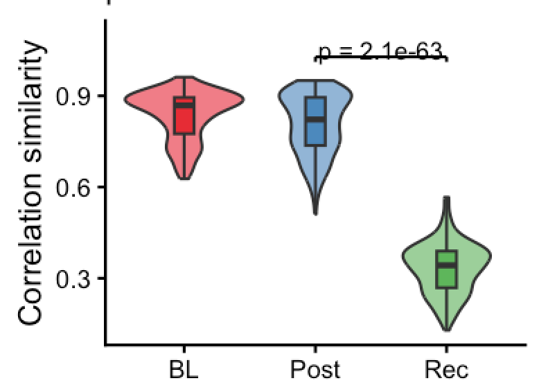
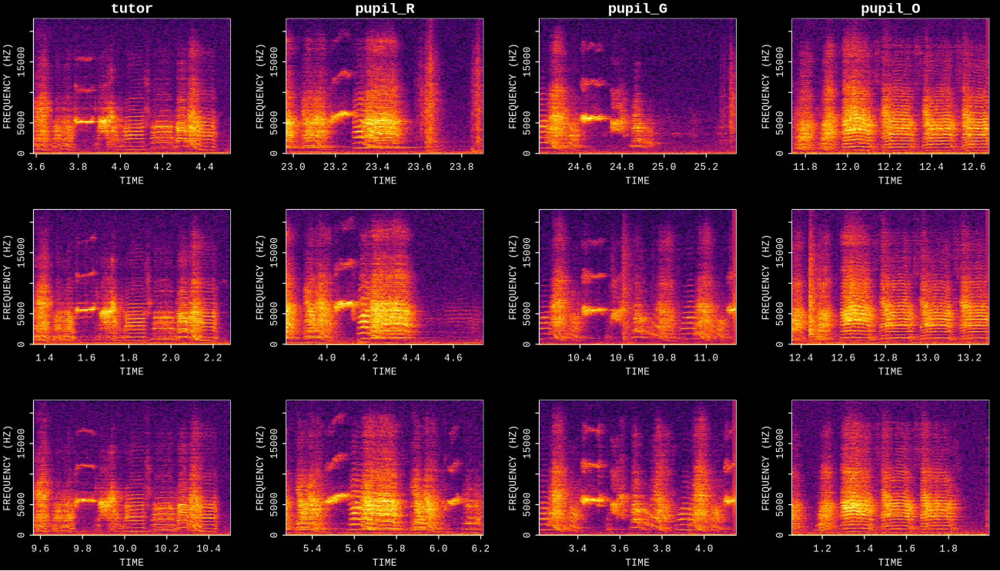
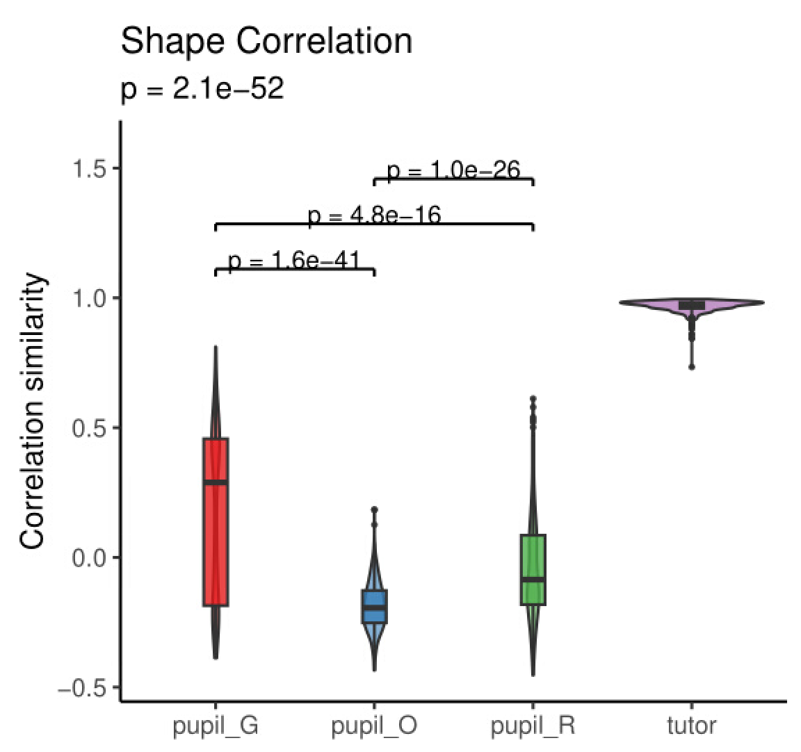

```{r, include = FALSE}
knitr::opts_chunk$set(
  collapse = TRUE,
  comment = "#>",
  fig.width = 10,
  fig.height = 6,
  out.width = "100%",
  eval = FALSE
)
```

## Introduction

This vignette demonstrates how to quantify **how similar each motif rendition
is to a designated reference stage** using the trajectory embeddings produced
in the previous vignette. Similarity scores derived from multiple complementary
distance metrics (RMS, Fréchet, DTW, and correlation) provide a per-rendition
and per-label measure of acoustic convergence to the reference trajectory.

**Prerequisites**: Before reading this vignette, we recommend completing:

- [Longitudinal Motif Trajectory Analysis](longitudinal_motif_trajectory.html)
  — Building trajectory matrices and UMAP embeddings

**What you will learn**:

1. How to remove outlier renditions before analysis using
   `filter_trajectory_outliers()`
2. How to compute trajectory similarity scores relative to a reference label
   with `trajectory_similarity()`
3. How to visualise and interpret per-label similarity distributions with
   `plot_trajectory_similarity()`

---

## Overview

A **trajectory similarity score** answers the question: *how closely does an
individual motif rendition follow the average path of the reference label in
PC space?* Four complementary metrics capture different aspects of path
resemblance, but they do **not** share the same scale:

| Metric | What it captures | Score range |
|---|---|---|
| **RMS** | Persistent pointwise deviation across the full trajectory | **(0, 1]** |
| **Fréchet** | Overall curve shape; robust to variable-length paths | **(0, 1]** |
| **DTW** | Shape similarity under timing shifts | **(0, 1]** |
| **Correlation** | Mean Pearson *r* across PC dimensions over time (scale-free) | **[-1, 1]** |

**Distance-based metrics (RMS, Fréchet, DTW)** are converted from raw distances
into bounded similarity scores via an exponential decay:
$\text{similarity} = \exp(-\max(\text{normalized\_distance} - 1,\; 0))$.
A score of **1** means the rendition is within normal reference variation; scores
approach **0** as deviation grows.

**Correlation** is the mean Pearson *r* across PC dimensions, preserved in its
native range. **+1** = identical temporal dynamics to the reference path;
**0** = no co-variation; **–1** = inverted trajectory.

In this vignette we use **BL** (baseline) as the reference, so all metrics
reflect how closely Post and Rec motifs match the pre-perturbation trajectory.

Beyond longitudinal developmental series, the same workflow applies whenever
you want to compare a group of renditions to a known reference. A natural
example is **tutor-pupil similarity**: pool tutor and pupil recordings into a
single SAP object (see [Constructing a SAP Object](construct_sap_object.html)
for `pool_sap_recordings()`), run the full trajectory pipeline treating the
tutor as the reference label, and the resulting similarity scores directly
quantify how closely each pupil motif copies the tutor's acoustic trajectory.

---

## Setup

```{r setup}
library(ASAP)
```

---

## Load a previously saved SAP object

This vignette continues from
[Longitudinal Motif Trajectory Analysis](longitudinal_motif_trajectory.html).
Load the SAP object saved at the end of that tutorial.

```{r load_sap}
sap <- readRDS("longitudinal_motif_trajectory.rds")
```

Verify that trajectory embeddings are present:

```{r inspect_sap}
cat("Motif renditions:", length(unique(sap$features$motif$traj.embeds$rendition)), "\n")
```

```{r inspect_sap_output, echo = FALSE, eval = TRUE, comment = ""}
cat("Motif renditions: 570")
```

---

## Complete Pipeline (copy-paste reference)

```{r pipeline}
library(ASAP)

sap <- readRDS("longitudinal_motif_trajectory.rds")

sap <- sap |>
  filter_trajectory_outliers() |>
  trajectory_similarity(metrics = "all")

plot_trajectory_similarity(sap, similarity_baseline = "reference")

saveRDS(sap, "longitudinal_motif_similarity.rds")
```

---

## Quality Control: filter outlier renditions

Before computing similarity scores, remove trajectory renditions that are
statistical outliers relative to their label group. This prevents a small
number of badly detected or corrupted motifs from distorting the reference path
and the resulting similarity scores.

`filter_trajectory_outliers()` works per label and per PC dimension: at each
time step it computes IQR bounds across renditions, flags any rendition whose
values fall outside those bounds for more than `min_outlier_fraction` of its
time steps, and removes those renditions entirely.

```{r filter_outliers}
sap <- filter_trajectory_outliers(sap)
```

```{r filter_outliers_output, echo = FALSE, eval = TRUE, comment = ""}
cat("=== Trajectory Outlier Filtering ===
IQR multiplier : 4.0  |  Min outlier fraction: 10%
Dimensions     : PC1, PC2

 label n_before n_removed n_after pct_removed
    BL      190         1     189         0.5
  Post      190         2     188         1.1
   Rec      190         0     190         0.0

Total renditions: 570 -> 567  (removed 3, 0.5%)")
```

### Key parameters

| Parameter | Role | Typical range |
|---|---|---|
| `dims` | PC dimensions used to assess outlier status | `c("PC1", "PC2")` |
| `iqr_multiplier` | Width of outlier bounds (larger = more lenient) | `3 - 6` |
| `min_outlier_fraction` | Fraction of flagged time steps required to remove a rendition | `0.05 - 0.2` |

### Tuning tips

- **Too many renditions removed** -> raise `iqr_multiplier` (e.g. `6`) or
  increase `min_outlier_fraction` (e.g. `0.2`).
- **Outliers still visible in UMAP** -> lower `iqr_multiplier` (e.g. `3`) or
  decrease `min_outlier_fraction` (e.g. `0.05`).
- **Restrict filtering to specific labels** -> use the `labels` argument, e.g.
  `labels = "Post"`.

---

## Compute trajectory similarity

`trajectory_similarity()` builds a robust reference path from the
`reference_label` renditions and then computes all four distance metrics
between every other rendition and that reference path. With `metrics = "all"`,
RMS, Fréchet, DTW, and correlation are computed together.

In this vignette we use **BL** as the reference, so similarity scores reflect
how closely Post and Rec motifs match the baseline acoustic trajectory.

```{r similarity}
sap <- trajectory_similarity(
  sap,
  reference_label = "BL",
  metrics          = "all"
)
```

```{r similarity_output, echo = FALSE, eval = TRUE, comment = ""}
cat("=== Trajectory Similarity Analysis ===
Dimensions       : PC1, PC2
Reference label  : BL
Trim fraction    : 10% each tail
Min coverage     : 50% of reference renditions per time step
Time binning     : 6 decimal places
Similarity base  : reference
Similarity scale : 1
Metrics          : rms, frechet, dtw, correlation
Interpolation    : matched time points
Labels           : BL, Post, Rec

Reference trajectory: 221 time steps (221 raw binned time steps)
Reference scales  :
  RMS     : 374.6786
  Fréchet : 1027.8868
  DTW     : 177.9610

--- Summary (Reference label excluded from tests) ---
  label   n rms_similarity_mean rms_similarity_sd frechet_similarity_mean frechet_similarity_sd dtw_similarity_mean
1    BL 189           0.8141877         0.2791135               0.8117797             0.2810829           0.8500838
2  Post 188           0.7081634         0.3370990               0.7080934             0.3400851           0.7872454
3   Rec 190           0.3485460         0.1965005               0.5574273             0.3549270           0.3878876
  dtw_similarity_sd correlation_mean correlation_sd
1         0.2197632        0.8367128     0.08009094
2         0.2565873        0.8069680     0.09936897
3         0.2124347        0.3334757     0.08329064

Kruskal-Wallis tests:
  rms: chi-sq = 99.95, p = 1.56e-23
  frechet: chi-sq = 32.17, p = 1.42e-08
  dtw: chi-sq = 151.40, p = 8.59e-35
  correlation: chi-sq = 282.59, p = 2.05e-63")
```

### Key parameters

| Parameter | Role | Typical range / notes |
|---|---|---|
| `reference_label` | Label used to build the reference path; omit to use the last sorted label | `"BL"` |
| `metrics` | Which distance metrics to compute | `"all"` or `c("rms", "correlation")` |
| `dims` | PC dimensions included in the distance calculation | `c("PC1", "PC2")` |
| `trim_fraction` | Fraction of extreme reference renditions trimmed when building the reference path | `0.05 - 0.2` |
| `min_coverage` | Minimum fraction of reference renditions that must cover a time bin | `0.3 - 0.7` |
| `similarity_baseline` | Transform for normalized distances: `"reference"` treats within-reference variation as converged, `"zero"` uses raw normalized distance | `"reference"` (default) |
| `stats` | Whether to run Kruskal-Wallis and pairwise Wilcoxon tests | `TRUE` / `FALSE` |

### Where are the results stored?

```{r inspect_similarity}
# Per-rendition similarity scores
head(sap$features$motif$trajectory_similarity$similarity)

# Per-label summary statistics
sap$features$motif$trajectory_similarity$summary

# Statistical tests
sap$features$motif$trajectory_similarity$tests
```

---

## Visualise similarity

`plot_trajectory_similarity()` generates one panel per metric, showing
per-label distributions of similarity scores with significance annotations.

```{r plot_similarity, fig.width = 10, fig.height = 6}
plot_trajectory_similarity(sap, similarity_baseline = "reference")
```

```{r plot_similarity_fig, echo = FALSE, eval = TRUE, out.width = "100%", fig.cap = "Per-label trajectory similarity distributions for each metric (RMS, Fréchet, DTW, Correlation). Similarity of 1 indicates a rendition that matches the BL reference path within the reference-label variability. Significance brackets show pairwise Wilcoxon results."}
if (file.exists("figures/motif_trajectory_similarity.png")) {
  
} else {
  message("Image placeholder: figures/motif_trajectory_similarity.png")
}
```

### Interpreting the plot

- **High similarity for Post (mean correlation ~ 0.81, RMS similarity ~ 0.71)** ->
  motifs in the Post stage remain acoustically very close to the baseline (BL)
  trajectory path.
- **Marked drop for Rec (mean correlation ~ 0.33, RMS similarity ~ 0.35)** ->
  motifs in the recovery stage deviate significantly from baseline, indicating
  substantial developmental divergence rather than a simple reversion.
- **Highly significant differences ($p < 10^{-7}$ across all metrics)** ->
  Kruskal-Wallis tests confirm robust statistical differentiation between
  experimental stages.
- **Narrow vs. wide distributions** -> width of violin/box reflects within-stage
  acoustic variability across individual motif renditions.

### Tuning tips

- **All labels show very high similarity** -> try `similarity_baseline = "zero"`
  to spread out the scale, or lower `similarity_scale_multiplier`.
- **Reference label (BL) shows low self-similarity** -> consider increasing
  `trim_fraction` or tightening `iqr_multiplier` in the outlier filtering step.
- **Only interested in two metrics** -> pass `metrics = c("rms", "correlation")`
  to `trajectory_similarity()` for a faster, cleaner plot.

---

## Application: tutor-pupil similarity

Trajectory similarity is equally well suited to scoring how closely a pupil
bird copies its tutor. The workflow is identical to the developmental example
above:

1. Pool tutor and pupil recordings into one SAP object with
   [`pool_sap_recordings()`](construct_sap_object.html), labelling them
   `"Tutor"`, `"Pupil_early"`, `"Pupil_late"`, etc.
2. Run `find_motif()` on the pooled object to detect motifs from both birds.
3. Build trajectory matrices and UMAP embeddings with
   `create_trajectory_matrix()` → `run_pca()` → `run_umap()`.
4. Filter outliers and compute similarity with the tutor as the reference:

```{r tutor_pipeline}
sap_tp <- sap_tp |>
  filter_trajectory_outliers() |>
  trajectory_similarity(
    reference_label = "Tutor",
    metrics          = "correlation"
  )

plot_trajectory_similarity(sap_tp)
```

The panels below illustrate this analysis: the first plot shows representative spectrograms of motifs extracted from the tutor and three pupils (`pupil_R`, `pupil_G`, `pupil_O`), and the second plot shows the trajectory shape correlation similarity scores comparing the pupil groups against the tutor reference:

```{r tutor_songs_fig, echo = FALSE, eval = TRUE, out.width = "100%", fig.cap = "Representative spectrograms of extracted motifs from tutor and three pupils (pupil_R, pupil_G, pupil_O)."}
if (file.exists("figures/tutor_pupils_songs.png")) {
  
} else {
  message("Image placeholder: figures/tutor_pupils_songs.png")
}
```

```{r tutor_similarity_fig, echo = FALSE, eval = TRUE, out.width = "100%", fig.cap = "Trajectory shape correlation similarity distributions (violin and box plots) comparing each pupil group to the tutor reference. The tutor self-similarity distribution is tightly centered near 1.0. Brackets indicate pairwise Wilcoxon significance tests comparing similarity across pupil groups."}
if (file.exists("figures/tutor_pupils_similarity.png")) {
  
} else {
  message("Image placeholder: figures/tutor_pupils_similarity.png")
}
```

---

## Save the SAP object

```{r save_sap}
saveRDS(sap, "longitudinal_motif_similarity.rds")

# Reload later with:
sap <- readRDS("longitudinal_motif_similarity.rds")
```

**What gets saved:**
- Everything from previous pipeline steps
- Filtered trajectory embeddings: `sap$features$motif$traj.embeds`
- Similarity results: `sap$features$motif$trajectory_similarity`
  - `$similarity` - per-rendition scores for all metrics
  - `$summary` - per-label summary statistics
  - `$tests` - Kruskal-Wallis and pairwise Wilcoxon results
  - `$reference_path` - the trimmed reference trajectory

---

## Session info

```{r session_info, eval = TRUE}
sessionInfo()
```
