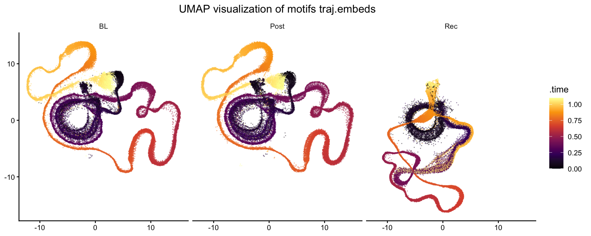
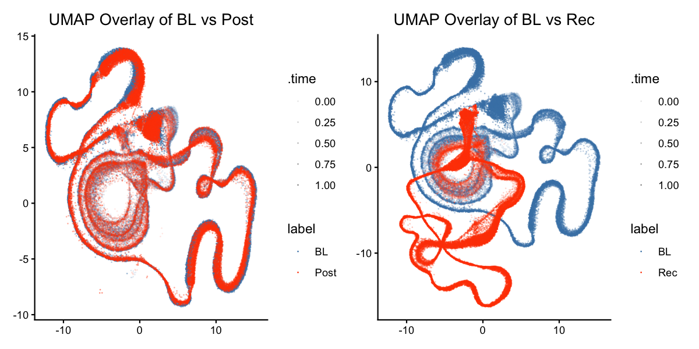

```{r, include = FALSE}
knitr::opts_chunk$set(
  collapse = TRUE,
  comment = "#>",
  fig.width = 10,
  fig.height = 6,
  out.width = "100%",
  eval = FALSE
)
```

## Introduction

This vignette demonstrates how to characterise **how motif acoustic structure
changes across developmental time** by building and visualising a
*trajectory matrix* — a compact, spectrogram-based representation of each
motif — and then projecting it into a low-dimensional UMAP embedding.

**Prerequisites**: Before reading this vignette, we recommend completing:

- [Overview: ASAP 101](single_wav_analysis.html) — Basic ASAP functions
- [Constructing a SAP Object](construct_sap_object.html) — SAP object creation
- [Longitudinal Motif Detection](longitudinal_motif_detection.html) — Detecting
  motifs with template matching

**What you will learn**:

1. How to build a trajectory matrix directly from raw WAV files using
   `create_trajectory_matrix()`
2. How to reduce dimensionality with `run_pca()` and `run_umap()`
3. How to visualise and compare UMAP trajectories across developmental stages
   with `plot_umap2()`

---

## Overview

A *trajectory matrix* is a time-resolved, spectrogram-based representation of
each motif rendition. Because it sweeps sliding windows across the full motif
duration, it encodes not only the individual vocal elements but also the
**silence gaps in between** — information that single-feature summaries
discard. Projecting this matrix through PCA and UMAP reveals how the complete
acoustic trajectory of each motif shifts across developmental time points.

---

## Setup

```{r setup}
library(ASAP)
```

---

## Load a previously saved SAP object

This vignette continues from
[Longitudinal Motif Detection](longitudinal_motif_detection.html).
Load the SAP object saved at the end of that tutorial.

The **only required component** is detected motifs (`sap$motifs`) — the
trajectory matrix is built directly from the raw WAV files, so prior steps like
`analyze_spectral()`, `find_clusters()`, and `run_umap()` are optional to run.

```{r load_sap}
sap <- readRDS("longitudinal_motif_analysis.rds")
```

Verify that motifs are present:

```{r inspect_sap}
cat("Motifs:", nrow(sap$motifs), "rows\n")
```

```{r inspect_sap_output, echo = FALSE, eval = TRUE, comment = ""}
cat("Motifs: 810 rows")
```

---

## Complete Pipeline (copy-paste reference)

```{r pipeline}
library(ASAP)

sap <- readRDS("longitudinal_motif_analysis.rds")

set.seed(222)

sap <- sap |>
  create_trajectory_matrix(
    data_type = "feat.embeds",
    clusters  = c(0, 1),
    balanced  = TRUE
  ) |>
  run_pca() |>
  run_umap(data_type = "traj_mat", min_dist = 0.5) |>
  plot_umap2(data_type = "traj.embeds")
```

---

## Build the trajectory matrix

### Basic usage

`create_trajectory_matrix()` reads each motif's WAV file, sweeps overlapping
spectrogram windows across the full time window (from `start_time` to
`end_time`), and concatenates those windows into a single row of the trajectory
matrix. This captures every vocal element and the silence gaps in between.

The example below also passes `data_type = "feat.embeds"` and
`clusters = c(0, 1)` to restrict the analysis to motifs in acoustic clusters 0
and 1 (requires `analyze_spectral()` and `find_clusters()` to have been run).
If you want to include all motifs without cluster filtering, simply omit those
two arguments:

```{r traj_mat_no_cluster, eval = FALSE}
# All motifs — no prior clustering required
sap <- create_trajectory_matrix(sap, balanced = TRUE)
```

```{r traj_mat}
set.seed(222)

# Restrict to clusters 0 and 1 (requires feat.embeds)
sap <- create_trajectory_matrix(
  sap,
  data_type = "feat.embeds",
  clusters  = c(0, 1),
  balanced  = TRUE
)
```

```{r traj_mat_output, echo = FALSE, eval = TRUE, comment = ""}
cat("=== Starting trajectory analysis for motifs using feat.embeds (cluster 0) ===

Filtered for clusters: 0, 1
Available labels: BL, Post, Rec

Initial data summary:
# A tibble: 3 × 3
  label     n mean_duration
  <chr> <int>         <dbl>
1 BL      206           1.2
2 Post    198           1.2
3 Rec     143           1.2

Balancing groups to 140 segments each

Final data summary:
# A tibble: 3 × 3
  label     n mean_duration
  <chr> <int>         <dbl>
1 BL      140           1.2
2 Post    140           1.2
3 Rec     140           1.2
Generating spectrograms using 7 cores...
Spectrogram generation complete!")
```

### Key parameters

| Parameter | Role | Typical range |
|---|---|---|
| `data_type` | Set to `"feat.embeds"` to enable cluster filtering; omit to use `sap$motifs` directly | `NULL` or `"feat.embeds"` |
| `clusters` | Integer vector of cluster IDs to include (requires `data_type = "feat.embeds"`) | `NULL` (all) or `c(0, 1)` |
| `balanced` | Draw equal numbers of motifs from each label | `TRUE` / `FALSE` |
| `sample_percent` | Percentage of motifs to sample per label when not balancing | `10 – 100` |
| `max_samples_per_label` | Maximum number of motifs to randomly sample from each label when `balanced = FALSE` | `50 – 500` |
| `window_size` | Duration of each sliding spectrogram window (seconds) | `0.05 – 0.2` |
| `step_size` | Step between consecutive windows (seconds) | `0.005 – 0.02` |
| `flim` | Frequency range for spectrograms (kHz) | `c(1, 12)` |

### Control subsampling before trajectory analysis

`create_trajectory_matrix()` is usually the most computationally expensive
step in this workflow because it reads audio and computes many overlapping
spectrogram windows for every selected motif. For a large longitudinal dataset,
running the full motif table can take many hours or even days. In practice, it
is often better to start with a controlled subset, confirm that the trajectory
settings are appropriate, and then scale up only if needed.

Use `sample_percent` when you want to keep a fixed percentage from each label:

```{r traj_subsample_percent, eval = FALSE}
sap <- create_trajectory_matrix(
  sap,
  data_type = "feat.embeds",
  clusters = c(0, 1),
  sample_percent = 20
)
```

Use `max_samples_per_label` when you want a direct cap on the number of motifs
processed from each label:

```{r traj_subsample_max, eval = FALSE}
sap <- create_trajectory_matrix(
  sap,
  data_type = "feat.embeds",
  clusters = c(0, 1),
  max_samples_per_label = 100
)
```

If `balanced = TRUE`, `max_samples_per_label` is ignored because balanced
sampling automatically sets the per-label count from the smallest available
group.

### Tuning tips

- **Not enough motifs per label** → lower `sample_percent` or widen the
  `clusters` selection.
- **Too much temporal smearing** → adjust `window_size` and `step_size` to capture finer temporal details.
- **Results differ across runs** → always set `set.seed()` before calling
  `create_trajectory_matrix()`.

### Where are the results stored?

```{r inspect_traj_mat}
# Trajectory matrix is in sap$features$motif$traj_mat
dim(sap$features$motif$traj_mat)
```

```{r inspect_traj_mat_output, echo = FALSE, eval = TRUE, comment = ""}
cat("[1] 420  50")
```

---

## Reduce dimensions with PCA

`run_pca()` applies PCA to `traj_mat` using the `irlba` method, which is
efficient for large matrices. The PCA scores replace the raw trajectory
columns in `traj_mat`; the original PCA parameters are preserved as attributes.

```{r pca}
sap <- run_pca(sap)
```

```{r pca_output, echo = FALSE, eval = TRUE, comment = ""}
cat("=== Starting PCA analysis for motifs using traj_mat (method: irlba) ===
Performing PCA using irlba method...

PCA Diagnostic Summary:
------------------------
Variance explained by first PC: 43 %
Variance explained by last PC: 0.08 %
Ratio between first and last PC: 544.22
Number of PCs needed for 80% variance: 5

RECOMMENDATION: Consider scaling before further dimension reduction because:
- First PC explains much more variance than last PC
- Scaling will help consider patterns in lower PCs

PCA score stored in traj_mat
Access via: sap$features$motif$traj_mat

- Access PCA parameters via: attributes(sap$features$motif$traj_mat)$pca_params")
```

### Interpreting PCA diagnostics

- **Variance explained by first PC >> last PC** → the data has a dominant
  direction; scaling before UMAP will bring out subtler structure.
- **Number of PCs for 80 % variance** → a rough guide for how many PCs UMAP
  will use as input. Fewer PCs = faster UMAP but potentially less detail.

---

## Project to UMAP

`run_umap()` takes the PCA scores in `traj_mat` and produces a 2-D embedding
stored in `sap$features$motif$traj.embeds`.

```{r umap}
sap <- run_umap(sap, data_type = "traj_mat", min_dist = 0.5)
```

```{r umap_output, echo = FALSE, eval = TRUE, comment = ""}
cat("=== Starting Run UMAP for motifs using traj_mat ===
No metadata columns specified. Using all columns as features:
 [1] \"PC1\"  \"PC2\"  \"PC3\"  \"PC4\"  \"PC5\"  ... \"PC50\"

10:07:30 UMAP embedding parameters a = 0.583 b = 1.334
10:07:30 Read 420 rows and found 50 numeric columns
10:07:30 Scaling to zero mean and unit variance
10:07:37 Annoy recall = 100%
10:08:10 Optimization finished

UMAP completed successfully!
Access results via: sap$features$motif$traj.embeds
Access parameters via: attributes(sap$features$motif$traj.embeds)$umap_params")
```

### Key parameters

| Parameter | Role | Typical range |
|---|---|---|
| `data_type` | Which feature matrix to embed | `"traj_mat"` |
| `min_dist` | Controls how tightly points cluster in UMAP space | `0.1 – 1.0` |
| `n_neighbors` | Balances local vs. global structure | `10 – 50` |

### Tuning tips

- **All labels overlap completely** → try a lower `min_dist` (e.g., `0.1`) or
  increase `n_neighbors` to emphasise global structure.
- **Labels form tight, disconnected islands** → raise `min_dist` or use fewer
  PCs as input.
- **Run-to-run variability** → set `set.seed()` before `run_umap()` for
  reproducible embeddings.

---

## Visualise the trajectory UMAP

`plot_umap2()` renders the UMAP embedding coloured by developmental label,
making it easy to see how motif acoustic trajectories shift across stages.

### Coloured by label

```{r plot_umap2, fig.width = 10, fig.height = 6}
plot_umap2(sap, data_type = "traj.embeds")
```

```{r plot_umap2_fig, echo = FALSE, eval = TRUE, out.width = "100%", fig.cap = "UMAP of motif trajectory embeddings coloured by developmental label (BL, Post, Rec). Each point is one motif; spatial proximity indicates acoustic similarity across the full motif trajectory."}
if (file.exists("figures/motif_trajectory_umap.png")) {
  
} else {
  message("Image placeholder: figures/motif_trajectory_umap.png")
}
```

### Overlay mode — comparing a stage to baseline

`overlay_mode = TRUE` highlights a target label against the baseline
(`base_label`), making developmental shifts more salient:

```{r plot_umap2_overlay, fig.width = 10, fig.height = 6}
trajectory_embeds <- sap$features$motif$traj.embeds

plot_umap2(
  trajectory_embeds,
  overlay_mode = TRUE,
  base_label   = "BL"
)
```

```{r plot_umap2_overlay_fig, echo = FALSE, eval = TRUE, out.width = "100%", fig.cap = "Overlay UMAP: each comparison label (Post, Rec) is shown individually against the baseline (BL) distribution. Shifts away from the baseline cloud indicate developmental change."}
if (file.exists("figures/motif_trajectory_umap_overlay.png")) {
  
} else {
  message("Image placeholder: figures/motif_trajectory_umap_overlay.png")
}
```

### Interpreting the UMAP

- **Large overlap between BL and Post** → acoustic trajectory structure is
  largely preserved across these two stages; motifs occupy similar UMAP
  regions.
- **BL and Rec occupy different regions** → the recovery stage shows a clear
  shift in overall acoustic trajectory, indicating meaningful change in motif
  structure relative to baseline.
- **Post and Rec diverge** → trajectory structure continues to change through
  recovery, suggesting an ongoing developmental process rather than a simple
  return to the pre-perturbation state.
- **Spread within a label** → wide scatter for a given label reflects
  within-stage variability in motif acoustic structure; tighter clouds indicate
  more stereotyped renditions.

---

## Save the SAP object

```{r save_sap}
saveRDS(sap, "longitudinal_motif_trajectory.rds")

# Reload later with:
sap <- readRDS("longitudinal_motif_trajectory.rds")
```

**What gets saved:**
- Everything from previous pipeline steps
- Trajectory matrix: `sap$features$motif$traj_mat`
- Trajectory UMAP embeddings: `sap$features$motif$traj.embeds`

---

## Session info

```{r session_info, eval = TRUE}
sessionInfo()
```
