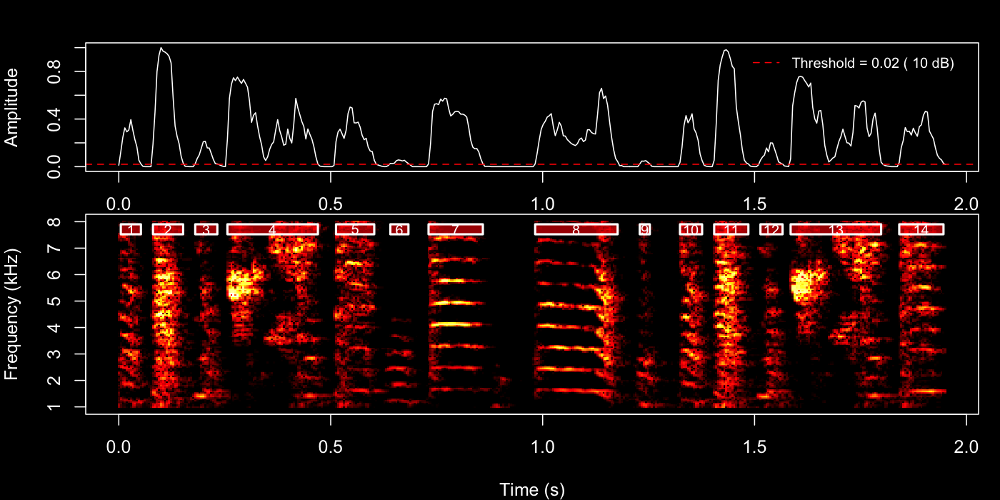
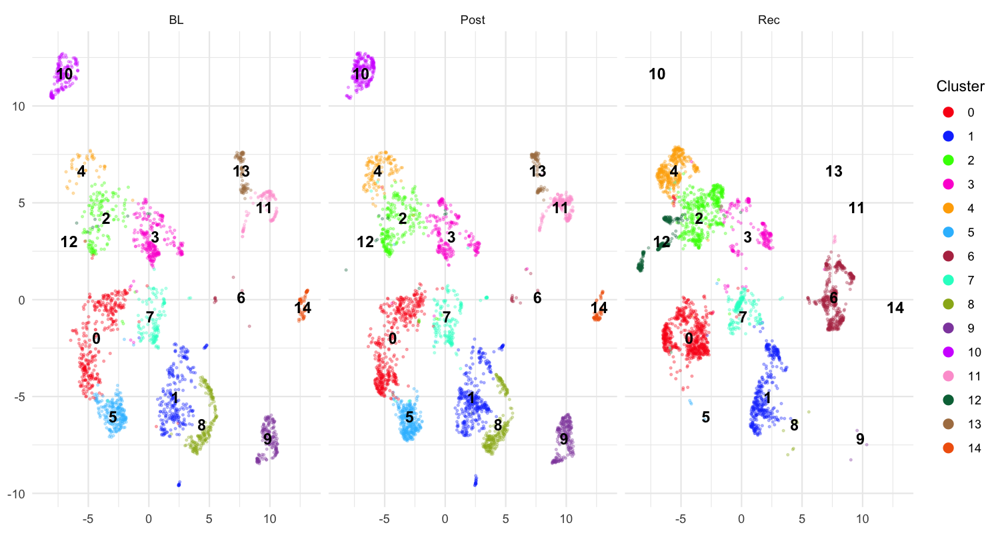

```{r, include = FALSE}
knitr::opts_chunk$set(
  collapse = TRUE,
  comment = "#>",
  fig.width = 10,
  fig.height = 5,
  out.width = "100%",
  eval = FALSE
)
```

## Introduction

This vignette demonstrates how to **segment song recordings into individual
syllables** across longitudinal time points and visualise the resulting acoustic
structure with UMAP embeddings.

**Prerequisites**: Before reading this vignette, we recommend completing:

- [Overview: Basic Audio Analysis](single_wav_analysis.html) — Core ASAP functions
- [Constructing a SAP Object](construct_sap_object.html) — SAP object creation
- [Longitudinal Bout Detection](longitudinal_bout_detection.html) — Detecting
  song bouts across development

**What you will learn**:

1. How to segment detected bouts into individual syllables
2. How to extract features, cluster, and run UMAP on syllable segments
3. How to visualise clustering results to guide subsequent labelling

---

## Overview

**What is syllable segmentation?** Individual song bouts contain multiple
syllables — discrete acoustic units that are the building blocks of the song
motif. Syllable segmentation identifies where each syllable starts and ends
within a bout or motif recording.

**Why segment syllables?** Syllable-level analysis enables:

- Identifying the full syllable repertoire of an individual bird
- Tracking changes in syllable acoustic structure across development
- Grouping syllables by acoustic similarity for downstream labelling
- Comparing syllable distributions across developmental stages

**Relationship to previous steps**: Motif detection (see
[Longitudinal Motif Detection](longitudinal_motif_detection.html)) and bout
detection (see [Longitudinal Bout Detection](longitudinal_bout_detection.html))
provide the time windows within which `segment()` searches for syllable
boundaries. In this vignette we segment within bouts (`segment_type = "bouts"`).

---

## Setup

```{r setup}
library(ASAP)
```

---

## Load a SAP object

A SAP object organises all recordings across developmental time points. Here we
assume you have already populated the object with detected bouts (see
[Longitudinal Bout Detection](longitudinal_bout_detection.html)).

```{r sap_object}
sap <- readRDS("longitudinal_bout_analysis.rds")
```


---

## Segment bouts (or motifs) into syllables

`segment()` uses adaptive spectrogram thresholding to locate individual
syllables within each detected bout or motif. Before running batch segmentation
across all recordings, it is good practice to **preview the result on a single
example** so you can tune the parameters first.

### Key parameters

| Parameter | Role | Typical range |
|---|---|---|
| `segment_type` | What to segment: `"bouts"` or `"motifs"` | — |
| `flim` | Frequency range in kHz | `c(1, 10)` |
| `silence_threshold` | Relative amplitude below which a frame is silent | `0.01 – 0.1` |
| `min_syllable_ms` | Minimum syllable length | `20 – 50 ms` |
| `max_syllable_ms` | Maximum syllable length | `150 – 300 ms` |
| `min_level_db` | Lower dB bound for adaptive search | `5 – 15 dB` |
| `db_delta` | Step size for dB search | `5 – 10 dB` |
| `search_direction` | Direction for dB threshold search: `"up"` (quiet recordings) or `"down"` (loud, clear recordings) | `"up"` |
| `plot_percent` | *(SAP method only)* Percentage of segments for which a PNG is saved | `10` |

### 2a — Interactive parameter tuning with default method

The quickest way to explore parameters is to call `segment()` directly on a
**WAV file path**. This invokes default method, which plots the detection
envelope and spectrogram boundaries immediately in your IDE — no files are
written. Set `save_plot = FALSE` (the default) so the result appears in the
plot pane right away.

Try the **4th bout** first:

```{r preview_bout}
example_bout <- sap$bouts[4, ]

segment(
  file.path(sap$base_path, example_bout$day_post_hatch, example_bout$filename),
  start_time        = example_bout$start_time,
  end_time          = example_bout$end_time,
  flim              = c(1, 8),
  silence_threshold = 0.02,
  min_syllable_ms   = 20,
  max_syllable_ms   = 240,
  min_level_db      = 10,
  search_direction  = "up",   # start from min_level_db suits variable recordings
  save_plot         = FALSE   # plot appears in IDE
)
```

{width=100%}


Then try the **22nd motif**.


```{r preview_motif}
example_motif <- sap$motifs[22, ]

segment(
  file.path(sap$base_path, example_motif$day_post_hatch, example_motif$filename),
  start_time        = example_motif$start_time,
  end_time          = example_motif$end_time,
  flim              = c(1, 8),
  silence_threshold = 0.02,
  min_syllable_ms   = 20,
  max_syllable_ms   = 240,
  min_level_db      = 10,
  search_direction  = "up",
  save_plot         = FALSE
)
```

{width=100%}

Inspect the plot pane after each call. Adjust `silence_threshold` or
`min_level_db` and re-run until boundaries look clean, then use those same
values in the next two steps.

### 2b — Spot-check a subset with Sap method

Once you have rough parameters, you can verify a small subset of recordings
before committing to the full batch. The Sap method accepts two composable
filter arguments:

- **`day`** — first restricts the pool of bouts/motifs to those from the
  specified recording day(s) (matched against `day_post_hatch`).
- **`indices`** — then selects specific row numbers **within that day's
  filtered pool**. If `day` is omitted, indices apply across all days.

They work together, not as alternatives. For example, to check bouts 1–5
from the baseline day only:

```{r preview_sap}
segment(
  sap,
  segment_type      = "bouts",
  day               = 190,    # restrict to BL (day_post_hatch = 190)
  indices           = 1:5,    # then pick rows 1–5 within that day
  flim              = c(1, 8),
  silence_threshold = 0.02,
  min_syllable_ms   = 20,
  max_syllable_ms   = 240,
  min_level_db      = 10,
  db_delta          = 10,
  search_direction  = "up",
  save_plot         = TRUE,
  plot_percent      = 100     # save all plots in this spot-check
)
```

Omit `indices` to process **all** bouts from that day, or omit `day` to apply
`indices` across the full dataset regardless of recording day.

The PNGs are saved to the default output directory reported in the console.
When you are satisfied with the boundaries, carry those parameters into the
batch call below.

### 2c — Batch segmentation across all recordings

Once you are happy with the parameters, run `segment()` via the SAP object to
process every detected bout across all recordings. To keep the run fast,
set `plot_percent` to a small value (e.g. `10`) so only a random 10 % of
detection plots are saved — sufficient for a final sanity check without the
overhead of writing thousands of PNGs.

```{r segmentation}
sap <- sap |>
  segment(
    segment_type      = "bouts",   # segment within each detected bout
    flim              = c(1, 8),   # 1–8 kHz (zebra finch song range)
    silence_threshold = 0.02,      # tuned from interactive preview above
    min_syllable_ms   = 20,
    max_syllable_ms   = 240,
    min_level_db      = 10,
    db_delta          = 10,
    search_direction  = "up",
    save_plot         = TRUE,
    plot_percent      = 10         # save 10% of plots to avoid slowing batch processing
  )
```

Detected syllable boundaries are stored in `sap$segments`. You can inspect
them directly:

```{r inspect_segments}
head(sap$segments)
#> filename          day_post_hatch label selec start_time end_time duration ...
#> S237_42674.wav    190            BL    1-1   1.135      1.178    0.043    ...
```


---


The workflow here is identical to the one described in
[Longitudinal Motif Detection](longitudinal_motif_detection.html) — the same
`analyze_spectral()`, `find_clusters()`, and `run_umap()` functions are used in
exactly the same order. The only difference is the **vocal element** being
analysed: in the motif tutorial the functions operate on whole motifs
(`segment_type = "motifs"`, which is the default), whereas here we pass
`segment_type = "segments"` to work on the individual syllables we just
detected.

```{r feature_clustering_umap}
sap <- sap |>
  analyze_spectral(
    segment_type    = "segments"
  ) |>
  find_clusters(
    segment_type = "segments"
  ) |>
  run_umap(
    segment_type = "segments",
    min_dist     = 0.3
  )
```

The 2-D coordinates are appended to `sap$features$segment$feat.embeds` as `UMAP1` and `UMAP2`.

### Saving the SAP object

Now that the SAP object contains segment boundaries, spectral features, cluster
assignments, and UMAP embeddings, save it so you can continue directly in the
[Syllable Labelling](syllable_labeling.html) tutorial. The embeddings are
required by `auto_label()`:

```{r save_sap}
saveRDS(sap, "longitudinal_syllable_analysis.rds")

# Reload later with:
# sap <- readRDS("longitudinal_syllable_analysis.rds")
```

**What gets saved:**
- All metadata, motif, and bout data from earlier steps
- Detected syllable boundaries (`sap$segments`)
- Spectral features (`sap$features$segment$feat.mat`)
- Cluster assignments and UMAP embeddings (`sap$features$segment$feat.embeds`)

**Important notes:**
- The original WAV files are **not** included in the saved object
- You must keep WAV files at their original paths to run additional analyses
- The saved `.rds` file is typically much smaller than the audio data

---

## Visualise UMAP

`plot_umap()` renders an interactive scatter plot of segments in UMAP space,
coloured and faceted to reveal developmental differences.

```{r plot_umap, fig.width = 15, fig.height = 5}
plot_umap(sap,
    segment_type = "segments",
    split.by     = "label",   # one panel per developmental stage
    label        = TRUE       # show cluster numbers on the plot
  )
```

{width=100%}

Each panel shows one developmental stage (BL, Post, Rec). Distinct clouds of
points that remain stable across panels correspond to acoustically consistent
syllable types — good candidates for labelling. Scattered or overlapping
clouds may suggest that the segmentation parameters need adjustment.

### Interpreting UMAP output

- **Tight, separated clusters** → well-defined syllable types; proceed to
  [Syllable Labelling](syllable_labeling.html)
- **Overlapping clusters** → increase `find_clusters()` resolution, or adjust
  spectral feature range
- **Many outliers** → lower `min_syllable_ms` (too-short segments may be noise)
  or raise `silence_threshold`

---

## Complete pipeline (copy-paste reference)

```{r full_pipeline}
library(ASAP)

# -- Create SAP object --
sap <- create_sap_object(
  base_path             = "/path/to/recordings",
  subfolders_to_include = c("190", "201", "203"),
  labels                = c("BL", "Post", "Rec")
)

# -- Motif & Bout detection --
sap <- sap |>
  create_audio_clip(indices = 1, start_time = 1, end_time = 2.5,
                    clip_names = "motif_ref") |>
  create_template(template_name = "syllable_d", clip_name = "motif_ref",
                  start_time = 0.72, end_time = 0.84,
                  freq_min = 1, freq_max = 10,
                  threshold = 0.5, write_template = TRUE) |>
  detect_template(template_name = "syllable_d") |>
  find_motif(template_name = "syllable_d", pre_time = 0.7, lag_time = 0.5) |>
  find_bout(min_duration = 0.4, summary = TRUE) |>

  # -- Segmentation pipeline --
  segment(segment_type = "bouts", flim = c(1, 8),
          silence_threshold = 0.02,
          min_syllable_ms = 20, max_syllable_ms = 240,
          min_level_db = 10, db_delta = 10,
          search_direction = "up",
          save_plot = TRUE, plot_percent = 10) |>
  analyze_spectral(segment_type = "segments") |>
  find_clusters(segment_type = "segments") |>
  run_umap(segment_type = "segments", min_dist = 0.3) |>
  plot_umap(segment_type = "segments", split.by = "label", label = TRUE)
```

---

## Next steps

Once you are satisfied with the UMAP structure, proceed to
[Syllable Labelling](syllable_labeling.html) to assign meaningful letter
identities to each cluster using automatic (`auto_label()`) and manual
(`manual_label()`) labelling.

## Session info

```{r session_info, eval = TRUE}
sessionInfo()
```
