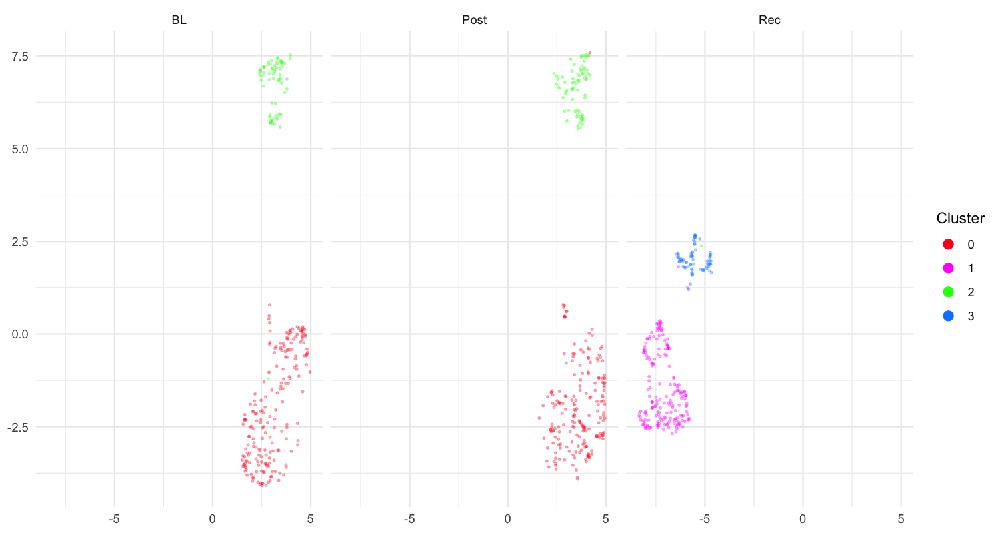

```{r, include = FALSE}
knitr::opts_chunk$set(
  collapse = TRUE,
  comment = "#>",
  fig.width = 10,
  fig.height = 5,
  out.width = "100%",
  eval = FALSE
)
```

## Introduction

This vignette demonstrates how to **segment song recordings into individual
syllables** across longitudinal time points and visualise the resulting acoustic
structure with UMAP embeddings.

**Prerequisites**: Before reading this vignette, we recommend completing:

- [Overview: Basic Audio Analysis](single_wav_analysis.html) — Core ASAP functions
- [Motif Detection](motif_detection.html) — Template optimisation workflow
- [Constructing a SAP Object](construct_sap_object.html) — SAP object creation
- [Longitudinal Motif Detection](longitudinal_motif_detection.html) — Detecting
  motifs across development

**What you will learn**:

1. How to segment detected bouts or motifs into individual syllables
2. How to extract spectral features from each segment
3. How to cluster segments using UMAP dimensionality reduction
4. How to visualise clustering results to guide subsequent labelling

---

## Setup

```{r setup}
library(ASAP)
```

---

## Step 1 — Load or create a SAP object

A SAP object organises all recordings across developmental time points. Here we
assume you have already run motif detection (see
[Longitudinal Motif Detection](longitudinal_motif_detection.html)) and a summary
of bouts (see [Longitudinal Bout Detection](longitudinal_bout_detection.html)).

```{r sap_object}
sap <- create_sap_object(
  base_path    = "/path/to/recordings",          # folder containing day sub-directories
  subfolders_to_include = c("190", "201", "203"),
  labels       = c("BL", "Post", "Rec")
)
```

Run the motif detection and bout detection steps first so that `sap$motifs` and
`sap$bouts` are populated before segmentation:

```{r motif_pipeline}
sap <- sap |>
  create_audio_clip(indices   = 1,
                    start_time = 1,
                    end_time   = 2.5,
                    clip_names = "motif_ref") |>
  create_template(template_name = "syllable_d",
                  clip_name     = "motif_ref",
                  start_time    = 0.72,
                  end_time      = 0.84,
                  freq_min      = 1,
                  freq_max      = 10,
                  threshold     = 0.5,
                  write_template = TRUE) |>
  detect_template(template_name = "syllable_d") |>
  find_motif(template_name = "syllable_d",
             pre_time      = 0.7,
             lag_time      = 0.5) |>
  find_bout(min_duration = 0.4, summary = TRUE)
```

---

## Step 2 — Segment bouts into syllables

`segment()` analyses each detected bout (or motif) and uses adaptive
spectrogram thresholding to locate individual syllables.

### Key parameters

| Parameter | Role | Typical range |
|---|---|---|
| `segment_type` | What to segment: `"bouts"` or `"motifs"` | — |
| `flim` | Frequency range in kHz | `c(1, 10)` |
| `silence_threshold` | Relative amplitude below which a frame is silent | `0.01 – 0.1` |
| `min_syllable_ms` | Minimum syllable length | `20 – 50 ms` |
| `max_syllable_ms` | Maximum syllable length | `150 – 300 ms` |
| `min_level_db` | Lower dB bound for adaptive search | `5 – 15 dB` |
| `db_delta` | Step size for dB search | `5 – 10 dB` |

```{r segmentation}
sap <- sap |>
  segment(
    segment_type      = "bouts",   # segment within each detected bout
    flim              = c(1, 8),   # focus on 1–8 kHz (zebra finch song range)
    silence_threshold = 0.02,
    min_syllable_ms   = 20,
    max_syllable_ms   = 240,
    min_level_db      = 10,
    db_delta          = 10
  )
```

After this step the detected syllable boundaries are stored in `sap$segments`.
You can inspect them directly:

```{r inspect_segments}
head(sap$segments)
#> filename          day_post_hatch label selec start_time end_time duration ...
#> S237_42674.wav    190            BL    1-1   1.135      1.178    0.043    ...
```

### Visualise detection on a single file (optional)

To check the segmentation quality on one recording, use `segment()` on a single
WAV file path:

```{r single_file_check}
wav_file <- system.file("extdata", "zf_example.wav", package = "ASAP")

syl <- segment(
  wav_file,
  start_time        = 1,
  end_time          = 5,
  flim              = c(1, 8),
  silence_threshold = 0.01,
  min_syllable_ms   = 20,
  max_syllable_ms   = 240,
  min_level_db      = 10,
  verbose           = FALSE
)
```

The plot shows the detection envelope (top panel) and spectrogram with
syllable boundaries overlaid (bottom panel). Adjust `silence_threshold` or
`min_level_db` if too many or too few segments are detected.

---

## Step 3 — Extract spectral features from segments

`analyze_spectral()` computes a bank of acoustic features for every detected
segment. Passing `segment_type = "segments"` tells the function to use
`sap$segments` rather than the motif data.

```{r spectral}
sap <- sap |>
  analyze_spectral(
    segment_type    = "segments",
    frequence_range = c(1, 10)   # kHz
  )
```

Features are stored in `sap$features$segment$feat.mat` (raw feature matrix) and
will be used in the next step for clustering.

---

## Step 4 — Cluster segments

`find_clusters()` groups the acoustic features using hierarchical or
density-based methods to reveal natural groupings in the data.

```{r cluster}
sap <- sap |>
  find_clusters(segment_type = "segments")
```

Cluster membership is stored alongside each segment's feature vector in
`sap$features$segment$feat.embeds`.

---

## Step 5 — UMAP dimensionality reduction

UMAP projects the high-dimensional feature space to 2D, making it easy to
visually inspect how syllable clusters separate.

```{r umap}
sap <- sap |>
  run_umap(
    segment_type = "segments",
    min_dist     = 0.3          # controls cluster compactness (0.1 – 0.5)
  )
```

The 2-D coordinates are appended to `sap$features$segment$feat.embeds` as
`UMAP1` and `UMAP2`.

---

## Step 6 — Visualise UMAP

`plot_umap()` renders an interactive scatter plot of segments in UMAP space,
coloured and faceted to reveal developmental differences.

```{r plot_umap, fig.width = 10, fig.height = 5}
sap <- sap |>
  plot_umap(
    segment_type = "segments",
    split.by     = "label",   # one panel per developmental stage
    label        = TRUE       # show cluster numbers on the plot
  )
```

{width=100%}

Each panel shows one developmental stage (BL, Post, Rec). Distinct clouds of
points that remain stable across panels correspond to acoustically consistent
syllable types — good candidates for labelling. Scattered or overlapping
clouds may suggest that the segmentation parameters need adjustment.

### Interpreting UMAP output

- **Tight, separated clusters** → well-defined syllable types; proceed to
  [Syllable Labelling](syllable_labeling.html)
- **Overlapping clusters** → increase `find_clusters()` resolution, or adjust
  spectral feature range
- **Many outliers** → lower `min_syllable_ms` (too-short segments may be noise)
  or raise `silence_threshold`

---

## Complete pipeline (copy-paste reference)

```{r full_pipeline}
library(ASAP)

sap <- create_sap_object(
  base_path             = "/path/to/recordings",
  subfolders_to_include = c("190", "201", "203"),
  labels                = c("BL", "Post", "Rec")
)

sap <- sap |>
  # -- Motif detection (prerequisites) --
  create_audio_clip(indices = 1, start_time = 1, end_time = 2.5,
                    clip_names = "motif_ref") |>
  create_template(template_name = "syllable_d", clip_name = "motif_ref",
                  start_time = 0.72, end_time = 0.84,
                  freq_min = 1, freq_max = 10,
                  threshold = 0.5, write_template = TRUE) |>
  detect_template(template_name = "syllable_d") |>
  find_motif(template_name = "syllable_d", pre_time = 0.7, lag_time = 0.5) |>
  find_bout(min_duration = 0.4, summary = TRUE) |>

  # -- Segmentation pipeline --
  segment(segment_type = "bouts", flim = c(1, 8),
          silence_threshold = 0.02,
          min_syllable_ms = 20, max_syllable_ms = 240,
          min_level_db = 10, db_delta = 10) |>
  analyze_spectral(segment_type = "segments", frequence_range = c(1, 10)) |>
  find_clusters(segment_type = "segments") |>
  run_umap(segment_type = "segments", min_dist = 0.3) |>
  plot_umap(segment_type = "segments", split.by = "label", label = TRUE)
```

---

## Next steps

Once you are satisfied with the UMAP structure, proceed to
[Syllable Labelling](syllable_labeling.html) to assign meaningful letter
identities to each cluster using automatic (`auto_label()`) and manual
(`manual_label()`) labelling.

## Session info

```{r session_info, eval = TRUE}
sessionInfo()
```
